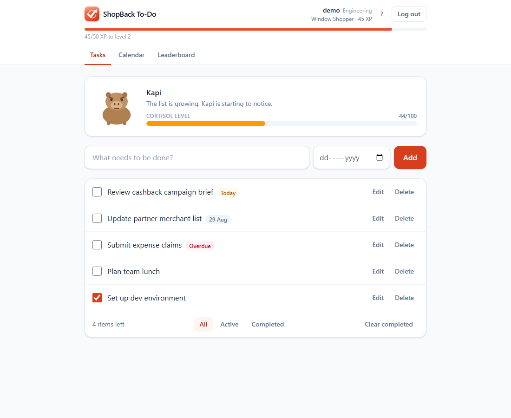
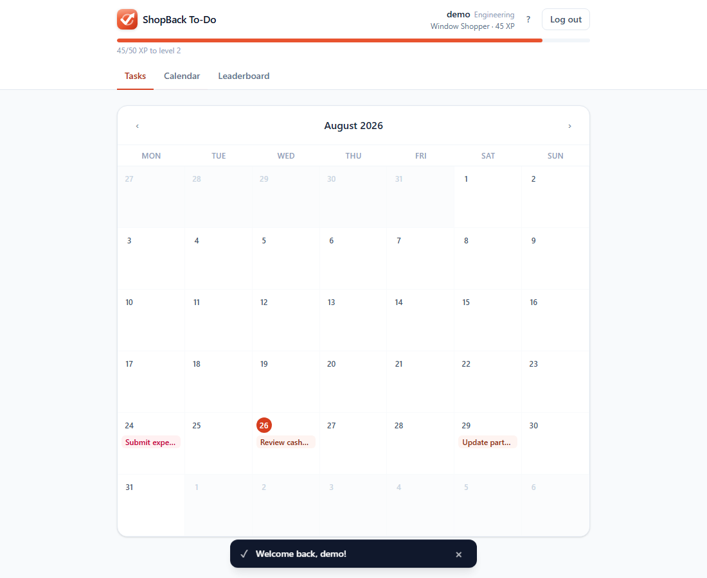
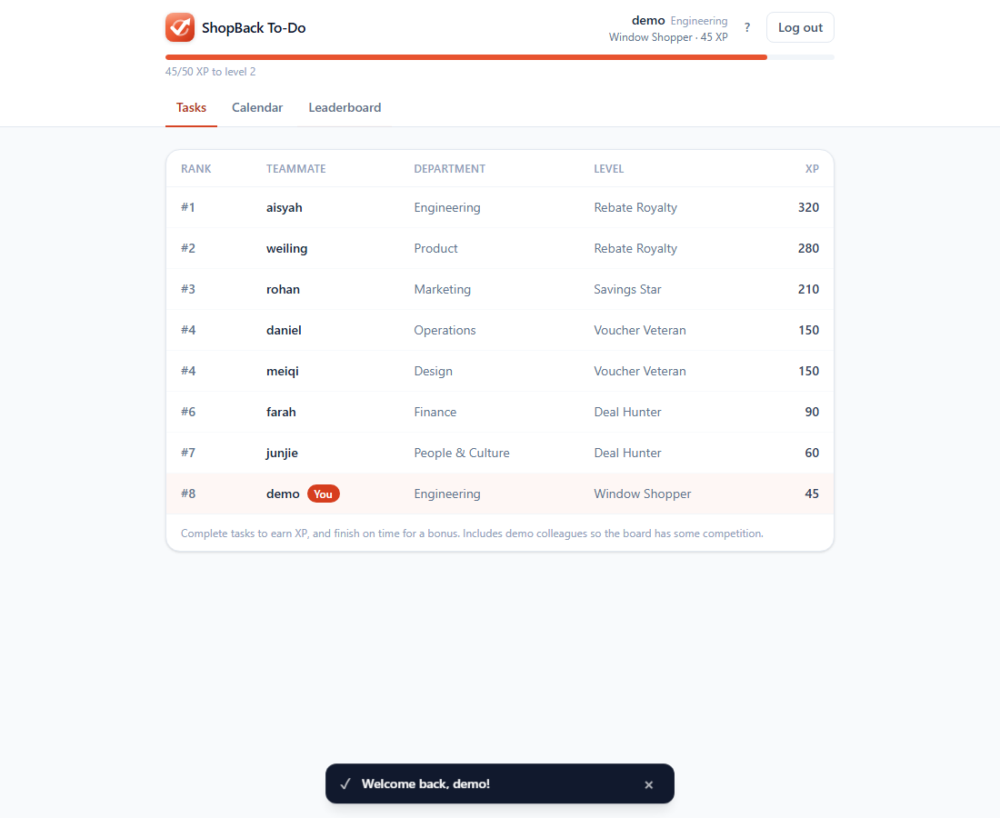
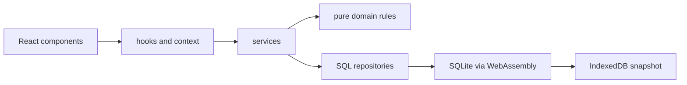

<div align="center">


# ShopBack To-Do

**A to-do list with XP, a team leaderboard, due dates, and a capybara that stresses out when you procrastinate.**

Built for the ShopBack AI-Assisted App assessment.

[](https://shopback-todo.vercel.app)


</div>

---

## Try it in 2 minutes (for evaluators)

The fastest way to see everything working, no setup needed:

1. **Open https://shopback-todo.vercel.app**
2. Click **Try the demo account** (or log in with `demo` / `demo1234`). The demo account comes pre-loaded with tasks, XP, and colleagues on the leaderboard.
3. A short onboarding tour explains the features. Then:
   - **Add a task** with the input at the top, optionally picking a due date. Try submitting an empty one to see validation.
   - **Tick a task off** and watch the `+10 XP` toast, the XP bar in the header, and Kapi the mascot calming down.
   - Tick **"Review cashback campaign brief"** (due today) for the `+15 XP` on-time bonus.
   - Un-tick and re-tick a task: no double XP, and the app tells you why.
   - Open the **Calendar** tab to see tasks on their due dates, and **Leaderboard** to see your ranking climb.
4. **Refresh the page.** Everything survives: tasks, XP, and your session.

Prefer running it locally? See [Getting started](#getting-started). Prefer proof over clicking? Run `npm test` for the 189-test suite.

---

## Screenshots

| Tasks and mascot | Calendar | Leaderboard |
| --- | --- | --- |
|  |  |  |

More in [screenshots/](screenshots/): login, onboarding, XP toasts, validation errors, the stressed mascot, and the mobile layout.

---

## Features

| Feature | Notes |
| --- | --- |
| **Accounts** | Sign up with a username, password and ShopBack department. Passwords hashed with PBKDF2-SHA256 and a per-user salt via Web Crypto. Sessions restore on the next visit. |
| **Add / edit / delete tasks** | Inline editing with Enter to save and Escape to cancel. Titles are trimmed; empty or over-long titles get an inline error. |
| **Mark complete** | Checkbox toggle with a live "N items left" counter, plus All / Active / Completed filters and one-click Clear completed. |
| **XP and levels** | 10 XP per completed task, +5 bonus for finishing on or before the due date. XP is banked once per task, so re-ticking cannot farm it. Levels run from *Window Shopper* to *Rebate Royalty*. |
| **Leaderboard** | Everyone ranked by XP with their department, your row highlighted. Seeded with demo colleagues so the board is never empty. |
| **Due dates and calendar** | Optional due date per task, Overdue / Today / Tomorrow badges in the list, and a month-grid calendar with navigation. |
| **Kapi the mascot** | A capybara with a cortisol bar driven by your open and overdue tasks. Five moods from zen to panic. Fewer tasks, happier capybara. |
| **Onboarding** | A four-step guide on first login, reopenable any time from the **?** button. |
| **Toasts** | Every action confirms itself with a dismissible notification. |
| **Persistence** | A real SQLite database in the browser, snapshotted to IndexedDB after every change. Corrupted data recovers gracefully with a visible notice. |

---

## Tech stack

| Layer | Choice |
| --- | --- |
| Language / UI | TypeScript, React 19 |
| Build | Vite |
| Styling | Tailwind CSS v4 |
| Database | SQLite compiled to WebAssembly (`sql.js`), persisted to IndexedDB |
| Auth | Web Crypto PBKDF2-SHA256 password hashing, localStorage session |
| Unit / integration tests | Vitest + React Testing Library |
| End-to-end tests | Playwright (Chromium) |
| Hosting | Vercel |

### Why SQLite in the browser?

The assessment allows any persistence. Plain localStorage worked (v1 of this app used it), but moving to SQLite gives real tables, foreign keys, migrations and SQL queries while still needing **no server**: the whole database runs as WebAssembly and is exported into IndexedDB after each change. The v1 localStorage data is even migrated into your account on signup.

The trade-off is deliberate and documented: **accounts are local to one browser on one device**. Real cross-device login needs a backend, which is out of scope. See [specs/01-scope.md](specs/01-scope.md).

---

## Getting started

**Requirements:** Node.js 20.19+ (built on Node 24) and npm.

```bash
git clone https://github.com/Kopi-O-Kosong-Beng/ShopBack_AI-Assisted-App.git
cd ShopBack_AI-Assisted-App
npm install
npm run dev
```

Open **http://localhost:3000** and click **Try the demo account**.

---

## Scripts

| Command | What it does |
| --- | --- |
| `npm run dev` | Start the Vite dev server on port 3000. |
| `npm run build` | Type-check with `tsc` and build for production into `dist/`. |
| `npm run preview` | Serve the production build locally. |
| `npm test` | Run all unit and integration tests once (Vitest). |
| `npm run test:watch` | Run Vitest in watch mode. |
| `npm run test:e2e` | Run the Playwright end-to-end suite. Starts the dev server automatically. |
| `npm run lint` | Lint the whole codebase (oxlint). |

**Before the first e2e run**, install the browser binary once:

```bash
npx playwright install chromium
```

---

## Testing

**189 unit and integration tests plus 14 end-to-end tests**, layered so each level catches what the others cannot. The full plan with per-use-case tables lives in [specs/06-test-plan.md](specs/06-test-plan.md).

| Level | Where | Approach |
| --- | --- | --- |
| Unit (bottom-up) | `src/domain/*.test.ts`, `src/auth`, `src/db`, `src/storage`, `src/services` | Pure business rules and the storage boundary, run against a **real in-memory SQLite database**. Failure modes (corrupted snapshots, unavailable storage) are forced deterministically through an injected snapshot adapter. |
| Integration (top-down) | `src/App.test.tsx` | Renders the whole app and drives it like a user: sign up, add tasks, earn XP, browse the calendar and leaderboard, finish onboarding. |
| End-to-end | `e2e/todo.spec.ts` | The real app in Chromium with real IndexedDB, including a genuine page reload to prove persistence and session restore. |

```bash
npm test          # 189 unit + integration tests
npm run test:e2e  # end-to-end
```

Two Playwright files are tooling rather than tests: `e2e/screenshots.spec.ts` regenerates the images in [screenshots/](screenshots/), and `e2e/gen-icons.spec.ts` rasterises the favicon into exact-size PNGs.

---

## Architecture



Business rules live in `src/domain/` as pure functions with **no React or browser imports**, which is why XP maths, cortisol levels and the calendar grid are unit-testable without rendering anything. Components hold no business logic; the database is the single source of truth and the UI re-queries after every mutation. Full detail in [specs/04-component-architecture.md](specs/04-component-architecture.md).

```
.
├── e2e/                      # Playwright end-to-end tests and tooling
├── screenshots/              # UI screenshots of the working app
├── specs/                    # Design documents written before implementation
│   ├── 01-scope.md               # scope, assumptions, definition of done
│   ├── 02-use-cases.md           # UC-01..UC-14 with flows and error states
│   ├── 03-domain-model.md        # domain class model (Mermaid)
│   ├── 04-component-architecture.md
│   ├── 05-sequence-diagrams.md
│   └── 06-test-plan.md           # test cases per use case
├── src/
│   ├── app/                  # app context, boot, toast system
│   ├── auth/                 # password hashing, session storage
│   ├── components/           # presentational React components
│   ├── db/                   # SQLite setup, migrations, seeding, snapshots
│   ├── domain/               # pure business rules: todo, xp, mascot, calendar
│   ├── hooks/                # useTodos, useNow
│   ├── services/             # auth and todo use cases
│   └── storage/              # SQL repositories
├── prompt.md                 # the initial AI prompt, as written
└── Reflection.md             # AI usage write-up
```

---

## Design decisions worth knowing

- **Completed tasks stay until you act.** They remain listed (struck through) so the Completed filter and the leaderboard history make sense, and you remove them explicitly with Delete or **Clear completed**. Auto-deleting finished work would surprise users and erase the satisfaction of a done list.
- **XP cannot be farmed by re-ticking.** Each task banks its XP once, tracked in the database, and the app explains this when you try.
- **XP is a motivator, not a currency.** Tasks are self-entered, so someone determined can add and complete tasks endlessly. Policing that needs a server. Documented as a known limitation rather than half-fixed.
- **Overdue tasks stress the mascot more than busy days do.** An overdue task adds 12 cortisol on top of the 8 every open task adds.
- **Errors stay next to the field; toasts confirm outcomes.** Showing the same validation error twice is noise.

---

## Known limitations

- **Accounts are per-browser.** No server means signing up on another device creates a separate account.
- **Demo-grade auth.** The PBKDF2 hashing is real, but everything runs client-side. Fine for an assessment, not for production secrets.
- **Single browser tab.** Two tabs writing snapshots can race; last write wins.

---

## Deploying

Static build, already live on Vercel:

```bash
npm run build
npx vercel deploy --prod
```

---

## Documentation

| File | Contents |
| --- | --- |
| [prompt.md](prompt.md) | The initial AI prompt, pasted as written. |
| [Reflection.md](Reflection.md) | AI usage write-up. |
| [specs/](specs/) | The six pre-implementation design documents. |
