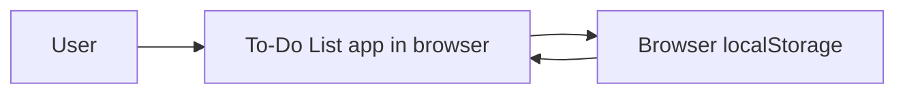

# 01 — Project Scope

This document defines the scope of the To-Do List web app built for the ShopBack engineering assessment: what the app does, what it deliberately does not do, the fixed technology stack, the assumptions the design rests on, and the definition of done. The companion documents specify the use cases (02), the domain model (03), the component architecture (04), the runtime interactions (05), and the test plan (06).

## 1. Overview

A single-page To-Do List application that lets a user manage a personal task list entirely in the browser. Tasks are persisted to browser `localStorage` so they survive page reloads; there is no backend, no authentication, and no routing. The project is built AI-assisted, with these specification documents written before implementation and committed alongside the code.

## 2. Goals

- Deliver a working, polished task manager covering the full task lifecycle: add, edit, complete, delete.
- Persist state transparently — the user never saves manually, and tasks survive a page refresh.
- Degrade gracefully: storage failures never crash the app or silently lose the user's session.
- Demonstrate engineering discipline: a layered architecture with a pure domain core, exhaustive edge-case handling, and a three-level test suite with full use-case traceability.

## 3. In scope

### Must-have features

| Feature | Use case |
| --- | --- |
| Add a task with a validated title | UC-01 Add task |
| Edit a task's title inline, with Save / Cancel | UC-02 Edit task title |
| Delete a task immediately | UC-03 Delete task |
| Mark a task complete or incomplete via checkbox | UC-04 Mark task complete / incomplete |
| Auto-save on every change; restore on startup | UC-05 Persist and restore tasks |

### Nice-to-have features — implemented

| Feature | Use case |
| --- | --- |
| Filter the list by All / Active / Completed, with an items-left counter | UC-06 Filter tasks |
| Remove all completed tasks in one action | UC-07 Clear completed tasks |

The full actor model, flows, and error states for each use case are specified in `02-use-cases.md`.

### Quality scope

- **Validation.** Titles are trimmed; empty or whitespace-only titles are rejected with the inline error "Task cannot be empty"; titles longer than 200 characters are rejected, and the input enforces `maxLength` as a first line of defense.
- **Resilience.** If `localStorage` is unavailable, the app runs in-memory for the session and shows a dismissible warning banner. If stored data is corrupted, the app starts with an empty list, warns the user, and the next save overwrites the bad payload.
- **Empty states.** An empty list renders a dedicated empty-state view whose message varies with the active filter, so an empty view never looks broken.
- **UI.** Clean and minimal: light theme, a single indigo accent color, card-style task list, mobile responsive, no heavy animation.

## 4. Out of scope

| Excluded | Rationale |
| --- | --- |
| Backend, API, or database | Assessment brief fixes persistence to browser localStorage |
| User accounts / authentication | Single anonymous user per browser profile |
| Routing / multiple pages | Single-view application |
| Cross-device or cross-browser sync | localStorage is per browser profile by nature |
| Due dates, priorities, tags, subtasks, reordering | Beyond the minimum feature set; the data model leaves room for them |
| Undo / confirmation dialogs for delete | Delete is immediate by design; undo is explicitly out of scope |
| Persisting the active filter | The filter is ephemeral view state; every visit starts on All |

## 5. Technology stack — fixed

| Concern | Choice |
| --- | --- |
| Language | TypeScript |
| UI framework | React 19 |
| Build tool | Vite |
| Styling | Tailwind CSS v4 |
| Persistence | Browser localStorage, key `shopback-todo.v1` |
| Unit / integration tests | Vitest + React Testing Library |
| End-to-end tests | Playwright, chromium |
| Deployment | Vercel |

The architecture is layered strictly one way: **UI components → `useTodos` hook → pure domain functions + storage repository → browser localStorage** (detailed in `03-domain-model.md` and `04-component-architecture.md`).

## 6. Assumptions and design decisions

| # | Decision | Consequence |
| --- | --- | --- |
| D1 | Duplicate titles are allowed | No uniqueness check; each task is identified by a generated `id` |
| D2 | Delete is immediate, no confirmation dialog | One click removes the task; undo is out of scope |
| D3 | Newest task appears on top | New tasks are prepended; nothing re-sorts the list |
| D4 | Max title length is 200 characters | Enforced by validation and by the input's `maxLength` |
| D5 | Editing to an empty title is rejected in place | The task keeps its old title until a valid save; Escape or Cancel discards the edit |
| D6 | Storage failures are warnings, not errors | The app keeps working in memory and tells the user durability is lost |
| D7 | Single user, single browser profile | No concurrency handling beyond last-write-wins within one tab session |

## 7. Definition of done

- All unit, integration, and end-to-end tests pass (`06-test-plan.md`).
- ESLint passes with no errors.
- The TypeScript check and Vite production build pass with no errors.
- Tasks survive a page refresh, verified by the Playwright suite.
- The app is deployed on Vercel.
- Screenshots of the running app are captured.

## 8. Document map

| Document | Contents |
| --- | --- |
| `01-scope.md` | This document — scope, stack, assumptions, definition of done |
| `02-use-cases.md` | Actors, use case diagram, full flows and error states for UC-01 – UC-07 |
| `03-domain-model.md` | `Todo` entity, domain functions, storage repository, `useTodos` hook |
| `04-component-architecture.md` | Layers, component contracts, data flow, file structure |
| `05-sequence-diagrams.md` | Runtime interaction diagrams per use case |
| `06-test-plan.md` | Test strategy, all UT / IT / E2E cases, traceability matrix |
