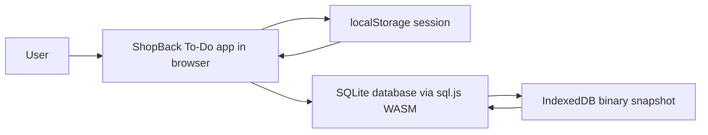

# 01 — Project Scope

This document defines the scope of the To-Do List web app built for the ShopBack engineering assessment: what the app does, what it deliberately does not do, the fixed technology stack, the assumptions the design rests on, and the definition of done. The companion documents specify the use cases (02), the domain model (03), the component architecture (04), the runtime interactions (05), and the test plan (06).

## 1. Overview

A single-page, frontend-only To-Do List application with user accounts, gamification, and a calendar — still with **no backend**. Each user signs up with a username, password, and ShopBack department; passwords are hashed with PBKDF2-SHA256 via the Web Crypto API. All data lives in a real SQLite database running **in the browser** through sql.js, a WebAssembly build of SQLite; after every mutation the whole database is exported as a binary snapshot into IndexedDB and reloaded on startup. The active session is kept in `localStorage` so a logged-in user is restored on reload.

Beyond the core task lifecycle, the app awards XP for completing tasks, ranks all users on a leaderboard, shows a capybara mascot named Kapi whose stress level tracks the user's task load, renders due dates in both the task list and a month calendar, and walks first-time users through a four-step onboarding tour. After login the app has three main tabs: **Tasks**, **Calendar**, and **Leaderboard**.

The project is built AI-assisted, with these specification documents written before implementation and committed alongside the code.

## 2. Goals

- Deliver a working, polished task manager covering the full task lifecycle: add, edit, complete, delete — now per user account, with optional due dates.
- Persist state transparently — the user never saves manually; tasks, accounts, and XP survive a page refresh via the SQLite snapshot in IndexedDB.
- Make the app fun and demonstrably evaluable: XP with levels and titles, a populated leaderboard, a reactive mascot, and a one-click demo account for evaluators.
- Degrade gracefully: a failed or corrupted database snapshot never crashes the app; the user is told what happened and gets a fresh database.
- Demonstrate engineering discipline: a strictly layered architecture with a pure domain core, real SQL storage behind repositories, exhaustive edge-case handling, and a three-level test suite with full use-case traceability.

## 3. In scope

### Core task management

| Feature | Use case |
| --- | --- |
| Add a task with a validated title and an optional due date | UC-01 Add task |
| Edit a task's title inline, with Save / Cancel, and edit its due date | UC-02 Edit task title |
| Delete a task immediately | UC-03 Delete task |
| Mark a task complete or incomplete via checkbox, awarding XP per UC-10 rules | UC-04 Mark task complete / incomplete |
| Auto-save every change as a SQLite snapshot in IndexedDB; restore on startup | UC-05 Persist and restore tasks |
| Filter the list by All / Active / Completed, with an items-left counter | UC-06 Filter tasks |
| Remove all completed tasks in one action | UC-07 Clear completed tasks |

### Accounts and gamification

| Feature | Use case |
| --- | --- |
| Sign up with username, password, and ShopBack department; one-time import of legacy v1 localStorage tasks | UC-08 Sign up for an account |
| Log in, log out, session restore on reload, and a one-click demo account for evaluators | UC-09 Log in and log out |
| Earn 10 XP per completed task, a 5 XP on-time bonus, one level per 50 XP with themed titles | UC-10 Earn XP and level up |
| Rank all users by XP with competition ranking, department, level title, and current-user highlight | UC-11 View the leaderboard |
| Assign due dates, see due badges in the list, and browse a Monday-start month calendar with task chips | UC-12 Assign due dates and view the calendar |
| Kapi the capybara mascot with a cortisol bar reacting to active and overdue task load | UC-13 Mascot reacts to task load |
| Four-step tour on first login per account, reopenable from a header help button | UC-14 First-time onboarding tour |

The full actor model, flows, and error states for each use case are specified in `02-use-cases.md`.

### Quality scope

- **Validation.** Task titles are trimmed; empty or whitespace-only titles are rejected with the inline error "Task cannot be empty"; titles longer than 200 characters are rejected, and the input enforces `maxLength` as a first line of defense. Usernames must be 3–20 alphanumeric characters, passwords at least 8 characters, and the department must come from the fixed `DEPARTMENTS` list.
- **Resilience.** If the stored snapshot is corrupted, the app boots a fresh database, re-seeds the demo users, and shows a recovery notice; if the database cannot be created at all — IndexedDB unavailable or the sql.js WASM binary failing to load — a database boot error screen is rendered instead of the app. It never crashes or silently discards the failure. The v1 `StorageWarning` banner is retired in favor of this database boot error handling.
- **XP integrity.** XP is awarded exactly once per task via an `xpAwarded` flag, so un-ticking and re-ticking a task cannot farm XP; un-completing a task does not remove XP already earned.
- **Empty states.** An empty task list renders a dedicated empty-state view whose message varies with the active filter, so an empty view never looks broken. The leaderboard can never be empty because the database is seeded with demo colleagues.
- **UI.** Clean and minimal: light theme, a single ShopBack-style red-orange accent color (design token `brand`, replacing the v1 indigo), card-style task list, mobile responsive, no heavy animation. The UI labels seeded leaderboard entries as demo colleagues.

## 4. Out of scope

| Excluded | Rationale |
| --- | --- |
| Backend or server-side API | The app is deliberately frontend-only; SQLite runs in the browser via sql.js |
| Cross-device or cross-browser accounts and sync | Accounts are local to the device and browser profile; real cross-device login would need a backend |
| Production-grade security | Passwords are properly hashed with PBKDF2, but all data lives client-side; this is demo-grade auth suitable for an assessment |
| Password reset, email verification, profile editing | Beyond the assessment's needs; the demo account covers evaluator access |
| Priorities, tags, subtasks, reordering, recurring tasks | Beyond the feature set; the data model leaves room for them |
| Undo / confirmation dialogs for delete | Delete is immediate by design; undo is explicitly out of scope |
| Persisting the active filter or selected tab | These are ephemeral view state; every visit starts on Tasks with the All filter |
| Notifications or reminders for due dates | Due dates drive badges, the calendar, and the on-time XP bonus only |

## 5. Technology stack — fixed

| Concern | Choice |
| --- | --- |
| Language | TypeScript |
| UI framework | React 19 |
| Build tool | Vite |
| Styling | Tailwind CSS v4 |
| Database | SQLite in the browser via sql.js, a WebAssembly build of SQLite |
| Durable persistence | Binary database snapshot exported to IndexedDB after every mutation, loaded on startup |
| Session persistence | Browser localStorage, key `shopback-todo.session.v1` |
| Password hashing | Web Crypto PBKDF2-SHA256, 100000 iterations, per-user salt |
| Unit / integration tests | Vitest + React Testing Library, with fake-indexeddb and an in-memory storage adapter |
| End-to-end tests | Playwright, chromium |
| Deployment | Vercel |

The architecture is layered strictly one way: **components → hooks/context → services → pure domain + repositories → sql.js database → IndexedDB snapshot** (detailed in `03-domain-model.md` and `04-component-architecture.md`). The legacy v1 localStorage key `shopback-todo.v1` is read exactly once — during signup, to import any pre-account tasks — and then removed.

## 6. Assumptions and design decisions

| # | Decision | Consequence |
| --- | --- | --- |
| D1 | Duplicate task titles are allowed | No uniqueness check on titles; each task is identified by a generated `id` |
| D2 | Delete is immediate, no confirmation dialog | One click removes the task; undo is out of scope |
| D3 | Newest task appears on top | New tasks are prepended; nothing re-sorts the list |
| D4 | Max title length is 200 characters | Enforced by validation and by the input's `maxLength` |
| D5 | Editing to an empty title is rejected in place | The task keeps its old title until a valid save; Escape or Cancel discards the edit |
| D6 | Accounts are local to the device and browser profile | No cross-device login; this is a documented assumption — a real one would need a backend, which is out of scope |
| D7 | Auth is demo-grade, suitable for an assessment | Passwords are PBKDF2-hashed and never stored in plain text, but the database itself lives client-side and is inspectable by the device owner |
| D8 | A demo account exists with username `demo` and password `demo1234` | Evaluators log in with one click; the demo account behaves like any other account |
| D9 | The database is seeded with 7 demo colleagues across departments | The leaderboard is populated from the first launch; the UI notes they are demo colleagues |
| D10 | XP is awarded once per task and never revoked | The `xpAwarded` flag prevents farming; un-completing keeps earned XP |
| D11 | Due dates are optional and past dates are allowed | Overdue tasks are a supported state, driving the red Overdue badge and the mascot's cortisol |
| D12 | Legacy v1 tasks are imported once at signup | Existing localStorage tasks join the new account; the legacy key is then removed so import cannot repeat |
| D13 | Single active user per tab, last-write-wins within a session | No concurrency handling across tabs; the snapshot written last wins |

## 7. Edge cases and failure handling

| Edge case | Behavior |
| --- | --- |
| Empty or whitespace-only task title | Rejected inline with "Task cannot be empty"; nothing is added or saved |
| Title over 200 characters | Rejected by validation; the input's `maxLength` prevents most occurrences |
| Duplicate username at signup | Signup is rejected with an inline error; the existing account is untouched |
| Wrong password at login | Login is rejected with a generic invalid-credentials error; no account details are leaked |
| Password shorter than 8 characters at signup | Rejected by validation before any hashing occurs |
| Re-ticking a completed task to farm XP | Blocked by the `xpAwarded` flag; XP for a task is awarded at most once |
| Task with a due date before the start of today | Shown with a red Overdue badge; counts double weight toward the mascot's cortisol |
| Task completed on or before the end of its due date | Earns the 5 XP on-time bonus in addition to the base 10 XP |
| Leaderboard with no users | Impossible by construction — the seeded demo colleagues guarantee a populated board |
| Database snapshot is corrupted | The app starts a fresh seeded database and shows a recovery notice; it never crashes |
| IndexedDB unavailable or the sql.js WASM binary fails to load at boot | A database boot error screen is rendered instead of the app |
| Legacy v1 tasks present at signup | Imported into the new account exactly once; the legacy localStorage key is removed |
| Session in localStorage references a missing user | The session is cleared and the user is returned to the auth page |

## 8. Definition of done

- All unit, integration, and end-to-end tests pass (`06-test-plan.md`).
- ESLint passes with no errors.
- The TypeScript check and Vite production build pass with no errors.
- Tasks and accounts survive a page reload, verified by the Playwright suite.
- XP cannot be farmed by re-completing a task, verified by tests.
- The app is deployed on Vercel.
- Screenshots of the running app are captured.

## 9. Document map

| Document | Contents |
| --- | --- |
| `01-scope.md` | This document — scope, stack, assumptions, edge cases, definition of done |
| `02-use-cases.md` | Actors, use case diagram, full flows and error states for UC-01 – UC-14 |
| `03-domain-model.md` | `Todo` and user entities, domain modules for todos, XP, mascot, and calendar, repositories, services |
| `04-component-architecture.md` | Layers, component contracts, data flow, file structure |
| `05-sequence-diagrams.md` | Runtime interaction diagrams per use case |
| `06-test-plan.md` | Test strategy, all UT / IT / E2E cases, traceability matrix |
