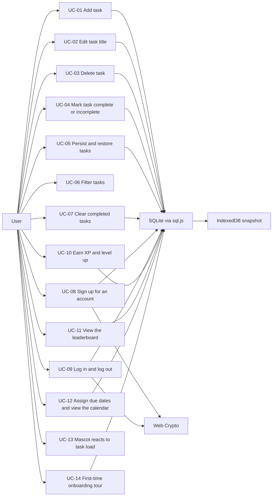

# 02 - Use Case Specifications

This document specifies the full use case model for the ShopBack To-Do app. Every flow is written against the canonical architecture: **UI components → hooks/context (`src/app/AppContext.tsx`, `src/hooks/useTodos.ts`) → services (`src/services/authService.ts`, `src/services/todoService.ts`) → pure domain modules (`src/domain/todo.ts`, `src/domain/xp.ts`, `src/domain/mascot.ts`, `src/domain/calendar.ts`) + repositories (`src/storage/userRepository.ts`, `src/storage/todoSqlRepository.ts`) → sql.js SQLite database (`src/db/database.ts`) → IndexedDB binary snapshot**.

The app is still **frontend-only**. SQLite runs in the browser via **sql.js** (a WebAssembly build of SQLite); after every mutation the whole database is exported as a binary snapshot and persisted into **IndexedDB**, and the snapshot is loaded on startup. Passwords are hashed with **PBKDF2-SHA256** (100,000 iterations, per-user salt) via the **Web Crypto** API. The login session is kept in `localStorage` under `shopback-todo.session.v1` and restored on load.

> **Documented assumption:** accounts are **local to the device and browser**. Signing up on one machine does not make the account exist on another - a real cross-device login would require a backend, which is out of scope for this assessment.

## Actors

| Actor | Type | Description |
| --- | --- | --- |
| User | Primary (human) | The person managing their task list, earning XP, and viewing the leaderboard in the browser. |
| SQLite database via sql.js | Secondary (system) | In-browser relational store holding `users`, `todos`, and `meta` tables. Accessed exclusively through the repositories. |
| IndexedDB | Secondary (system) | Durable home of the exported SQLite binary snapshot, written by `AppDatabase.persist` after every mutation and read on startup. |
| Web Crypto | Secondary (system) | Provides PBKDF2-SHA256 key derivation and random salt generation for `src/auth/password.ts`. |
| Browser localStorage | Secondary (system) | Holds only the session record (`shopback-todo.session.v1`) and, transiently, the legacy v1 task key (`shopback-todo.v1`) consumed during signup import. |

## Use case summary

| ID | Name | Priority | Primary actor | Secondary actors | Touches storage |
| --- | --- | --- | --- | --- | --- |
| UC-01 | Add task | Must-have | User | SQLite via sql.js, IndexedDB | Yes - insert + snapshot |
| UC-02 | Edit task title | Must-have | User | SQLite via sql.js, IndexedDB | Yes - update + snapshot |
| UC-03 | Delete task | Must-have | User | SQLite via sql.js, IndexedDB | Yes - delete + snapshot |
| UC-04 | Mark task complete / incomplete | Must-have | User | SQLite via sql.js, IndexedDB | Yes - update, possible XP write, + snapshot |
| UC-05 | Persist and restore tasks | Must-have | User | SQLite via sql.js, IndexedDB | Yes - snapshot load + save |
| UC-06 | Filter tasks | Nice-to-have, implemented | User | - | No - view-only |
| UC-07 | Clear completed tasks | Nice-to-have, implemented | User | SQLite via sql.js, IndexedDB | Yes - bulk delete + snapshot |
| UC-08 | Sign up for an account | Must-have | User | SQLite via sql.js, IndexedDB, Web Crypto, localStorage | Yes - insert user, legacy import, + snapshot |
| UC-09 | Log in and log out | Must-have | User | SQLite via sql.js, Web Crypto, localStorage | Yes - session read/write |
| UC-10 | Earn XP and level up | Must-have | User | SQLite via sql.js, IndexedDB | Yes - XP update + snapshot |
| UC-11 | View the leaderboard | Must-have | User | SQLite via sql.js | Yes - read-only query |
| UC-12 | Assign due dates and view the calendar | Must-have | User | SQLite via sql.js, IndexedDB | Yes - due date writes; calendar is read-only |
| UC-13 | Mascot reacts to task load | Nice-to-have, implemented | User | - | No - pure derivation from loaded tasks |
| UC-14 | First-time onboarding tour | Nice-to-have, implemented | User | SQLite via sql.js, IndexedDB | Yes - onboarding flag + snapshot |

Notes on the diagram: UC-06 and UC-13 have no storage edge - filtering and the mascot are pure, ephemeral derivations over already-loaded state. All database edges reach IndexedDB through the single `AppDatabase.persist` snapshot path; no use case writes to IndexedDB directly.

---

## UC-01 - Add task

| Field | Value |
| --- | --- |
| Use case ID | UC-01 |
| Name | Add task |
| Primary actor | User |
| Secondary actors | SQLite via sql.js, IndexedDB |
| Trigger | User submits the `AddTodoForm` - presses Enter in the title input or clicks the Add button, optionally after picking a due date. |
| Preconditions | User is logged in; `AppProvider` has booted the database and the Tasks tab is active. |
| Postconditions | A new `Todo` row with `completed: false`, `xpAwarded: false`, and the chosen `dueDate` (or `null`) exists for the current user; the database snapshot has been re-persisted to IndexedDB. |

**Main flow**

1. User types a title into the `AddTodoForm` input (the input enforces `maxLength={MAX_TITLE_LENGTH}` as a first line of defense) and optionally selects a due date in the form's due date input. Past dates are allowed.
2. User submits via Enter or the Add button.
3. `AddTodoForm` hands the submission to the `useTodos` hook, which calls `todoService.addTask` with the current user's id, the raw title, and the optional due date.
4. `addTask` calls `validateTitle(raw)`, which trims the input and checks for emptiness and the 200-character limit.
5. Validation returns `{ ok: true, value }`; the service generates a unique `id` and a `createdAt` timestamp, then builds the todo via `createTodo(value, id, createdAt, dueDate)` - `dueDate` is normalized via `startOfDay` and stored as a timestamp, or `null` when omitted.
6. The service inserts the row through `todoSqlRepository.insert` under the current `user_id`; the list ordering remains newest first.
7. The service awaits `adb.persist`, which exports the SQLite database to a binary snapshot and writes it into IndexedDB.
8. `addTask` resolves without an error; `AddTodoForm` clears its inputs and any previous inline error.
9. React re-renders: `TodoList` shows the new task at the top as an unchecked `TodoItem` - with a due badge from `dueBadge` when a due date was set - the `FilterBar` counter ("N items left", via `activeCount`) increments, and Kapi's cortisol bar rises by 8 points for the new active task (UC-13).

**Alternative flows**

- **A1 - Leading/trailing whitespace.** `validateTitle` trims the input; the stored title is the trimmed value.
- **A2 - Duplicate title.** Allowed by design. The task is added as a distinct row with its own `id` and `createdAt`.
- **A3 - Active filter is "Completed".** The task is still added and persisted, but `filterTodos` excludes it from the visible list because it is active. The "N items left" counter still increments, signalling success.
- **A4 - No due date chosen.** `dueDate` is `null`; the task renders with no due badge and never appears on the calendar or in the overdue count.
- **A5 - Past due date chosen.** Permitted (e.g. backfilling an already-late task). The task is immediately overdue: its badge reads **Overdue** in red and it contributes 12 points to cortisol instead of 8.

**Error states**

- **E1 - Empty or whitespace-only title.** `validateTitle` returns `{ ok: false, error: "Task cannot be empty" }`; `addTask` returns that message; `AddTodoForm` renders it as an inline error below the input. No database write, no snapshot; the input retains its content.
- **E2 - Title longer than 200 characters.** The input's `maxLength` normally prevents this; if an over-length value reaches `addTask` (e.g. programmatic paste), `validateTitle` rejects it and an inline length error is shown. No state change.
- **E3 - Snapshot persistence failure.** The IndexedDB write inside `persist` rejects (storage unavailable or quota exceeded); the app surfaces a database error notice. The row remains in the in-memory SQLite database, so the task works for the rest of the session; only durability is lost until a later persist succeeds.

**Success state**

The new task is visible at the top of the list, unchecked, showing its due badge if a due date was set; the counter reflects one more active item; the input is empty and focused for the next entry; the IndexedDB snapshot contains the new row, so the task survives a page refresh.

---

## UC-02 - Edit task title

| Field | Value |
| --- | --- |
| Use case ID | UC-02 |
| Name | Edit task title (and due date) |
| Primary actor | User |
| Secondary actors | SQLite via sql.js, IndexedDB |
| Trigger | User activates inline edit mode on a `TodoItem`. |
| Preconditions | User is logged in; at least one of their tasks exists and is visible under the current filter. |
| Postconditions | The targeted todo's `title` (and/or `dueDate`) is updated with all other fields unchanged, and the snapshot is re-persisted - or the edit was discarded and nothing changed. |

**Main flow**

1. User activates edit mode on a `TodoItem`; the static title is replaced by an inline text input pre-filled with the current title (with `maxLength={MAX_TITLE_LENGTH}`) alongside a due date input pre-filled with the current due date, if any.
2. User modifies the text and/or the due date and confirms via Enter or the Save action.
3. `TodoItem` submits through the `useTodos` hook, which calls `todoService.editTask` with the todo id, the new title, and the new due date value.
4. The service calls `validateTitle(newTitle)`; it returns `{ ok: true, value }` with the trimmed title.
5. The service applies the change through `todoSqlRepository.updateTitle` and, when the due date changed, `todoSqlRepository.updateDueDate` - only the matching row is touched; `completed`, `createdAt`, and `xpAwarded` are untouched.
6. The service awaits `adb.persist`, snapshotting the database to IndexedDB.
7. `editTask` resolves without an error; `TodoItem` exits edit mode and renders the updated title and due badge.

**Alternative flows**

- **A1 - Cancel via Escape or the Cancel action.** Edit mode closes and the draft is discarded. `editTask` is never called; the task keeps its old title and due date; no write, no snapshot.
- **A2 - Saved values equal the old values.** The flow completes normally; the update is idempotent and the snapshot is re-persisted. No special handling is required.
- **A3 - Editing a completed task.** Permitted. Only `title`/`dueDate` change; `completed`, `createdAt`, and `xpAwarded` are untouched - so editing can never re-arm XP (UC-10).
- **A4 - Whitespace padding.** The trimmed value is what gets saved and displayed.
- **A5 - Due date added, changed, or removed.** Clearing the due date input stores `null` and removes the badge; setting a past date makes the task immediately overdue (badge and cortisol update on the next render); moving a date changes which calendar cell shows the task's chip (UC-12).

**Error states**

- **E1 - Cleared to empty or whitespace-only.** `editTask` returns "Task cannot be empty"; `TodoItem` shows the inline error and **stays in edit mode**. The underlying todo keeps its old values until the user either saves a valid title or cancels.
- **E2 - Over-length title.** Rejected by `validateTitle` with an inline length error; edit mode persists; no state change.
- **E3 - Snapshot persistence failure.** As UC-01 E3: the edit applies in the in-memory database, the IndexedDB write fails, and the database error notice appears.

**Success state**

The task displays its new trimmed title and due badge in place, with its completion state, XP flag, and list position unchanged; the updated row is in the IndexedDB snapshot and survives a page refresh.

---

## UC-03 - Delete task

| Field | Value |
| --- | --- |
| Use case ID | UC-03 |
| Name | Delete task |
| Primary actor | User |
| Secondary actors | SQLite via sql.js, IndexedDB |
| Trigger | User clicks the Delete button on a `TodoItem`. |
| Preconditions | User is logged in; at least one of their tasks exists and is visible under the current filter. |
| Postconditions | The targeted todo row no longer exists in the database or the snapshot. |

**Main flow**

1. User clicks the Delete button on a `TodoItem`.
2. `TodoItem` invokes the `useTodos` delete action, which calls `todoService.deleteTask` with the todo id. Deletion is immediate - by design there is no confirmation dialog (undo is out of scope).
3. The service removes the row via `todoSqlRepository.remove` and awaits `adb.persist`.
4. React re-renders: the item disappears from `TodoList`; if the deleted task was active, the "N items left" counter decrements and cortisol drops (UC-13); if it had a due date, its chip disappears from the calendar (UC-12).

**Alternative flows**

- **A1 - Last visible task under the current filter is deleted.** `TodoList` gives way to `EmptyState`, whose message matches the active filter.
- **A2 - Last task overall is deleted.** The list is empty; `EmptyState` renders, the counter reads "0 items left", and Kapi reaches cortisol 0 - the zen mood.
- **A3 - Deleting a completed task.** The counter is unchanged (it counts active tasks only); if the Clear completed control was enabled solely because of this task, it becomes inactive. **Any XP the task already awarded is kept** - deletion never claws back XP (UC-10).

**Error states**

- **E1 - Stale id (e.g. rapid double-click).** The SQL `DELETE` matches no row on the second call; the operation is a harmless no-op. No crash, no visible effect.
- **E2 - Snapshot persistence failure.** The deletion applies in the in-memory database; the IndexedDB write fails and the database error notice appears.

**Success state**

The task is gone from the visible list, the calendar, and the database; the counter and cortisol level are correct; the IndexedDB snapshot no longer contains the row, so it does not reappear after a page refresh.

---

## UC-04 - Mark task complete / incomplete

| Field | Value |
| --- | --- |
| Use case ID | UC-04 |
| Name | Mark task complete / incomplete |
| Primary actor | User |
| Secondary actors | SQLite via sql.js, IndexedDB |
| Trigger | User clicks the checkbox on a `TodoItem`. |
| Preconditions | User is logged in; at least one of their tasks exists and is visible under the current filter. |
| Postconditions | The targeted todo's `completed` flag is inverted; if XP was earned, the user's `xp` and the todo's `xpAwarded` flag are updated (UC-10); the snapshot is re-persisted. |

**Main flow**

1. User clicks the checkbox of an active task.
2. `TodoItem` invokes the `useTodos` toggle action, which calls `todoService.toggleTask` with the todo id.
3. The service flips the flag via `todoSqlRepository.setCompleted`.
4. Because the task is transitioning to completed and its `xpAwarded` flag is `false`, the service applies the UC-10 rules: it computes `completionXp(todo, completedAt)` - 10 XP, plus a 5 XP on-time bonus when the task has a due date and `completedAt` is on or before the end of that day - then credits the user via `userRepository.addXp` and sets the flag via `todoSqlRepository.markXpAwarded`.
5. The service awaits `adb.persist` and **returns the `xpGained` amount** to the UI.
6. React re-renders: the item shows its completed styling (checked box, struck-through title, dimmed calendar chip), the counter decrements, the user chip in the `Shell` header shows the new XP total and possibly a new level title, and cortisol drops (UC-13).

**Alternative flows**

- **A1 - Un-completing.** Clicking the checkbox of a completed task flips `completed` back to `false`; styling reverts and the counter increments. **XP is not removed** and `xpAwarded` stays `true` - `toggleTask` returns `xpGained: 0`.
- **A2 - Re-completing a task that already awarded XP.** `xpAwarded` is `true`, so step 4 is skipped entirely and `xpGained` is 0. Un-ticking and re-ticking can never farm XP.
- **A3 - Toggling under the "Active" filter.** Completing a task removes it from the visible list on the next render, because `filterTodos` with `'active'` excludes it. Symmetrically, un-completing under "Completed" removes it from that view.
- **A4 - Last active task completed.** The counter reads "0 items left"; under the "Active" filter, `EmptyState` renders with its filter-specific message; Kapi reaches the zen mood.
- **A5 - Completing an overdue task or a task with no due date.** Base 10 XP only - the on-time bonus requires a due date met on or before the end of that day.

**Error states**

- **E1 - Stale id.** The SQL `UPDATE` matches no row; the operation is a harmless no-op. No crash, no visible effect.
- **E2 - Snapshot persistence failure.** The toggle (and any XP credit) applies in the in-memory database; the IndexedDB write fails and the database error notice appears. Completion state and XP stay consistent with each other because both were written before the single persist call.

**Success state**

The task visibly reflects its new completion state, the counter is accurate, any earned XP is reflected in the header chip and the leaderboard, and the flipped `completed` flag plus XP bookkeeping are in the IndexedDB snapshot - after a refresh the task and the XP total are restored intact.

---

## UC-05 - Persist and restore tasks

| Field | Value |
| --- | --- |
| Use case ID | UC-05 |
| Name | Persist and restore tasks |
| Primary actor | User |
| Secondary actors | SQLite via sql.js, IndexedDB |
| Trigger | Restore: user opens or reloads the app. Persist: any database mutation (UC-01 through UC-04, UC-07, UC-08, UC-10, UC-14). |
| Preconditions | The app is served in a browser context; IndexedDB may or may not be available. |
| Postconditions | The in-memory SQLite database and the IndexedDB snapshot are consistent, or the user has been shown a database boot error explaining why not. |

**Main flow**

1. User navigates to the app (or reloads the page).
2. `AppProvider` calls `createAppDatabase`, injecting the sql.js `wasmBinary` and the IndexedDB storage adapter (tests inject the in-memory adapter instead).
3. The adapter reads the stored binary snapshot from IndexedDB; sql.js instantiates the database from those bytes.
4. `createAppDatabase` runs migrations, comparing the schema version in the `meta` table against the current version and applying any pending steps.
5. `AppProvider` restores the session (UC-09) and, for a logged-in user, the `useTodos` hook loads their tasks via `todoSqlRepository.listByUser`; the UI renders the restored list in its stored order (newest first) with completion states, due dates, and XP flags intact.
6. From then on, every mutation flows through a service that ends by awaiting `adb.persist`: the database is exported with `db.export` to a binary snapshot and written into IndexedDB, replacing the previous snapshot atomically.

**Alternative flows**

- **A1 - First visit, no snapshot.** The adapter finds no stored snapshot; `createAppDatabase` creates a fresh database, runs all migrations, and **seeds the demo users** - the `demo` account and 7 demo colleagues across departments (flagged `is_demo`) so the leaderboard is populated from day one. The app shows the `AuthPage`.
- **A2 - Snapshot exists but no valid session.** The database loads with all accounts and tasks intact; the user lands on `AuthPage` and their data reappears after login.
- **A3 - Reload mid-session.** Snapshot and session both restore; the user returns directly to the Tasks tab with their list, XP, and onboarding state exactly as left.

**Error states**

- **E1 - Corrupted snapshot.** sql.js fails to instantiate from the stored bytes; `createAppDatabase` discards them, creates a fresh database, runs all migrations, and reseeds as in A1, flagging that recovery happened. The app shows a **recovery notice** explaining that saved data could not be read (the v1 `StorageWarning` banner is retired in favor of this database error handling); the next successful `persist` overwrites the corrupt snapshot with a valid one.
- **E2 - IndexedDB unavailable.** Opening IndexedDB throws or rejects (e.g. privacy mode); `createAppDatabase` rejects with a typed boot error and the app renders the **database boot error screen** instead of the app - no database is available, so the app does not proceed.
- **E3 - WASM load failure.** The sql.js WebAssembly binary fails to initialize; the boot error screen is shown, since no database can exist without it.
- **E4 - Quota exceeded on persist.** A later `persist` call rejects; the mutation that triggered it remains applied in memory and the database error notice appears, as in UC-01 E3.

**Success state**

After any sequence of signup, login, task, XP, and onboarding operations followed by a full page reload, the restored state is equivalent to the pre-reload state: same accounts, same tasks with titles, order, completion states, due dates, and XP flags, same XP totals and leaderboard, same onboarding flags. This round-trip is verified by the Playwright e2e suite against real IndexedDB.

---

## UC-06 - Filter tasks

| Field | Value |
| --- | --- |
| Use case ID | UC-06 |
| Name | Filter tasks |
| Primary actor | User |
| Secondary actors | None - no storage involvement |
| Trigger | User clicks the All, Active, or Completed tab in `FilterBar`. |
| Preconditions | User is logged in and on the Tasks tab. (Meaningful with any list, including an empty one.) |
| Postconditions | The `filter` state holds the selected value; the tasks and the database are unchanged. |

**Main flow**

1. User clicks a filter tab (e.g. **Active**) in `FilterBar`.
2. `FilterBar` updates the filter state held in the `useTodos` hook; the loaded todos are untouched.
3. `TodosView` derives the visible list via `filterTodos(todos, filter)` and passes it to `TodoList`.
4. React re-renders: only matching tasks are shown, the selected tab is visually highlighted, and the "N items left" counter is unchanged - it always reports `activeCount(todos)` over the full list, independent of the filter.

**Alternative flows**

- **A1 - Filter result is empty.** `EmptyState` renders with a message specific to the active filter (e.g. no active tasks vs. no completed tasks vs. no tasks at all), so an empty view never looks broken.
- **A2 - Mutations while filtered.** Adds, toggles, edits, and deletes performed under a filter operate on the full list; the visible subset is re-derived on each render (see UC-01 A3 and UC-04 A3).
- **A3 - Page reload or tab switch.** The filter is ephemeral UI state and is not persisted; after a reload - or after leaving for the Calendar or Leaderboard tab and returning - the Tasks view starts at the default **All** filter while the tasks themselves are restored per UC-05.

**Error states**

- None. Filtering is a pure, synchronous view derivation via `filterTodos`; it performs no validation and no storage I/O, so it has no failure modes.

**Success state**

The chosen tab is highlighted and exactly the matching subset is visible: All shows every task, Active shows `completed: false`, Completed shows `completed: true`. The underlying data - in the SQLite database and the IndexedDB snapshot - is unchanged.

---

## UC-07 - Clear completed tasks

| Field | Value |
| --- | --- |
| Use case ID | UC-07 |
| Name | Clear completed tasks |
| Primary actor | User |
| Secondary actors | SQLite via sql.js, IndexedDB |
| Trigger | User clicks the Clear completed button in `FilterBar`. |
| Preconditions | User is logged in; at least one of their tasks is marked completed (the button is disabled or hidden otherwise). |
| Postconditions | No todo with `completed: true` remains for the user in the database or the snapshot; active tasks are untouched and keep their order; the user's XP total is untouched. |

**Main flow**

1. User clicks **Clear completed** in `FilterBar`.
2. `FilterBar` invokes the `useTodos` clear action, which calls `todoService.clearCompletedTasks`. The bulk removal is immediate - consistent with UC-03, there is no confirmation dialog and no undo.
3. The service removes all of the user's completed rows via `todoSqlRepository.clearCompleted` and awaits `adb.persist`.
4. React re-renders: all completed items disappear from `TodoList` and their chips from the calendar; the "N items left" counter is unchanged since only completed tasks were removed; the Clear completed control becomes inactive; cortisol is unchanged because completed tasks never contributed to it.

**Alternative flows**

- **A1 - Every task was completed.** The list becomes empty and `EmptyState` renders; the counter reads "0 items left"; Kapi is already at zen since no active tasks remained.
- **A2 - Performed under the "Completed" filter.** The visible list empties and `EmptyState` shows the completed-filter message; switching to All or Active shows the surviving active tasks.
- **A3 - No completed tasks exist.** Not reachable through the UI (control disabled/hidden); if invoked anyway, the `DELETE` matches no rows and the operation is a harmless no-op.

**Error states**

- **E1 - Snapshot persistence failure.** The removal applies in the in-memory database; the IndexedDB write fails and the database error notice appears.

**Success state**

Only active tasks remain, in their original relative order; the counter is unchanged; **XP earned from the cleared tasks is retained** (UC-10 - XP is never removed); the IndexedDB snapshot holds the pruned table, so the cleared tasks do not reappear after a page refresh.

---

## UC-08 - Sign up for an account

| Field | Value |
| --- | --- |
| Use case ID | UC-08 |
| Name | Sign up for an account |
| Primary actor | User |
| Secondary actors | SQLite via sql.js, IndexedDB, Web Crypto, Browser localStorage |
| Trigger | User submits the `SignupForm` on the `AuthPage` with a username, password, and ShopBack department. |
| Preconditions | The database has booted (UC-05); no session is active. |
| Postconditions | A new `users` row exists with a PBKDF2 hash and per-user salt; any legacy v1 tasks have been imported once and the legacy key removed; a session is saved; the snapshot is re-persisted; the onboarding tour is queued (UC-14). |

**Main flow**

1. User opens the Sign up form on `AuthPage` and enters a username, a password, and picks a department from the `DEPARTMENTS` list - Engineering, Product, Design, Marketing, Operations, Finance, People and Culture.
2. User submits; `SignupForm` calls `authService.signup`.
3. The service validates: username is 3–20 characters, alphanumeric; password is at least 8 characters; department is one of `DEPARTMENTS`.
4. The service checks uniqueness via `userRepository.findByUsername` - no existing row matches.
5. `hashPassword` (in `src/auth/password.ts`) generates a random per-user salt via Web Crypto and derives a PBKDF2-SHA256 hash with 100,000 iterations. The plaintext password is never stored.
6. The service inserts the user via `userRepository.insertUser` with `xp: 0`, `has_seen_onboarding: 0`, `is_demo: 0`.
7. **Legacy import:** if the v1 key `shopback-todo.v1` exists in `localStorage`, its tasks are validated, inserted into the new account's `todos` (each imported task carries `dueDate: null` and `xpAwarded: false`), and the legacy key is removed - the import happens at most once, for the first account created on the device.
8. The service awaits `adb.persist` and saves the session via `saveSession` under `shopback-todo.session.v1`.
9. The user lands in the `Shell` on the Tasks tab; because `has_seen_onboarding` is 0, the onboarding tour opens (UC-14). Any imported legacy tasks are already in the list.

**Alternative flows**

- **A1 - No legacy data.** Step 7 finds no `shopback-todo.v1` key; signup proceeds without an import.
- **A2 - Second account on the same device.** The legacy key was already consumed and removed by the first signup, so later signups start with an empty list. Accounts are fully isolated: each user sees only their own tasks via `listByUser`.
- **A3 - Corrupt legacy payload.** The v1 data fails validation; the import is skipped silently, the legacy key is still removed, and signup completes normally with an empty list.

**Error states**

- **E1 - Invalid username.** Fewer than 3 or more than 20 characters, or non-alphanumeric: the form shows an inline error naming the rule; no write occurs.
- **E2 - Username taken.** `findByUsername` matches (including `demo` and the seeded colleagues); the form shows a "username is taken" error; no write occurs.
- **E3 - Password too short.** Under 8 characters: inline error; no write occurs.
- **E4 - Snapshot persistence failure.** The account exists in the in-memory database and the session is saved, so the user proceeds; the database error notice appears and the account will not survive a reload until a later persist succeeds.

**Success state**

The user is logged into their new account: the header chip shows their username, **Window Shopper** title, and 0 XP; imported legacy tasks, if any, are in the list; the legacy localStorage key is gone; the onboarding tour is open; the account and tasks are in the IndexedDB snapshot and survive a reload on this device.

---

## UC-09 - Log in and log out

| Field | Value |
| --- | --- |
| Use case ID | UC-09 |
| Name | Log in and log out |
| Primary actor | User |
| Secondary actors | SQLite via sql.js, Web Crypto, Browser localStorage |
| Trigger | Log in: user submits `LoginForm` or clicks the one-click demo button. Log out: user clicks Logout in the `Shell` header. Restore: app load with a saved session. |
| Preconditions | The database has booted (UC-05). Log in: the account exists on this device. |
| Postconditions | Log in: a session for the user is stored under `shopback-todo.session.v1` and the `Shell` renders. Log out: the session key is cleared and `AuthPage` renders. |

**Main flow - log in**

1. User enters their username and password in `LoginForm` and submits.
2. `authService.login` looks up the account via `userRepository.findByUsername`.
3. `verifyPassword` re-derives the PBKDF2-SHA256 hash from the entered password and the stored per-user salt (100,000 iterations) and compares it to the stored hash.
4. On a match, the service saves the session via `saveSession` (key `shopback-todo.session.v1`).
5. `AppProvider` sets the current user; the `Shell` renders with the Tasks, Calendar, and Leaderboard tabs, the user chip showing username, level title, and XP, the help button, and Logout. The user's tasks load via `listByUser`.

**Main flow - log out**

1. User clicks **Logout** in the `Shell` header.
2. `AppProvider` calls `clearSession`, removing `shopback-todo.session.v1`, and clears the in-memory user.
3. `AuthPage` renders. The database and snapshot are untouched - all accounts and tasks remain for the next login.

**Alternative flows**

- **A1 - One-click demo login.** The evaluator clicks the demo button on `AuthPage`; `authService` logs into the seeded **demo / demo1234** account through the same verification path. No typing required.
- **A2 - Session restore on load.** On startup, `AppProvider` calls `getSession`; a stored session's user id is resolved via `userRepository.findById` and the user is logged in without re-entering credentials - this is how a reload returns the user straight to their tasks (UC-05 A3).
- **A3 - Stale session.** `getSession` returns an id that `findById` cannot resolve (e.g. the database was reset). The session is cleared and `AuthPage` renders; no error is shown because this is a recoverable state.

**Error states**

- **E1 - Unknown username.** `findByUsername` returns nothing; the form shows a generic "invalid username or password" error. The message deliberately does not reveal which field was wrong.
- **E2 - Wrong password.** `verifyPassword` fails; the same generic error is shown; no session is written.
- **E3 - Empty fields.** The form blocks submission with inline required-field errors; the service is not called.

**Success state**

Log in: the `Shell` is visible with the correct user chip, tabs, and the user's own tasks; the session survives a reload. Log out: `AuthPage` is visible, the session key is gone, and reloading does not restore the session - but logging back in restores all data.

---

## UC-10 - Earn XP and level up

| Field | Value |
| --- | --- |
| Use case ID | UC-10 |
| Name | Earn XP and level up |
| Primary actor | User |
| Secondary actors | SQLite via sql.js, IndexedDB |
| Trigger | User completes a task (UC-04) whose `xpAwarded` flag is `false`. |
| Preconditions | User is logged in and has at least one active task. |
| Postconditions | The user's `xp` is increased by exactly the computed amount; the todo's `xpAwarded` flag is `true`; the header chip and leaderboard reflect the new total; the snapshot is re-persisted. |

**XP rules** (constants in `src/domain/xp.ts`)

| Rule | Value |
| --- | --- |
| Base award for completing a task | `COMPLETION_XP` = 10 |
| On-time bonus - task has a due date and is completed on or before the end of that day | `ON_TIME_BONUS_XP` = 5 |
| XP per level | `XP_PER_LEVEL` = 50 |
| Level titles, in order | Window Shopper, Deal Hunter, Cashback Collector, Voucher Veteran, Savings Star, Rebate Royalty |
| One award per task | Enforced by the `xpAwarded` flag; un-completing never removes XP |

**Main flow**

1. User ticks an active task's checkbox; `todoService.toggleTask` runs (UC-04).
2. The task is transitioning to completed and `xpAwarded` is `false`, so the service computes `completionXp(todo, completedAt)`: 10 XP base, plus 5 XP if `todo.dueDate` is set and `completedAt` falls on or before the end of the due day.
3. `userRepository.addXp` increments the user's `xp`; `todoSqlRepository.markXpAwarded` sets the flag; `adb.persist` snapshots both writes together.
4. `toggleTask` returns `xpGained` (10 or 15); the UI surfaces the gain and the header chip updates its XP figure.
5. `levelForXp` derives the level (one level per 50 XP) and `levelTitle` maps it to a title, capped at **Rebate Royalty** for all levels beyond the list; `levelProgress` drives the progress indicator in the chip. If the new total crossed a 50-XP boundary, the chip shows the new title.

**Alternative flows**

- **A1 - On-time completion.** Task due today (or later), completed now: 15 XP.
- **A2 - Late completion.** Task was due before today: 10 XP - the bonus is forfeited, but completion still pays.
- **A3 - No due date.** 10 XP; the bonus rule never applies.
- **A4 - Un-tick then re-tick.** Un-completing keeps XP and keeps `xpAwarded: true`; re-completing finds the flag set and awards 0. The farming loop is closed by design.
- **A5 - Delete or clear after earning.** UC-03 and UC-07 remove rows but never call `addXp` with a negative amount; earned XP is permanent.

**Error states**

- **E1 - Snapshot persistence failure.** XP credit and flag are written to the in-memory database before the single failing persist, so they stay mutually consistent; the database error notice appears and durability is deferred, as in UC-04 E2.

**Success state**

The user's XP total is exactly the sum of every awarded completion, each task having paid at most once; the header chip shows the correct total, level title, and progress toward the next level; the same figures appear on the leaderboard (UC-11) and survive a reload.

---

## UC-11 - View the leaderboard

| Field | Value |
| --- | --- |
| Use case ID | UC-11 |
| Name | View the leaderboard |
| Primary actor | User |
| Secondary actors | SQLite via sql.js |
| Trigger | User clicks the **Leaderboard** tab in the `Shell`. |
| Preconditions | User is logged in; the database is seeded (UC-05 A1), so the board is never empty. |
| Postconditions | None - the leaderboard is a read-only view; no data changes. |

**Main flow**

1. User clicks the **Leaderboard** tab.
2. The `Leaderboard` component queries all users via `userRepository.listLeaderboard`.
3. `rankUsers` (in `src/domain/xp.ts`) orders users by XP descending and assigns **competition ranking** for ties: users with equal XP share the same rank, and the next distinct XP value takes the rank after the skipped positions (1, 2, 2, 4); ties are listed alphabetically by username for a deterministic display order.
4. The table renders one row per user: **rank, username, department, level title, XP** - every account on the device, real and demo alike.
5. The current user's row is visually highlighted so they can find themselves at a glance, and a caption notes that the seeded entries are **demo colleagues**, not real people.

**Alternative flows**

- **A1 - Fresh device.** Only the demo account and the 7 seeded colleagues exist; the board is already populated and ranked across departments.
- **A2 - The current user tops the board.** Their highlighted row is rank 1; nothing else changes.
- **A3 - XP earned, then tab revisited.** The board re-queries on render, so gains from UC-10 are reflected the next time the tab is shown.

**Error states**

- None beyond a failed database boot, which is handled globally by UC-05 - with a booted database the leaderboard is a pure read of existing rows and a pure ranking computation.

**Success state**

A complete, correctly ordered board: XP strictly descending by rank, ties sharing a rank with competition-style skips, every row showing rank, username, department, level title, and XP; the current user's row highlighted; the demo-colleague note visible.

---

## UC-12 - Assign due dates and view the calendar

| Field | Value |
| --- | --- |
| Use case ID | UC-12 |
| Name | Assign due dates and view the calendar |
| Primary actor | User |
| Secondary actors | SQLite via sql.js, IndexedDB |
| Trigger | Assign: user sets a due date while adding (UC-01) or editing (UC-02) a task. View: user clicks the **Calendar** tab. |
| Preconditions | User is logged in. |
| Postconditions | Assign: the todo's `due_date` column holds the chosen day's timestamp (or `NULL`) and the snapshot is re-persisted. View: none - the calendar is read-only. |

**Main flow - due badges in the list**

1. Tasks with a due date render a badge computed by `dueBadge(todo, now)` in `src/domain/calendar.ts`.
2. The badge reads **Overdue** with the red tone when the due date is before the start of today and the task is not completed; **Today** when due today; **Tomorrow** when due the next day; otherwise a short date such as "3 Sep".
3. Completed tasks never show the Overdue tone - a done task cannot be late.

**Main flow - calendar view**

1. User clicks the **Calendar** tab in the `Shell`.
2. `CalendarView` calls `buildMonthGrid(year, month, today)`, which returns **Monday-start** weeks of `CalendarDay` cells (`ts`, `inMonth`, `isToday`), including leading and trailing days from adjacent months to complete the weeks.
3. The header shows `monthLabel` for the current month with previous and next navigation controls.
4. Today's cell is visually highlighted via `isToday`.
5. For each cell, `todosOn` selects the user's tasks due that day; each renders as a compact chip, with completed tasks in a dimmed, struck-through completed styling.
6. User navigates between months; the grid rebuilds for the new month, with today's highlight appearing only when the visible month contains today.

**Alternative flows**

- **A1 - Month with no due tasks.** The grid renders normally with no chips; navigation still works.
- **A2 - Multiple tasks on one day.** The cell stacks multiple chips.
- **A3 - Due date moved or cleared via UC-02.** The chip moves to the new cell, or disappears when the date is cleared.
- **A4 - Out-of-month cells.** Leading and trailing days render de-emphasized (`inMonth: false`) so weeks are always complete, Monday through Sunday.

**Error states**

- None specific to this use case. Date arithmetic is pure (`startOfDay`, `isSameDay`, `addDays`); the calendar performs no writes; assigning a due date shares UC-01/UC-02 error handling, including their snapshot-failure states.

**Success state**

List view: every dated task carries the correct badge - Overdue in red, Today, Tomorrow, or a short date. Calendar view: a Monday-start month grid with today highlighted, chips on exactly the right days, completed styling on done tasks, and working month navigation. All of it derived from the same `due_date` column that survives reloads.

---

## UC-13 - Mascot reacts to task load

| Field | Value |
| --- | --- |
| Use case ID | UC-13 |
| Name | Mascot reacts to task load |
| Primary actor | User |
| Secondary actors | None - pure derivation over the loaded task list |
| Trigger | Any change to the user's tasks (add, complete, un-complete, delete, clear, due date edits) or the passage of days making tasks overdue. |
| Preconditions | User is logged in and viewing a screen that renders the `Mascot`. |
| Postconditions | None - the mascot writes nothing; it is a live visualization. |

**Cortisol model** (pure functions in `src/domain/mascot.ts`)

- `active` = tasks with `completed: false`; `overdue` = active tasks whose due date is before the start of today (`isOverdue`).
- `cortisolLevel(todos, now)` = **min(100, active × 8 + overdue × 12)**. Overdue tasks count in both terms: 8 as active plus 12 as overdue.
- `moodForCortisol` maps the level to a `Mood`: **0 → zen; 1–39 → chill; 40–63 → worried; 64–89 → stressed; 90+ → panic**.

**Main flow**

1. The `Mascot` component renders **Kapi the capybara** as an inline SVG, next to a `CortisolBar` showing the current cortisol level out of 100.
2. On every relevant state change, `cortisolLevel` recomputes from the current tasks and now.
3. `moodForCortisol` selects the mood; Kapi's SVG expression switches to match, and `mascotMessage` supplies a mood-specific caption - serene at zen, easy-going at chill, concerned at worried, frazzled at stressed, overwhelmed at panic.
4. Completing or deleting tasks lowers cortisol and calms Kapi - **fewer tasks means a happier mascot** - nudging the user to finish work.

**Alternative flows**

- **A1 - Empty or fully completed list.** Cortisol is 0; Kapi is zen.
- **A2 - Task becomes overdue overnight.** With no data change at all, a new day moves a due date behind `startOfDay(now)`; the next render adds 4 to that task's contribution (12 instead of 8) and Kapi may change mood.
- **A3 - Saturation.** Enough load drives the formula past 100; the level clamps at 100 and Kapi stays in panic - it cannot get worse than panic.
- **A4 - Boundary values.** Exactly 39 is chill, 40 is worried, 63 is worried, 64 is stressed, 89 is stressed, 90 is panic.

**Error states**

- None. The mascot is a pure function of the loaded tasks and the clock: no I/O, no validation, no failure modes.

**Success state**

Kapi's expression, the cortisol bar value, and the message are mutually consistent and correct for the current task list at all times - e.g. 3 active tasks of which 1 overdue gives cortisol 36 and a chill Kapi; clearing the overdue task drops it to 16, still chill but visibly lower on the bar.

---

## UC-14 - First-time onboarding tour

| Field | Value |
| --- | --- |
| Use case ID | UC-14 |
| Name | First-time onboarding tour |
| Primary actor | User |
| Secondary actors | SQLite via sql.js, IndexedDB |
| Trigger | Automatic: first login into an account with `has_seen_onboarding: 0`. Manual: user clicks the help button in the `Shell` header. |
| Preconditions | User is logged in. |
| Postconditions | Automatic run: `has_seen_onboarding` is 1 for the account and the snapshot is re-persisted. Manual reopen: no data change. |

**Main flow**

1. Immediately after a login (or signup) where the account's `has_seen_onboarding` is 0, the `OnboardingTour` modal opens over the `Shell`.
2. The tour has 4 steps, in order: **tasks and due dates**, **XP and the leaderboard**, **Kapi and cortisol**, and **the calendar** - each a short, illustrated explanation of the corresponding feature.
3. User pages through with **Next** and **Back**; a step indicator shows progress; **Skip** is available on every step.
4. On finishing the last step - or on Skip at any point - the modal closes and `AppContext.completeOnboarding` sets the flag via `userRepository.setOnboardingSeen` and awaits `adb.persist`.
5. The tour never auto-opens for this account again, on this or any later login.

**Alternative flows**

- **A1 - Skip on step 1.** Counts as seen: the flag is set exactly as if the tour was finished; the user can always reopen it via help.
- **A2 - Manual reopen.** Clicking the **help button** in the header opens the same 4-step tour at step 1, at any time. Closing it performs no write, because the flag is already 1.
- **A3 - Per-account behavior.** The flag lives on the `users` row, so each account gets exactly one automatic showing: a second account signing up on the same device sees its own tour once; an account that has seen it never sees it auto-open again.
- **A4 - Demo account.** The seeded demo account starts with `has_seen_onboarding: 0`, so an evaluator's first demo login shows the tour once - a guided first contact with every v2 feature.

**Error states**

- **E1 - Snapshot persistence failure on completion.** The flag is set in the in-memory database and the modal closes; the database error notice appears. In the worst case - a reload before a successful persist - the tour auto-opens once more, which is annoying but safe.

**Success state**

Every account sees the tour automatically exactly once, covering tasks and due dates, XP and leaderboard, Kapi and cortisol, and the calendar; finishing or skipping persists `has_seen_onboarding: 1`; the help button reopens the tour on demand without touching the flag.

---

## Traceability

| Use case | Unit coverage | Integration coverage | E2E coverage |
| --- | --- | --- | --- |
| UC-01 | `validateTitle`, `createTodo` with due date, `addTodo` in `src/domain/todo.test.ts`; `todoSqlRepository.insert` and `todoService.addTask` against in-memory sql.js | Add flows incl. due date input in `src/App.test.tsx` with fake-indexeddb and injected wasm | Add scenarios in the Playwright suite |
| UC-02 | `validateTitle`, `editTodoTitle`; `updateTitle`, `updateDueDate`, `editTask` against in-memory sql.js | Inline edit flows incl. cancel, empty-save, due date change | Edit scenarios |
| UC-03 | `deleteTodo`; `remove`, `deleteTask` | Delete flows incl. empty-state transition | Delete scenarios |
| UC-04 | `toggleTodo`, `activeCount`; `setCompleted`, `toggleTask` incl. `xpGained` return | Toggle flows incl. counter, chip XP update | Toggle scenarios |
| UC-05 | `createAppDatabase` with in-memory adapter: fresh boot, migrations, seed, snapshot round-trip, corrupt snapshot | Boot + restore in `App.test.tsx` via fake-indexeddb | Persistence of tasks and accounts across a real page reload |
| UC-06 | `filterTodos` | Filter tab flows incl. per-filter empty states | Filter scenarios |
| UC-07 | `clearCompleted` domain and repository | Clear completed flows | Clear completed scenarios |
| UC-08 | `hashPassword`/`verifyPassword` in `src/auth/password.test.ts`; `authService.signup` validation, uniqueness, legacy import against in-memory sql.js | Signup flow incl. validation errors and legacy import | Signup scenario incl. onboarding auto-open |
| UC-09 | `verifyPassword` reject cases; `sessionStore` get/save/clear; `authService.login` and demo login | Login, logout, session restore flows | Demo login, logout, session restore across reload |
| UC-10 | `completionXp`, `levelForXp`, `levelTitle`, `levelProgress` in `src/domain/xp.test.ts`; `addXp`, `markXpAwarded`; anti-farming via `toggleTask` | Complete-task flow asserting XP gain, bonus, no-farm re-tick | XP gain visible in header and leaderboard |
| UC-11 | `rankUsers` competition ranking incl. ties; `listLeaderboard` against seeded in-memory sql.js | Leaderboard tab render, highlight, demo note | Leaderboard scenario after earning XP |
| UC-12 | `startOfDay`, `isSameDay`, `addDays`, `buildMonthGrid`, `monthLabel`, `todosOn`, `dueBadge` in `src/domain/calendar.test.ts` | Calendar tab render, navigation, chips, badges | Calendar scenario incl. month navigation |
| UC-13 | `isOverdue`, `cortisolLevel`, `moodForCortisol`, `mascotMessage` incl. boundary values in `src/domain/mascot.test.ts` | Mascot mood changes across task mutations | Mascot reaction during task flows |
| UC-14 | `setOnboardingSeen`; `completeOnboarding` service path | Tour auto-open on first login, skip/finish, help reopen | Onboarding scenario on signup and demo login |

Test IDs follow the fixed convention: `UT-xx` for unit, `IT-xx` for integration, `E2E-xx` for end-to-end. IDs for v1 behaviors that are unchanged remain stable; new v2 cases continue the numbering. The concrete case lists live in the test plan document.
