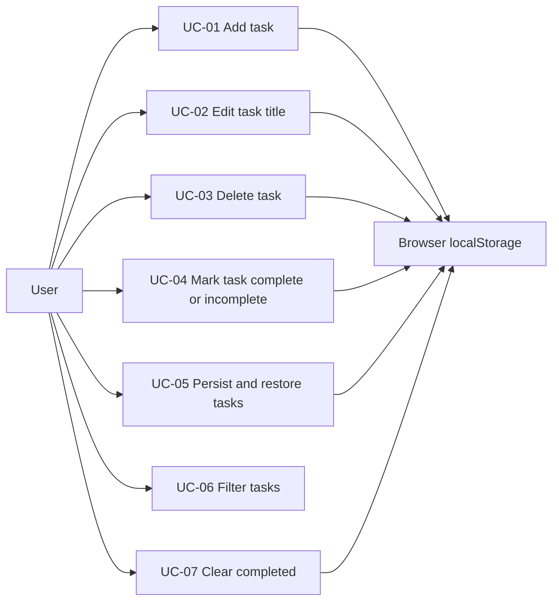

# 02 — Use Case Specifications

This document specifies the full use case model for the To-Do List web app. Every flow is written against the canonical architecture: **UI components → `useTodos` hook → pure domain functions (`src/domain/todo.ts`) + storage repository (`src/storage/todoRepository.ts`) → browser `localStorage`**.

## Actors

| Actor | Type | Description |
| --- | --- | --- |
| User | Primary (human) | The person managing their task list in the browser. |
| Browser localStorage | Secondary (system) | Persistence mechanism, accessed exclusively through `todoRepository.ts` under the key `shopback-todo.v1`. |

## Use case summary

| ID | Name | Priority | Primary actor | Secondary actor | Touches storage |
| --- | --- | --- | --- | --- | --- |
| UC-01 | Add task | Must-have | User | Browser localStorage | Yes — auto-save |
| UC-02 | Edit task title | Must-have | User | Browser localStorage | Yes — auto-save |
| UC-03 | Delete task | Must-have | User | Browser localStorage | Yes — auto-save |
| UC-04 | Mark task complete / incomplete | Must-have | User | Browser localStorage | Yes — auto-save |
| UC-05 | Persist and restore tasks | Must-have | User | Browser localStorage | Yes — load + save |
| UC-06 | Filter tasks | Nice-to-have, implemented | User | — | No — view-only |
| UC-07 | Clear completed tasks | Nice-to-have, implemented | User | Browser localStorage | Yes — auto-save |

Note: UC-06 has no edge to localStorage — the filter is ephemeral UI state and is never persisted.

---

## UC-01 — Add task

| Field | Value |
| --- | --- |
| Use case ID | UC-01 |
| Name | Add task |
| Primary actor | User |
| Secondary actor | Browser localStorage |
| Trigger | User submits the `AddTodoForm` — presses Enter in the input or clicks the Add button. |
| Preconditions | App is loaded; `TodoApp` is mounted and `useTodos` has completed its initial load. |
| Postconditions | A new `Todo` with `completed: false` exists at the head of the list; the todos array has been re-persisted (or a storage warning is shown). |

**Main flow**

1. User types a title into the `AddTodoForm` input (the input enforces `maxLength={MAX_TITLE_LENGTH}` as a first line of defense).
2. User submits via Enter or the Add button.
3. `AddTodoForm` calls `addTask(title)` from `useTodos`.
4. `useTodos` calls `validateTitle(raw)`, which trims the input and checks for emptiness and the 200-character limit.
5. Validation returns `{ ok: true, value }`; `useTodos` generates a unique `id` and a `createdAt` timestamp, then builds the todo via `createTodo(value, id, createdAt)`.
6. `useTodos` computes the next list via `addTodo(todos, todo)` — the new todo is **prepended** (newest first) — and updates state immutably.
7. `addTask` returns `null`; `AddTodoForm` clears its input and any previous inline error.
8. React re-renders: `TodoList` shows the new task at the top as an unchecked `TodoItem`, and the `FilterBar` counter ("N items left", via `activeCount`) increments.
9. The `useTodos` auto-save `useEffect` observes the todos change and calls `saveTodos(todos)`, which serializes the array to `localStorage` under `shopback-todo.v1`.

**Alternative flows**

- **A1 — Leading/trailing whitespace.** `validateTitle` trims the input; the stored title is the trimmed value.
- **A2 — Duplicate title.** Allowed by design. The task is added as a distinct `Todo` with its own `id` and `createdAt`.
- **A3 — Active filter is "Completed".** The task is still added and persisted, but `filterTodos` excludes it from the visible list because it is active, not completed. The "N items left" counter still increments, signalling success.

**Error states**

- **E1 — Empty or whitespace-only title.** `validateTitle` returns `{ ok: false, error: "Task cannot be empty" }`; `addTask` returns that message; `AddTodoForm` renders it as an inline error below the input. No state change, no save; the input retains its content.
- **E2 — Title longer than 200 characters.** The input's `maxLength` normally prevents this; if an over-length value reaches `addTask` (e.g. programmatic paste), `validateTitle` rejects it and an inline length error is shown. No state change.
- **E3 — Persistence failure.** `saveTodos` returns `false` (storage unavailable or quota exceeded); `useTodos` sets `storageWarning` and the dismissible `StorageWarning` banner appears. The task remains in the in-memory list for the session.

**Success state**

The new task is visible at the top of the list, unchecked; the counter reflects one more active item; the input is empty and focused for the next entry; `localStorage["shopback-todo.v1"]` contains the updated array, so the task survives a page refresh.

---

## UC-02 — Edit task title

| Field | Value |
| --- | --- |
| Use case ID | UC-02 |
| Name | Edit task title |
| Primary actor | User |
| Secondary actor | Browser localStorage |
| Trigger | User activates inline edit mode on a `TodoItem`. |
| Preconditions | At least one task exists and is visible under the current filter. |
| Postconditions | The targeted todo's `title` is updated (all other fields unchanged) and the list is re-persisted, or the edit was discarded and nothing changed. |

**Main flow**

1. User activates edit mode on a `TodoItem`; the static title is replaced by an inline text input pre-filled with the current title (with `maxLength={MAX_TITLE_LENGTH}`).
2. User modifies the text and confirms via Enter or the Save action.
3. `TodoItem` calls `editTask(id, newTitle)` from `useTodos`.
4. `useTodos` calls `validateTitle(newTitle)`; it returns `{ ok: true, value }` with the trimmed title.
5. `useTodos` computes the next list via `editTodoTitle(todos, id, value)` — a new array where only the matching todo carries the new title — and updates state.
6. `editTask` returns `null`; `TodoItem` exits edit mode and renders the updated title.
7. The auto-save `useEffect` persists the new array via `saveTodos(todos)`.

**Alternative flows**

- **A1 — Cancel via Escape or the Cancel action.** Edit mode closes and the draft is discarded. `editTask` is never called; the task keeps its old title; no state change, no save.
- **A2 — Saved title equals the old title.** The flow completes normally; `editTodoTitle` produces an equivalent list and it is persisted. No special handling is required.
- **A3 — Editing a completed task.** Permitted. Only `title` changes; `completed` and `createdAt` are untouched.
- **A4 — Whitespace padding.** The trimmed value is what gets saved and displayed.

**Error states**

- **E1 — Cleared to empty or whitespace-only.** `editTask` returns "Task cannot be empty"; `TodoItem` shows the inline error and **stays in edit mode**. The underlying todo keeps its old title until the user either saves a valid value or cancels.
- **E2 — Over-length title.** Rejected by `validateTitle` with an inline length error; edit mode persists; no state change.
- **E3 — Persistence failure.** As UC-01 E3: the edit applies in memory, `saveTodos` returns `false`, and the `StorageWarning` banner appears.

**Success state**

The task displays its new trimmed title in place, with its completion state and list position unchanged; the updated array is stored under `shopback-todo.v1` and the new title survives a page refresh.

---

## UC-03 — Delete task

| Field | Value |
| --- | --- |
| Use case ID | UC-03 |
| Name | Delete task |
| Primary actor | User |
| Secondary actor | Browser localStorage |
| Trigger | User clicks the Delete button on a `TodoItem`. |
| Preconditions | At least one task exists and is visible under the current filter. |
| Postconditions | The targeted todo no longer exists in state or storage. |

**Main flow**

1. User clicks the Delete button on a `TodoItem`.
2. `TodoItem` calls `deleteTask(id)` from `useTodos`. Deletion is immediate — by design there is no confirmation dialog (undo is out of scope).
3. `useTodos` computes the next list via `deleteTodo(todos, id)` — a new array without the matching todo — and updates state.
4. React re-renders: the item disappears from `TodoList`; if the deleted task was active, the "N items left" counter decrements.
5. The auto-save `useEffect` persists the shortened array via `saveTodos(todos)`.

**Alternative flows**

- **A1 — Last visible task under the current filter is deleted.** `TodoList` gives way to `EmptyState`, whose message matches the active filter.
- **A2 — Last task overall is deleted.** The list is empty; `EmptyState` renders and the counter reads "0 items left".
- **A3 — Deleting a completed task.** The counter is unchanged (it counts active tasks only); if the Clear completed control was enabled solely because of this task, it becomes inactive.

**Error states**

- **E1 — Stale id (e.g. rapid double-click).** `deleteTodo` filters on `id`; a second call with a missing id yields an equivalent array. No crash, no visible effect.
- **E2 — Persistence failure.** The deletion applies in memory; `saveTodos` returns `false` and the `StorageWarning` banner appears.

**Success state**

The task is gone from the visible list and from the in-memory array; the counter is correct; `shopback-todo.v1` no longer contains the todo, so it does not reappear after a page refresh.

---

## UC-04 — Mark task complete / incomplete

| Field | Value |
| --- | --- |
| Use case ID | UC-04 |
| Name | Mark task complete / incomplete |
| Primary actor | User |
| Secondary actor | Browser localStorage |
| Trigger | User clicks the checkbox on a `TodoItem`. |
| Preconditions | At least one task exists and is visible under the current filter. |
| Postconditions | The targeted todo's `completed` flag is inverted and the list is re-persisted. |

**Main flow**

1. User clicks the checkbox of an active task.
2. `TodoItem` calls `toggleTask(id)` from `useTodos`.
3. `useTodos` computes the next list via `toggleTodo(todos, id)` — a new array where only the matching todo has `completed` flipped — and updates state.
4. React re-renders: the item shows its completed styling (checked box, struck-through title) and the counter (via `activeCount`) decrements.
5. The auto-save `useEffect` persists the array via `saveTodos(todos)`.

**Alternative flows**

- **A1 — Un-completing.** Clicking the checkbox of a completed task runs the same flow in reverse: `completed` returns to `false`, styling reverts, the counter increments.
- **A2 — Toggling under the "Active" filter.** Completing a task removes it from the visible list on the next render, because `filterTodos` with `'active'` excludes it. Symmetrically, un-completing under "Completed" removes it from that view.
- **A3 — Last active task completed.** The counter reads "0 items left"; under the "Active" filter, `EmptyState` renders with its filter-specific message.

**Error states**

- **E1 — Stale id.** `toggleTodo` maps over the array; an unmatched id produces an equivalent array. No crash, no visible effect.
- **E2 — Persistence failure.** The toggle applies in memory; `saveTodos` returns `false` and the `StorageWarning` banner appears.

**Success state**

The task visibly reflects its new completion state, the counter is accurate, and the flipped `completed` flag is stored in `shopback-todo.v1` — after a refresh the task is restored with the same state.

---

## UC-05 — Persist and restore tasks

| Field | Value |
| --- | --- |
| Use case ID | UC-05 |
| Name | Persist and restore tasks |
| Primary actor | User |
| Secondary actor | Browser localStorage |
| Trigger | Restore: user opens or reloads the app. Persist: any mutation of the todos array (UC-01 through UC-04, UC-07). |
| Preconditions | The app is served in a browser context; `localStorage` may or may not be available. |
| Postconditions | In-memory state and `shopback-todo.v1` are consistent, or the user has been warned via `StorageWarning` that they are not. |

**Main flow**

1. User navigates to the app (or reloads the page).
2. `App` renders `TodoApp`, which calls `useTodos`; on mount, `useTodos` runs its load effect exactly once and calls `loadTodos()`.
3. `loadTodos` reads the raw string stored under `STORAGE_KEY` (`shopback-todo.v1`).
4. The value parses via `JSON.parse` and passes the `isValidTodoArray` type guard; `loadTodos` returns `{ todos, error: null }`.
5. `useTodos` sets the todos state; the UI renders the restored list in its stored order (newest first) with each task's completion state intact, and `storageWarning` stays clear.
6. From then on, every mutation flows through the auto-save `useEffect`: it calls `saveTodos(todos)`, which serializes the current array and writes it back under `shopback-todo.v1`.

**Alternative flows**

- **A1 — First visit, key missing.** `loadTodos` returns `{ todos: [], error: null }`. The app starts with an empty list and `EmptyState`; no warning is shown, because an absent key is a normal state, not an error.
- **A2 — Corrupted stored data.** `JSON.parse` throws, or the parsed value fails `isValidTodoArray`; `loadTodos` returns `{ todos: [], error: 'corrupted' }`. The app starts with an empty list and `useTodos` sets `storageWarning`; the `StorageWarning` banner explains that saved data could not be read. The next successful save overwrites the corrupted value with valid JSON.
- **A3 — Storage unavailable.** Accessing storage throws (e.g. privacy mode or disabled site data); `loadTodos` returns `{ todos: [], error: 'unavailable' }`. The app runs fully **in-memory for the session** with the `StorageWarning` banner shown; every subsequent `saveTodos` call returns `false` without crashing the app.
- **A4 — Banner dismissed.** The user dismisses `StorageWarning`; the app continues unchanged. The banner does not reappear until a new storage error occurs.

**Error states**

- **E1 — Corrupted payload on load.** Handled as A2: never a crash, never a partial list — deterministic fallback to empty list plus warning.
- **E2 — Storage unavailable on load or save.** Handled as A3: the app remains fully functional in memory; only durability is lost, and the user is told.
- **E3 — Quota exceeded on save.** `saveTodos` catches the write failure and returns `false`; `useTodos` sets `storageWarning`. In-memory state remains the source of truth for the session.

**Success state**

After any sequence of add/edit/toggle/delete/clear operations followed by a full page reload, the rendered list is byte-for-byte equivalent to the pre-reload list: same tasks, same titles, same order, same completion states. This exact round-trip is verified by the Playwright e2e suite (`e2e/todo.spec.ts`).

---

## UC-06 — Filter tasks

| Field | Value |
| --- | --- |
| Use case ID | UC-06 |
| Name | Filter tasks |
| Primary actor | User |
| Secondary actor | None — no storage involvement |
| Trigger | User clicks the All, Active, or Completed tab in `FilterBar`. |
| Preconditions | App is loaded. (Meaningful with any list, including an empty one.) |
| Postconditions | The `filter` state holds the selected value; the todos array and stored data are unchanged. |

**Main flow**

1. User clicks a filter tab (e.g. **Active**) in `FilterBar`.
2. `FilterBar` calls `setFilter('active')` from `useTodos`.
3. `useTodos` updates the `filter` state; the todos array is untouched.
4. `TodoApp` derives the visible list via `filterTodos(todos, filter)` and passes it to `TodoList`.
5. React re-renders: only matching tasks are shown, the selected tab is visually highlighted, and the "N items left" counter is unchanged — it always reports `activeCount(todos)` over the full list, independent of the filter.

**Alternative flows**

- **A1 — Filter result is empty.** `EmptyState` renders with a message specific to the active filter (e.g. no active tasks vs. no completed tasks vs. no tasks at all), so an empty view never looks broken.
- **A2 — Mutations while filtered.** Adds, toggles, edits, and deletes performed under a filter operate on the full list; the visible subset is re-derived on each render (see UC-01 A3 and UC-04 A2).
- **A3 — Page reload.** The filter is ephemeral UI state and is not persisted; after a reload the app returns to the default **All** view while the tasks themselves are restored per UC-05.

**Error states**

- None. Filtering is a pure, synchronous view derivation via `filterTodos`; it performs no validation and no storage I/O, so it has no failure modes.

**Success state**

The chosen tab is highlighted and exactly the matching subset is visible: All shows every task, Active shows `completed: false`, Completed shows `completed: true`. The underlying data — in memory and in `shopback-todo.v1` — is unchanged.

---

## UC-07 — Clear completed tasks

| Field | Value |
| --- | --- |
| Use case ID | UC-07 |
| Name | Clear completed tasks |
| Primary actor | User |
| Secondary actor | Browser localStorage |
| Trigger | User clicks the Clear completed button in `FilterBar`. |
| Preconditions | At least one task is marked completed (the button is disabled or hidden otherwise). |
| Postconditions | No todo with `completed: true` remains in state or storage; active tasks are untouched and keep their order. |

**Main flow**

1. User clicks **Clear completed** in `FilterBar`.
2. `FilterBar` calls `clearCompletedTasks()` from `useTodos`. The bulk removal is immediate — consistent with UC-03, there is no confirmation dialog and no undo.
3. `useTodos` computes the next list via `clearCompleted(todos)` — a new array containing only active todos, order preserved — and updates state.
4. React re-renders: all completed items disappear from `TodoList`; the "N items left" counter is unchanged since only completed tasks were removed; the Clear completed control becomes inactive.
5. The auto-save `useEffect` persists the pruned array via `saveTodos(todos)`.

**Alternative flows**

- **A1 — Every task was completed.** The list becomes empty and `EmptyState` renders; the counter reads "0 items left".
- **A2 — Performed under the "Completed" filter.** The visible list empties and `EmptyState` shows the completed-filter message; switching to All or Active shows the surviving active tasks.
- **A3 — No completed tasks exist.** Not reachable through the UI (control disabled/hidden); if invoked anyway, `clearCompleted` returns an equivalent array and the operation is a harmless no-op.

**Error states**

- **E1 — Persistence failure.** The removal applies in memory; `saveTodos` returns `false` and the `StorageWarning` banner appears.

**Success state**

Only active tasks remain, in their original relative order; the counter is unchanged; `shopback-todo.v1` holds the pruned array, so the cleared tasks do not reappear after a page refresh.

---

## Traceability

| Use case | Unit coverage | Integration coverage | E2E coverage |
| --- | --- | --- | --- |
| UC-01 | `validateTitle`, `createTodo`, `addTodo` in `src/domain/todo.test.ts` | Add flows in `src/components/TodoApp.test.tsx` | Add scenarios in `e2e/todo.spec.ts` |
| UC-02 | `validateTitle`, `editTodoTitle` | Inline edit flows incl. cancel and empty-save | Edit scenarios |
| UC-03 | `deleteTodo` | Delete flows incl. empty-state transition | Delete scenarios |
| UC-04 | `toggleTodo`, `activeCount` | Toggle flows incl. counter updates | Toggle scenarios |
| UC-05 | `loadTodos`, `saveTodos`, `isValidTodoArray` in `src/storage/todoRepository.test.ts` with a mocked `Storage` | Load/save against jsdom `localStorage` | Persistence across a real page reload |
| UC-06 | `filterTodos` | Filter tab flows incl. per-filter empty states | Filter scenarios |
| UC-07 | `clearCompleted` | Clear completed flows | Clear completed scenarios |

Test IDs follow the fixed convention: `UT-xx` for unit, `IT-xx` for integration, `E2E-xx` for end-to-end; the concrete case lists live in the test plan document.
