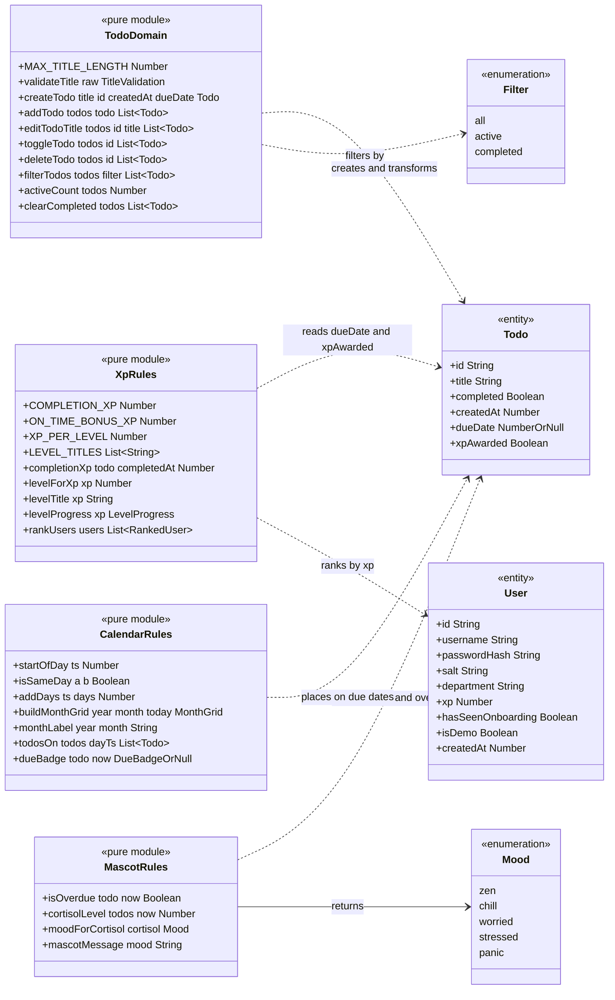
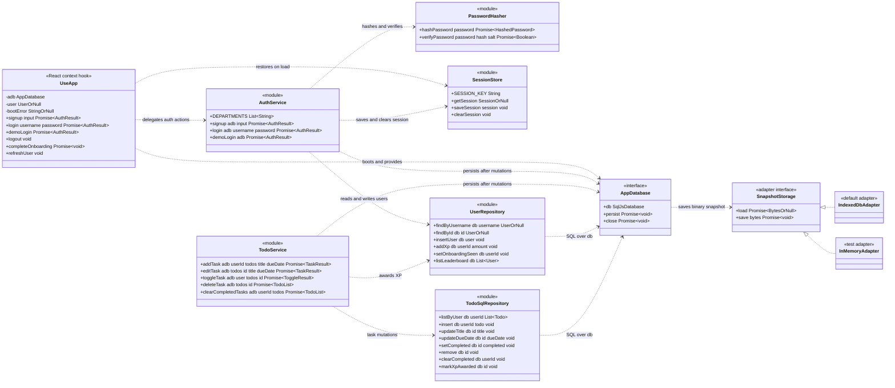

# 03 - Domain Model

This document defines the domain model of the To-Do List application: the `Todo` and `User` entities, the pure function modules that own every business rule (`TodoDomain`, `XpRules`, `MascotRules`, `CalendarRules`), the infrastructure that carries state (`PasswordHasher`, `SessionStore`, `AppDatabase`, `UserRepository`, `TodoSqlRepository`), the services that orchestrate them (`AuthService`, `TodoService`), and the `AppContext` seam that binds everything to React. It is the single reference for names, signatures, and invariants - the implementation must match it exactly.

The model follows the layering fixed for this project:

> components → hooks/context → services → pure domain + repositories → sql.js database → IndexedDB snapshot

All business rules live in the pure modules under `src/domain/`. All persistence runs through the repositories under `src/storage/` against an in-browser SQLite database (`sql.js`, a WebAssembly build of SQLite) created by `src/db/database.ts` and snapshotted into IndexedDB after every mutation. Services in `src/services/` are the only place that composes domain rules with repositories, ID generation, and timestamps. Components never touch the domain, repository, or database modules directly for writes - they reach state through `useApp` and the `useTodos` hook, which delegate every mutation to the services.

**Documented assumption:** the app is frontend-only. Accounts, tasks, and XP are local to the device/browser that created them; a real cross-device login would need a backend, which is out of scope.

## 1. Class Diagram - Domain Layer



## 2. Class Diagram - Infrastructure and Services



**Notation.** GitHub's Mermaid renderer does not tolerate parentheses inside class member lines, so members are written as `name parameters ReturnType`. For example, `validateTitle raw TitleValidation` reads as *`validateTitle(raw)` returning `TitleValidation`*. Suffix `OrNull` abbreviates `X | null`; `TodoList` abbreviates `Todo[]` (Mermaid does not support nested generics); `MonthGrid` abbreviates `CalendarDay[][]`; `HashedPassword` abbreviates `{ hash: string; salt: string }`. Exact TypeScript signatures are given in the sections below.

## 3. Todo - the task entity

**File:** `src/domain/todo.ts`

```ts
interface Todo {
  id: string;             // unique, generated via crypto.randomUUID()
  title: string;          // trimmed, 1..MAX_TITLE_LENGTH characters
  completed: boolean;
  createdAt: number;      // epoch milliseconds, from Date.now()
  dueDate: number | null; // epoch ms at start of the due day, or null
  xpAwarded: boolean;     // true once XP has been granted for this task
}
```

`Todo` is a plain, immutable data record - no methods, no class. The visible application state for the signed-in user is a `Todo[]`; each row belongs to exactly one user via the `user_id` column in SQLite (ownership is a persistence concern and is not part of the in-memory shape).

**Invariants:**

| Invariant | Enforced by |
| --- | --- |
| `id` is unique within the database | Generated with `crypto.randomUUID()` in `TodoService`; never reused or edited; `TEXT PRIMARY KEY` in SQLite |
| `title` is always trimmed | `validateTitle` trims before any `Todo` is created or retitled |
| `title` length is 1..200 characters | `validateTitle` rejects empty/whitespace-only input and input longer than `MAX_TITLE_LENGTH` |
| `createdAt` is epoch milliseconds | Supplied as `Date.now()` by `TodoService` at creation time; immutable thereafter |
| `dueDate` is optional and may be in the past | Set when adding or editing; past dates are allowed by design so overdue state is representable |
| `xpAwarded` becomes true at most once | Set by `TodoService.toggleTask` on the first completion; never reset, so re-toggling cannot farm XP |
| Instances are never mutated | Every domain function returns new objects/arrays; existing instances are treated as frozen |
| Duplicate titles are allowed | Documented product assumption - no uniqueness check on `title` |

`createdAt` records creation order but is not used for sorting: ordering is positional (see TodoDomain below). `dueDate` drives due badges, calendar placement, overdue detection, and the on-time XP bonus.

## 4. User - the account entity

**Files:** `src/db/database.ts` (schema), `src/storage/userRepository.ts` (row mapping)

```ts
interface User {
  id: string;                // crypto.randomUUID()
  username: string;          // unique, 3..20 chars, alphanumeric
  passwordHash: string;      // PBKDF2-SHA256 output, encoded
  salt: string;              // per-user random salt, encoded
  department: string;        // one of DEPARTMENTS
  xp: number;                // lifetime XP, monotonically increasing
  hasSeenOnboarding: boolean;
  isDemo: boolean;           // true for the demo account and seeded colleagues
  createdAt: number;         // epoch milliseconds
}
```

```ts
const DEPARTMENTS = [
  'Engineering', 'Product', 'Design', 'Marketing',
  'Operations', 'Finance', 'People and Culture',
] as const;
```

**Invariants:**

| Invariant | Enforced by |
| --- | --- |
| `username` is unique | `AuthService.signup` checks `findByUsername` first; `UNIQUE` constraint in SQLite is the backstop |
| `username` is 3..20 alphanumeric characters | Validated by `AuthService.signup` before any insert |
| Password is never stored in plain text | Only `passwordHash` and `salt` are persisted; hashing via `PasswordHasher` (Web Crypto PBKDF2) |
| `xp` never decreases | The only writer is `UserRepository.addXp` with a positive amount; un-completing a task does not remove XP |
| `hasSeenOnboarding` flips false → true once per account | `AuthService`/`useApp.completeOnboarding` via `setOnboardingSeen` when the tour is finished or skipped |
| `isDemo` marks seeded data | Set only by database seeding; the leaderboard UI notes these are demo colleagues |
| Accounts are device-local | Documented assumption - the SQLite database lives in this browser's IndexedDB only |

The demo account (`username: demo`, `password: demo1234`) and 7 demo colleagues across departments are seeded on a fresh database so the leaderboard is populated from the first launch; all carry `isDemo: true`.

## 5. Enumerations and value types

**Files:** as noted per type.

```ts
// src/domain/todo.ts
type Filter = 'all' | 'active' | 'completed';

const MAX_TITLE_LENGTH = 200;

type TitleValidation =
  | { ok: true; value: string }   // value is the trimmed title
  | { ok: false; error: string }; // user-facing message, e.g. "Task cannot be empty"

// src/domain/mascot.ts
type Mood = 'zen' | 'chill' | 'worried' | 'stressed' | 'panic';

// src/domain/calendar.ts
interface CalendarDay { ts: number; inMonth: boolean; isToday: boolean }
type MonthGrid = CalendarDay[][]; // Monday-start weeks

type DueBadge = { label: string; tone: 'overdue' | 'today' | 'tomorrow' | 'date' };

// src/domain/xp.ts
interface LevelProgress { level: number; title: string; xpIntoLevel: number; xpPerLevel: number }
interface RankedUser { rank: number; user: User }

// src/auth/sessionStore.ts
interface Session { userId: string }

// src/services/authService.ts
type AuthResult =
  | { ok: true; user: User }
  | { ok: false; error: string }; // user-facing message

// src/services/todoService.ts
type TaskResult = { todos: Todo[]; error: string | null };
type ToggleResult = { todos: Todo[]; xpGained: number };
```

**Filter invariants** are unchanged from v1: the filter is pure view state. It never changes the underlying `Todo[]`, is never persisted, and defaults to `all` on every app start. `filterTodos` and the `FilterBar` component are the only consumers.

**Mood** is a closed union produced only by `moodForCortisol`; components never compute moods themselves.

## 6. TodoDomain - the task rules module

**File:** `src/domain/todo.ts`

`TodoDomain` is not a class - it is the set of exported pure functions in `src/domain/todo.ts`, grouped in the diagram for clarity. It owns every list-level state transition on `Todo[]`, exactly as in v1, extended for due dates and XP flags.

| Function | Signature | Behavior |
| --- | --- | --- |
| `validateTitle` | `(raw: string): TitleValidation` | Trims the input. Returns `{ ok: true, value }` with the trimmed title, or `{ ok: false, error }` when the result is empty/whitespace-only or exceeds `MAX_TITLE_LENGTH` (200) |
| `createTodo` | `(title: string, id: string, createdAt: number, dueDate?: number \| null): Todo` | Builds a new `Todo` with `completed: false` and `xpAwarded: false`. `dueDate` defaults to `null`. Expects an already-validated title; `id` and `createdAt` are injected by the caller |
| `addTodo` | `(todos: Todo[], todo: Todo): Todo[]` | Returns a new array with `todo` **prepended** - newest first |
| `editTodoTitle` | `(todos: Todo[], id: string, title: string): Todo[]` | Returns a new array with the matching todo's title replaced |
| `toggleTodo` | `(todos: Todo[], id: string): Todo[]` | Returns a new array with the matching todo's `completed` flag flipped |
| `deleteTodo` | `(todos: Todo[], id: string): Todo[]` | Returns a new array without the matching todo |
| `filterTodos` | `(todos: Todo[], filter: Filter): Todo[]` | Returns the subset matching the filter; `all` returns the input list |
| `activeCount` | `(todos: Todo[]): number` | Count of todos with `completed === false` - drives the "N items left" counter |
| `clearCompleted` | `(todos: Todo[]): Todo[]` | Returns a new array containing only active todos |

**Invariants:**

- **Purity.** No React, no browser APIs, no `Date.now()`, no randomness, no I/O. Given the same inputs, every function returns the same output - which is why `id` and `createdAt` are parameters of `createTodo` rather than generated inside it. This makes the module trivially unit-testable (`UT-xx` tests in `src/domain/todo.test.ts`).
- **Immutability.** Input arrays and objects are never mutated. Every transition returns a fresh array; updated todos are fresh objects. Untouched todos keep referential identity, which keeps React re-renders cheap.
- **Ordering.** Newest-first is established solely by `addTodo` prepending. All other functions preserve relative order; nothing re-sorts.
- **No-op on unknown id.** `editTodoTitle`, `toggleTodo`, and `deleteTodo` called with an id not present in the list return an equivalent list unchanged - they never throw.
- **Validation is separate from construction.** `validateTitle` is the single gatekeeper for title rules; `createTodo` and `editTodoTitle` assume their title argument has already passed it.
- **XP-agnostic.** `toggleTodo` only flips `completed`. Awarding XP and setting `xpAwarded` are orchestrated by `TodoService` using `XpRules` - the list module knows nothing about points.

## 7. XpRules - the gamification module

**File:** `src/domain/xp.ts`

| Member | Signature | Behavior |
| --- | --- | --- |
| `COMPLETION_XP` | `10` | Base XP for completing a task |
| `ON_TIME_BONUS_XP` | `5` | Bonus when a task with a due date is completed on or before the end of that day |
| `XP_PER_LEVEL` | `50` | One level per 50 XP |
| `LEVEL_TITLES` | `string[]` | In order: Window Shopper, Deal Hunter, Cashback Collector, Voucher Veteran, Savings Star, Rebate Royalty |
| `completionXp` | `(todo: Todo, completedAt: number): number` | Returns `COMPLETION_XP`, plus `ON_TIME_BONUS_XP` when `todo.dueDate` is non-null and `completedAt` is before the start of the day after the due date |
| `levelForXp` | `(xp: number): number` | 1-based level: `floor(xp / XP_PER_LEVEL) + 1` |
| `levelTitle` | `(xp: number): string` | `LEVEL_TITLES[min(levelForXp(xp) - 1, LEVEL_TITLES.length - 1)]` - levels beyond the sixth keep the final title |
| `levelProgress` | `(xp: number): LevelProgress` | Level, title, XP earned within the current level, and `XP_PER_LEVEL` - drives the header user chip |
| `rankUsers` | `(users: User[]): RankedUser[]` | Sorts by `xp` descending and assigns **competition ranking** for ties: equal XP shares a rank, and the next distinct XP resumes at the position index - 1, 2, 2, 4 |

**Invariants:**

- **Pure and clock-free.** `completedAt` is a parameter; the module never reads the clock, so on-time boundaries are exactly testable.
- **Award-once is decided elsewhere.** `completionXp` computes the amount; whether to award at all is guarded by `todo.xpAwarded` in `TodoService.toggleTask`. This module never sees or sets the flag.
- **Deterministic ranking.** Ties by XP are broken deterministically for display order (by username ascending) while sharing the same rank number.

## 8. MascotRules - the cortisol module

**File:** `src/domain/mascot.ts`

Kapi the capybara (rendered as inline SVG by the `Mascot` component) reacts to the user's task load through a single scalar, the **cortisol level**. Fewer tasks means a happier mascot.

| Function | Signature | Behavior |
| --- | --- | --- |
| `isOverdue` | `(todo: Todo, now: number): boolean` | True when the todo is not completed, has a due date, and that due date is before the start of today - computed from `now` |
| `cortisolLevel` | `(todos: Todo[], now: number): number` | `min(100, active * 8 + overdue * 12)` where `active` counts not-completed todos and `overdue` counts active todos passing `isOverdue`. Overdue tasks are also active, so each contributes 8 + 12 = 20 |
| `moodForCortisol` | `(cortisol: number): Mood` | `0` → `zen`; `1..39` → `chill`; `40..63` → `worried`; `64..89` → `stressed`; `90+` → `panic` |
| `mascotMessage` | `(mood: Mood): string` | A fixed user-facing message per mood, paired with a distinct SVG expression |

**Invariants:** pure and clock-free (`now` is injected); `cortisolLevel` is always in `0..100`, which lets `CortisolBar` render it directly as a percentage; the mood bands are exhaustive and non-overlapping, so every cortisol value maps to exactly one mood.

## 9. CalendarRules - the date module

**File:** `src/domain/calendar.ts`

All date arithmetic in the app lives here; no component computes dates ad hoc.

| Function | Signature | Behavior |
| --- | --- | --- |
| `startOfDay` | `(ts: number): number` | Epoch ms at local midnight of the day containing `ts` |
| `isSameDay` | `(a: number, b: number): boolean` | True when both timestamps fall on the same local calendar day |
| `addDays` | `(ts: number, days: number): number` | Calendar-safe day arithmetic (handles DST/month boundaries via the Date API, not fixed 24 h offsets) |
| `buildMonthGrid` | `(year: number, month: number, today: number): MonthGrid` | Monday-start weeks covering the whole month, padded with leading/trailing out-of-month days; each cell is a `CalendarDay { ts, inMonth, isToday }` |
| `monthLabel` | `(year: number, month: number): string` | Human-readable heading, e.g. "August 2026" |
| `todosOn` | `(todos: Todo[], dayTs: number): Todo[]` | Todos whose `dueDate` falls on the given day - feeds calendar task chips |
| `dueBadge` | `(todo: Todo, now: number): DueBadge \| null` | `null` when `dueDate` is null. Otherwise a badge: tone `overdue` (red) for active todos due before today, `today`, `tomorrow`, or `date` with a short date label |

**Invariants:** pure and clock-free (`today`/`now` injected); every grid is a whole number of 7-day weeks starting Monday; exactly one cell in a grid containing today has `isToday: true`; a completed todo never gets the `overdue` tone - its badge falls through to the neutral `date`/`today`/`tomorrow` label so finished work is not alarmed (documented assumption).

## 10. PasswordHasher - the credential module

**File:** `src/auth/password.ts`

| Function | Signature | Behavior |
| --- | --- | --- |
| `hashPassword` | `(password: string): Promise<{ hash: string; salt: string }>` | Generates a fresh random per-user salt, derives PBKDF2-SHA256 with **100000 iterations** via Web Crypto `crypto.subtle`, returns both encoded as strings |
| `verifyPassword` | `(password: string, hash: string, salt: string): Promise<boolean>` | Re-derives with the stored salt and compares against the stored hash |

**Invariants:** the plain password never leaves this module's call stack and is never persisted or logged; salts are unique per user; iteration count and digest are fixed constants so stored hashes remain verifiable. Async because Web Crypto is promise-based - one reason `AuthService` is async end to end.

## 11. SessionStore - the session boundary

**File:** `src/auth/sessionStore.ts`

The only remaining localStorage concern in the app. It records *who* is signed in on this device; all account and task data lives in SQLite.

| Member | Signature | Behavior |
| --- | --- | --- |
| `SESSION_KEY` | `'shopback-todo.session.v1'` | Single versioned key |
| `getSession` | `(): Session \| null` | Parses the stored `{ userId }`; returns `null` on missing key, parse failure, wrong shape, or storage access errors |
| `saveSession` | `(session: Session): void` | Writes the session; swallows storage failures - a failed write only means no auto-login next visit |
| `clearSession` | `(): void` | Removes the key on logout |

**Invariants:** never throws; stores only the user id - never credentials; a stale session pointing at a deleted/unknown user id resolves to the logged-out state (`AppProvider` clears it).

## 12. AppDatabase - the SQLite engine and snapshot lifecycle

**File:** `src/db/database.ts`

```ts
interface SnapshotStorage {
  load(): Promise<Uint8Array | null>;
  save(bytes: Uint8Array): Promise<void>;
}

interface AppDatabase {
  db: Database;               // the live sql.js database handle
  persist(): Promise<void>;   // export binary snapshot -> SnapshotStorage.save
  close(): Promise<void>;
}

function createAppDatabase(options?: {
  wasmBinary?: ArrayBuffer;   // injected in tests; fetched normally in the app
  storage?: SnapshotStorage;  // defaults to the IndexedDB adapter
}): Promise<AppDatabase>;
```

`createAppDatabase` initializes sql.js, loads an existing snapshot from the storage adapter (or starts fresh), runs migrations keyed off the `meta` schema-version row, and seeds the demo account plus 7 demo colleagues **only on a fresh database**. Two adapters implement `SnapshotStorage`: the **IndexedDB adapter** (default, production) and an **in-memory adapter** for unit tests; integration tests use `fake-indexeddb` with the real adapter.

**SQLite schema:**

```sql
CREATE TABLE users (
  id TEXT PRIMARY KEY,
  username TEXT UNIQUE NOT NULL,
  password_hash TEXT NOT NULL,
  salt TEXT NOT NULL,
  department TEXT NOT NULL,
  xp INTEGER NOT NULL DEFAULT 0,
  has_seen_onboarding INTEGER NOT NULL DEFAULT 0,
  is_demo INTEGER NOT NULL DEFAULT 0,
  created_at INTEGER NOT NULL
);

CREATE TABLE todos (
  id TEXT PRIMARY KEY,
  user_id TEXT NOT NULL,
  title TEXT NOT NULL,
  completed INTEGER NOT NULL DEFAULT 0,
  created_at INTEGER NOT NULL,
  due_date INTEGER NULL,
  xp_awarded INTEGER NOT NULL DEFAULT 0
);

CREATE TABLE meta (
  key TEXT PRIMARY KEY,
  value TEXT NOT NULL
);
```

**Invariants:**

- **Snapshot-after-mutation.** Every service-level mutation ends with `persist()` - the whole database is exported as a binary snapshot into IndexedDB. There is no partial write; the snapshot is the unit of durability (UC-05).
- **Injectable impurity.** Both the WASM binary and the storage adapter are constructor parameters, so repositories and services are tested against a **real** sql.js database with the in-memory adapter - no SQL mocking.
- **Migrations are forward-only** and idempotent, keyed by the `meta` schema-version row.
- **Boot failures are values.** `AppProvider` catches `createAppDatabase` rejections and renders a database boot error screen. This replaces the v1 `StorageWarning` banner, which is retired.
- **Booleans are integers** (`0`/`1`) in SQLite; repositories translate them to `boolean` at the row-mapping boundary so nothing above the repositories sees integers.

## 13. UserRepository and TodoSqlRepository - the persistence boundary

**Files:** `src/storage/userRepository.ts`, `src/storage/todoSqlRepository.ts`

These modules replace the v1 `todoRepository` localStorage module. They are the only code that speaks SQL. Each function takes the live `db` handle; none of them calls `persist()` - snapshotting is the caller's (service's) responsibility, so multi-statement operations snapshot once.

**UserRepository:**

| Function | Behavior |
| --- | --- |
| `findByUsername(db, username)` | `User \| null` - signup uniqueness check and login lookup |
| `findById(db, id)` | `User \| null` - session restore |
| `insertUser(db, user)` | Inserts a fully-formed `User` row |
| `addXp(db, userId, amount)` | `UPDATE users SET xp = xp + amount` - the only XP writer |
| `setOnboardingSeen(db, userId)` | Flips `has_seen_onboarding` to 1 |
| `listLeaderboard(db)` | All users ordered by `xp` descending - feeds `rankUsers` |

**TodoSqlRepository:**

| Function | Behavior |
| --- | --- |
| `listByUser(db, userId)` | The user's todos, newest first - mirrors `addTodo` prepend order via `created_at` descending |
| `insert(db, userId, todo)` | Inserts a `Todo` owned by `userId` |
| `updateTitle(db, id, title)` | Retitles one row |
| `updateDueDate(db, id, dueDate)` | Sets or clears `due_date` |
| `setCompleted(db, id, completed)` | Writes the `completed` flag |
| `remove(db, id)` | Deletes one row |
| `clearCompleted(db, userId)` | Deletes the user's completed rows |
| `markXpAwarded(db, id)` | Sets `xp_awarded` to 1 - never back to 0 |

**Invariants:** dumb persistence - no business rules, no validation beyond row shape, exactly as the v1 repository was; every todo query is scoped by `user_id`, so one user's tasks are invisible to another account on the same device; row mapping is the single point translating snake_case integer columns to camelCase typed fields.

## 14. AuthService - account orchestration

**File:** `src/services/authService.ts`

| Function | Behavior |
| --- | --- |
| `signup(adb, { username, password, department })` | Validates username (3–20 chars, alphanumeric), password (min 8 chars), and department (must be in `DEPARTMENTS`); rejects taken usernames; hashes via `PasswordHasher`; inserts the user; **imports legacy v1 tasks once** (see below); saves the session; `persist()`; returns `AuthResult` |
| `login(adb, username, password)` | Looks up the user, `verifyPassword` against stored hash and salt; saves the session on success; returns `AuthResult` with a generic failure message on bad credentials |
| `demoLogin(adb)` | One-click login as the seeded `demo` / `demo1234` account for evaluators - same path as `login` |

**Legacy import (v1 → v2 migration):** on signup only, the service reads the v1 localStorage key `shopback-todo.v1`, validates the value with the v1 array-shape guard, inserts each task into the new account (with `dueDate: null`, `xpAwarded: false`), and **removes the legacy key** so the import happens at most once per device. A missing or corrupted legacy value is silently skipped. This is the only surviving responsibility of the v1 `todoRepository`, now inlined here.

**Invariants:** validation errors are returned as `AuthResult` values, never thrown; failed logins do not reveal whether the username or the password was wrong; all writes end in a single `persist()`.

## 15. TodoService - task orchestration

**File:** `src/services/todoService.ts`

`TodoService` takes over the mutation logic that lived inside the v1 `useTodos` hook; the slimmed-down v2 `useTodos` (`src/hooks/useTodos.ts`) keeps React state, delegates every mutation here, and re-queries afterwards. `TodoService` is the one place that generates identity and time for tasks: `addTask` runs `validateTitle`, then `createTodo(validated.value, crypto.randomUUID(), Date.now(), dueDate)`, then persists - the domain stays deterministic.

| Function | Behavior |
| --- | --- |
| `addTask(adb, userId, todos, title, dueDate)` | Validates, creates, `insert`s, prepends via `addTodo`, `persist()`s. Returns `TaskResult` - the error message on validation failure, `null` on success (UC-01) |
| `editTask(adb, todos, id, title, dueDate)` | Revalidates the title, writes `updateTitle` and `updateDueDate`, `persist()`s. Returns `TaskResult` (UC-02) |
| `toggleTask(adb, user, todos, id)` | Flips via `toggleTodo` + `setCompleted`. When the flip **completes** a task with `xpAwarded === false`: computes `completionXp(todo, Date.now())`, calls `markXpAwarded` and `addXp`, returns that amount as `xpGained`; otherwise `xpGained` is 0. Un-completing never removes XP. One `persist()` covers all writes (UC-04, UC-10) |
| `deleteTask(adb, todos, id)` | `remove` + `deleteTodo`, `persist()` (UC-03) |
| `clearCompletedTasks(adb, userId, todos)` | Repository `clearCompleted` + domain `clearCompleted`, `persist()` (UC-07) |

**Invariants:** every mutation ends with exactly one `persist()`; the in-memory `Todo[]` returned to the caller and the SQLite rows are updated in the same call, so they never diverge; the `xpAwarded` guard makes XP idempotent - un-tick and re-tick yields `xpGained: 0`.

## 16. AppContext - the composing seam

**File:** `src/app/AppContext.tsx`

`AppProvider` is the top stateful seam of the application; together with the `useTodos` hook that `Shell` instantiates for task state, it forms the hooks/context layer. Everything below this layer is pure or persistence; everything above it is presentational.

```ts
function useApp(): {
  adb: AppDatabase;
  user: User | null;
  bootError: string | null;
  signup: (input: SignupInput) => Promise<AuthResult>;
  login: (username: string, password: string) => Promise<AuthResult>;
  demoLogin: () => Promise<AuthResult>;
  logout: () => void;
  completeOnboarding: () => Promise<void>;
  refreshUser: () => void;
}
```

**Responsibilities:**

- **Boot.** On mount, `AppProvider` awaits `createAppDatabase()`. While pending it renders a loading state; a rejection is caught and exposed as `bootError`, rendering the database boot error screen (the retired `StorageWarning`'s successor).
- **Session restore.** After boot it calls `getSession()`; a stored `userId` resolving via `findById` restores the signed-in user, otherwise the session is cleared and `AuthPage` is shown (UC-09).
- **Auth actions.** `signup`/`login`/`demoLogin` delegate to `AuthService` and set `user` on success; `logout` calls `clearSession` and nulls `user`.
- **Onboarding.** `completeOnboarding` calls `setOnboardingSeen`, persists, and updates `user` - `OnboardingTour` opens automatically when `user.hasSeenOnboarding` is false and can be reopened from the header help button (UC-14).
- **Provision.** Exposes `adb` so view components (`TodosView`, `CalendarView`, `Leaderboard`) can load their data through repositories/services, and `refreshUser` so the header chip reflects new XP right after `toggleTask` reports a gain. Task list state and the current `Filter` live in the `useTodos` hook owned by `Shell`, which delegates every mutation to `TodoService` and re-queries afterwards.

**Invariants:** state transitions go exclusively through services and domain functions; persistence goes exclusively through repositories and `persist()`; `useApp` outside an `AppProvider` throws immediately - a programming error, not a runtime state.

## 17. Relationship and dependency rules

| Relationship | Meaning |
| --- | --- |
| `UseApp ..> AppDatabase` | The provider boots the database once and provides the handle to the tree |
| `UseApp ..> SessionStore` | Session restored on load, saved on login, cleared on logout |
| `UseApp ..> AuthService` | Auth actions are thin async delegations |
| `AuthService ..> PasswordHasher` | The only consumer of hashing; PBKDF2-SHA256, 100000 iterations |
| `AuthService / TodoService ..> repositories` | Services are the only callers of repository functions |
| `TodoService ..> XpRules` | `completionXp` decides the award amount; the `xpAwarded` flag decides whether |
| `UserRepository / TodoSqlRepository ..> AppDatabase` | SQL runs only here, against `adb.db` |
| `AppDatabase ..> SnapshotStorage` | `persist` exports the database and hands the bytes to the adapter - IndexedDB in the app, in-memory in unit tests |
| `TodoDomain / XpRules / MascotRules / CalendarRules ..> Todo, User, Filter, Mood` | Pure modules create and transform values; they import nothing from React, the browser, or sql.js |

Dependency direction is strictly downward: components import only `useApp`, `useTodos`, and pure domain helpers for display (`filterTodos`, `dueBadge`, `cortisolLevel`, `rankUsers`, `buildMonthGrid`, `levelProgress`); services import domain modules, repositories, auth modules, and the `AppDatabase` type; repositories import only entity types and the `db` handle type; `src/domain/*` imports nothing from React, the browser, or sql.js. There are no upward or sideways imports, which is what makes the bottom-up unit / top-down integration test strategy possible: domain modules and `PasswordHasher` are tested in isolation, repositories and services against a real in-memory sql.js database, and the full stack through RTL with `fake-indexeddb` and an injected WASM binary.
