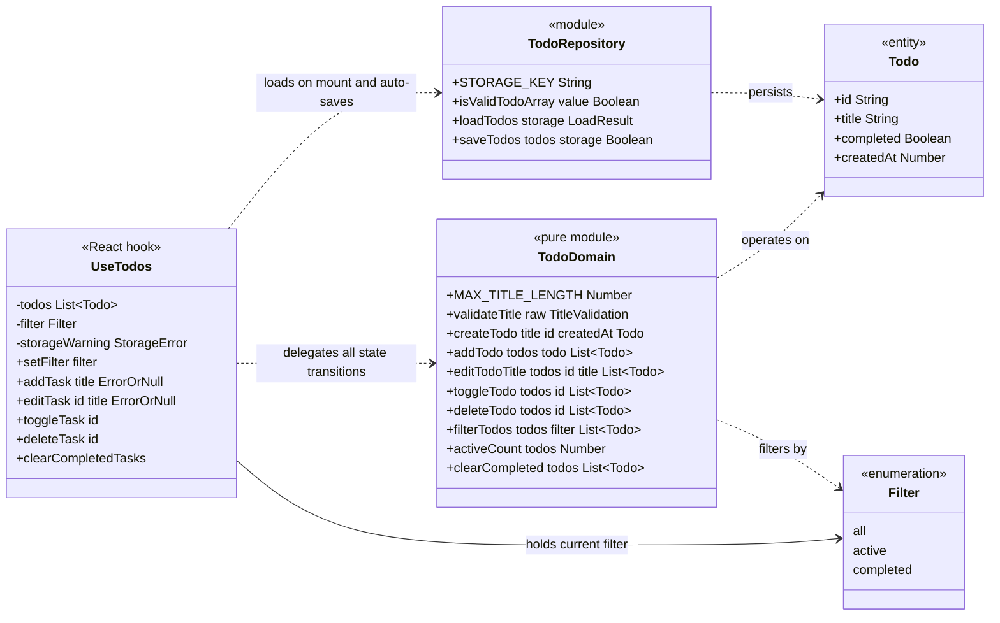

# 03 — Domain Model

This document defines the domain model of the To-Do List application: the core `Todo` entity, the pure function module that owns every state transition, the localStorage repository, the `useTodos` hook that binds them to React, and the `Filter` enumeration. It is the single reference for names, signatures, and invariants — the implementation must match it exactly.

The model follows the layering fixed for this project:

> UI components → `useTodos` hook → pure domain functions + storage repository → browser `localStorage`

All business rules live in `src/domain/todo.ts`. All persistence concerns live in `src/storage/todoRepository.ts`. The hook composes the two and is the only place with React state, ID generation, and timestamps. Components never touch the domain or storage modules directly.

## 1. Class Diagram



**Notation.** GitHub's Mermaid renderer does not tolerate parentheses inside class member lines, so members are written as `name parameters ReturnType`. For example, `validateTitle raw TitleValidation` reads as *`validateTitle(raw)` returning `TitleValidation`*. `ErrorOrNull` abbreviates `string | null` — an error message on failure, `null` on success. Exact TypeScript signatures are given in the sections below.

## 2. Todo — the entity

**File:** `src/domain/todo.ts`

```ts
interface Todo {
  id: string;        // unique, generated via crypto.randomUUID()
  title: string;     // trimmed, 1..MAX_TITLE_LENGTH characters
  completed: boolean;
  createdAt: number; // epoch milliseconds, from Date.now()
}
```

`Todo` is a plain, immutable data record — no methods, no class. It is the only entity in the system; the entire application state is a `Todo[]`.

**Invariants:**

| Invariant | Enforced by |
| --- | --- |
| `id` is unique within the list | Generated with `crypto.randomUUID()` in `useTodos`; never reused or edited |
| `title` is always trimmed | `validateTitle` trims before any `Todo` is created or retitled |
| `title` length is 1..200 characters | `validateTitle` rejects empty/whitespace-only input and input longer than `MAX_TITLE_LENGTH` |
| `createdAt` is epoch milliseconds | Supplied as `Date.now()` by `useTodos` at creation time; immutable thereafter |
| Instances are never mutated | Every domain function returns new objects/arrays; existing instances are treated as frozen |
| Duplicate titles are allowed | Documented product assumption — no uniqueness check on `title` |

`createdAt` records creation order but is not used for sorting: ordering is positional (see TodoDomain below). It exists so the data model is self-describing and future-proof (e.g. a later "sort by date" feature needs no migration).

## 3. Filter — the enumeration

**File:** `src/domain/todo.ts`

```ts
type Filter = 'all' | 'active' | 'completed';
```

A closed set of three view modes, modeled as a TypeScript string-literal union (rendered as an enumeration in the diagram):

- `all` — every task.
- `active` — tasks with `completed === false`.
- `completed` — tasks with `completed === true`.

**Invariants:** the filter is pure view state. It never changes the underlying `Todo[]`, is not persisted to localStorage, and defaults to `all` on every app start. `filterTodos` and the `FilterBar` component are the only consumers.

## 4. TodoDomain — the pure function module

**File:** `src/domain/todo.ts`

`TodoDomain` is not a class — it is the set of exported pure functions in `src/domain/todo.ts`, grouped in the diagram for clarity. It owns every business rule and every state transition on `Todo[]`.

| Function | Signature | Behavior |
| --- | --- | --- |
| `validateTitle` | `(raw: string): TitleValidation` | Trims the input. Returns `{ ok: true, value }` with the trimmed title, or `{ ok: false, error }` when the result is empty/whitespace-only or exceeds `MAX_TITLE_LENGTH` (200) |
| `createTodo` | `(title: string, id: string, createdAt: number): Todo` | Builds a new `Todo` with `completed: false`. Expects an already-validated title; `id` and `createdAt` are injected by the caller |
| `addTodo` | `(todos: Todo[], todo: Todo): Todo[]` | Returns a new array with `todo` **prepended** — newest first |
| `editTodoTitle` | `(todos: Todo[], id: string, title: string): Todo[]` | Returns a new array with the matching todo's title replaced |
| `toggleTodo` | `(todos: Todo[], id: string): Todo[]` | Returns a new array with the matching todo's `completed` flag flipped |
| `deleteTodo` | `(todos: Todo[], id: string): Todo[]` | Returns a new array without the matching todo |
| `filterTodos` | `(todos: Todo[], filter: Filter): Todo[]` | Returns the subset matching the filter; `all` returns the input list |
| `activeCount` | `(todos: Todo[]): number` | Count of todos with `completed === false` — drives the "N items left" counter |
| `clearCompleted` | `(todos: Todo[]): Todo[]` | Returns a new array containing only active todos |

**Invariants:**

- **Purity.** No React, no browser APIs, no `Date.now()`, no randomness, no I/O. Given the same inputs, every function returns the same output — which is why `id` and `createdAt` are parameters of `createTodo` rather than generated inside it. This makes the module trivially unit-testable (`UT-xx` tests in `src/domain/todo.test.ts`).
- **Immutability.** Input arrays and objects are never mutated. Every transition returns a fresh array; updated todos are fresh objects. Untouched todos keep referential identity, which keeps React re-renders cheap.
- **Ordering.** Newest-first is established solely by `addTodo` prepending. All other functions preserve relative order; nothing re-sorts.
- **No-op on unknown id.** `editTodoTitle`, `toggleTodo`, and `deleteTodo` called with an id not present in the list return an equivalent list unchanged — they never throw.
- **Validation is separate from construction.** `validateTitle` is the single gatekeeper for title rules; `createTodo` and `editTodoTitle` assume their title argument has already passed it.

**Supporting type:**

```ts
const MAX_TITLE_LENGTH = 200;

type TitleValidation =
  | { ok: true; value: string }   // value is the trimmed title
  | { ok: false; error: string }; // user-facing message, e.g. "Task cannot be empty"
```

## 5. TodoRepository — the storage boundary

**File:** `src/storage/todoRepository.ts`

The repository is the only module that talks to `localStorage`. It isolates the rest of the app from every way browser storage can fail, and it reports failures as values — it never throws.

| Member | Signature | Behavior |
| --- | --- | --- |
| `STORAGE_KEY` | `'shopback-todo.v1'` | Single versioned key. The `.v1` suffix allows a future schema migration to read old data under a new key |
| `isValidTodoArray` | `(value: unknown): value is Todo[]` | Type guard: checks the parsed value is an array of objects with the exact `Todo` field shapes. Rejects anything else |
| `loadTodos` | `(storage?: Storage): LoadResult` | Missing key → `{ todos: [], error: null }`. `JSON.parse` failure or invalid shape → `{ todos: [], error: 'corrupted' }`. Storage access throws (disabled/blocked) → `{ todos: [], error: 'unavailable' }` |
| `saveTodos` | `(todos: Todo[], storage?: Storage): boolean` | Serializes and writes under `STORAGE_KEY`. Returns `false` when storage is unavailable or the quota is exceeded; `true` on success |

**Invariants:**

- **Never throws.** All failure modes are absorbed and surfaced through `LoadResult` / the boolean return, so callers need no try/catch.
- **Never returns bad data.** Anything that fails `isValidTodoArray` is discarded; the app starts from an empty list rather than crashing on tampered or legacy data. The next successful save overwrites the corrupted value.
- **Injectable storage.** The optional `storage` parameter (defaulting to `window.localStorage`) exists so unit tests (`src/storage/todoRepository.test.ts`) can pass a mocked `Storage` object — including ones that throw — without touching global state.
- **Dumb persistence.** The repository stores and retrieves `Todo[]` verbatim. It applies no business rules, no ordering, no validation beyond structural shape.

**Supporting types:**

```ts
type StorageError = 'unavailable' | 'corrupted' | null;
type LoadResult = { todos: Todo[]; error: StorageError };
```

## 6. useTodos — the composing hook

**File:** `src/hooks/useTodos.ts`

`useTodos()` is the single stateful seam of the application. `TodoApp` calls it once; everything below it is pure, everything above it is presentational.

```ts
function useTodos(): {
  todos: Todo[];
  filter: Filter;
  setFilter: (filter: Filter) => void;
  storageWarning: StorageError;
  addTask: (title: string) => string | null;   // error message or null on success
  editTask: (id: string, title: string) => string | null;
  toggleTask: (id: string) => void;
  deleteTask: (id: string) => void;
  clearCompletedTasks: () => void;
}
```

**Responsibilities:**

- **Owns state.** `todos`, `filter`, and `storageWarning` live here and nowhere else.
- **Hydration.** Calls `loadTodos()` once on mount. The returned `todos` seed the state; a non-null `error` sets `storageWarning`, which `StorageWarning.tsx` renders as a dismissible banner.
- **Auto-save.** A `useEffect` watching `todos` calls `saveTodos(todos)` after every change — the user never saves manually (UC-05). A `false` return sets `storageWarning` to `'unavailable'`, and the app keeps working in memory for the session.
- **Impurity injection.** `addTask` is the one place that generates identity and time: it runs `validateTitle`, then `createTodo(validated.value, crypto.randomUUID(), Date.now())`, then `addTodo`. The domain stays deterministic.
- **Validation as return values.** `addTask` and `editTask` return the validation error message (`string`) on failure and `null` on success. Components render the message inline (`AddTodoForm`, `TodoItem` edit mode); nothing throws, and invalid input never reaches the todo list.
- **Delegation.** `toggleTask`, `deleteTask`, and `clearCompletedTasks` are thin wrappers over `toggleTodo`, `deleteTodo`, and `clearCompleted`. The hook contains no list-manipulation logic of its own.

**Invariants:** state transitions go exclusively through `TodoDomain` functions; persistence goes exclusively through `TodoRepository`; `storageWarning` is the only channel by which storage failures reach the UI.

## 7. Relationship and dependency rules

| Relationship | Meaning |
| --- | --- |
| `UseTodos ..> TodoDomain` | The hook delegates every state transition to pure functions; it never manipulates `Todo[]` directly |
| `UseTodos ..> TodoRepository` | The hook loads once on mount and auto-saves on every `todos` change |
| `TodoDomain ..> Todo` | Domain functions create and transform `Todo` values immutably |
| `TodoRepository ..> Todo` | The repository serializes `Todo[]` to localStorage and validates it on the way back |
| `UseTodos --> Filter` | The hook holds the current filter as UI state, default `all` |
| `TodoDomain ..> Filter` | `filterTodos` interprets the enumeration |

Dependency direction is strictly downward: components import only `useTodos` (plus the types); `useTodos` imports the domain and repository modules; `src/domain/todo.ts` imports nothing from React or the browser; `src/storage/todoRepository.ts` imports only the `Todo` type and its guard-related types. There are no upward or sideways imports, which is what makes the bottom-up unit / top-down integration test strategy possible.
