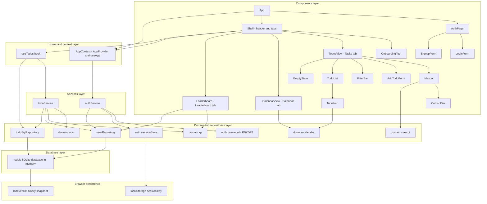
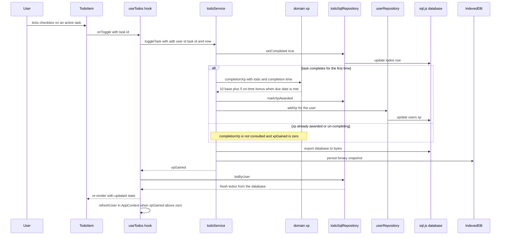

# 04 - Component Architecture

This document specifies the component and module architecture of the ShopBack To-Do app before implementation. It defines the layers, the responsibility of each component and module, the props/state contract between them, and the data-flow rules that every piece of code must follow.

**Stack:** TypeScript · React 19 · Vite · Tailwind CSS v4 · sql.js (SQLite compiled to WebAssembly) · IndexedDB (binary database snapshot) · Web Crypto (PBKDF2-SHA256) · Vitest + React Testing Library + fake-indexeddb · Playwright

The app is frontend-only. SQLite runs **in the browser** via sql.js; the entire database is exported and persisted as a binary snapshot into IndexedDB after every mutation and loaded on startup. **Documented assumption:** accounts are local to the device/browser - a real cross-device login would need a backend, which is out of scope.

The brand accent token is `brand`, a ShopBack-style red-orange (replacing the v1 indigo).

---

## 1. Layered architecture

The app is organised into six layers with a strict, one-directional dependency rule for writes: **components → hooks/context → services → pure domain + repositories → sql.js database → IndexedDB snapshot**. Nothing below the hooks/context layer knows React exists; nothing in the domain layer knows the browser or SQLite exists.



### Layer responsibilities

| Layer | Files | Responsibility | Allowed to import |
| --- | --- | --- | --- |
| Components | `src/components/*.tsx`, `src/App.tsx` | Render UI, capture user input, display errors. No business rules. | React, `useApp`, `useTodos`, domain **types** and pure **read** helpers (`cortisolLevel`, `dueBadge`, `buildMonthGrid`, `levelTitle`, `rankUsers`, …) |
| Hooks/context | `src/app/AppContext.tsx`, `src/hooks/useTodos.ts` | Boot the database, restore the session, own React state, orchestrate service calls, re-query the database after mutations. | React, services, repositories (reads), `AppDatabase` type |
| Services | `src/services/authService.ts`, `src/services/todoService.ts` | Use-case orchestration: input validation via domain rules, repository writes, XP awarding, legacy import, snapshot persistence after every mutation. | Domain, repositories, auth utilities, `AppDatabase` type |
| Domain | `src/domain/todo.ts`, `xp.ts`, `mascot.ts`, `calendar.ts` | All business rules: validation, todo mutations, XP and levels, cortisol and moods, calendar math, due badges. Pure and immutable. | Only `Todo`/type imports between domain modules - no React, no browser APIs, no sql.js |
| Repositories + auth utilities | `src/storage/userRepository.ts`, `src/storage/todoSqlRepository.ts`, `src/auth/password.ts`, `src/auth/sessionStore.ts` | Translate between domain objects and SQL rows; hash and verify passwords with Web Crypto; read/write the session key. | Domain types, sql.js `Database` type, Web Crypto, `Storage` interface |
| Database | `src/db/database.ts` | Create the sql.js instance (injectable `wasmBinary` and storage adapter), run migrations tracked in the `meta` table, seed demo users on a fresh database, export/persist the snapshot. | sql.js, storage adapter interface |
| Browser | IndexedDB, localStorage | Physical persistence: the exported SQLite snapshot lives in IndexedDB; the session lives under `shopback-todo.session.v1` in localStorage. | - |

The database holds three tables: `users` (id, username, password_hash, salt, department, xp, has_seen_onboarding, is_demo, created_at), `todos` (id, user_id, title, completed, created_at, due_date nullable, xp_awarded), and `meta` (key/value, holding the schema version). The full schema and domain model are specified in `03-domain-model.md`.

### Dependency rules

- **Writes always go down the full stack.** Components never call a repository write or a domain mutation function directly - every state change goes component → `useTodos`/`useApp` action → service → repository → sql.js → snapshot persist.
- **Reads may take a shortcut.** View components may call pure domain read helpers for display (Mascot computes cortisol and mood, TodoItem computes its due badge, CalendarView builds the month grid), and `Leaderboard` may run the read-only `listLeaderboard` query using the `adb` handle from `useApp`. Reads never change state, so this does not weaken the single source of truth.
- Domain files have **zero runtime imports** outside `src/domain/` (only the `Todo` type is shared between them). Every function takes inputs and returns new values - arrays and objects are never mutated in place.
- `src/db/database.ts` exposes `createAppDatabase` with an injectable `wasmBinary` and an injectable storage adapter: the IndexedDB adapter is the default in the app; an in-memory adapter is injected in unit and integration tests so no browser storage is touched.
- `src/auth/sessionStore.ts` accepts an optional `Storage` parameter (defaulting to `window.localStorage`) so unit tests inject a mock.
- `useTodos` is the only module that combines service writes with repository reads: it calls `todoService` to mutate, then `todoSqlRepository.listByUser` to re-query, and sets React state from the query result.

---

## 2. Component props, state, and actions

`App` switches between `AuthPage` (logged out) and `Shell` (logged in) based on `useApp`. `Shell` owns the single `useTodos` instance for the logged-in user and passes its state and actions to the tab views; every other component is presentational and receives data and callbacks via props.

| Component | Props | Local state | Actions triggered |
| --- | --- | --- | --- |
| `App` | - | - | Reads `useApp`; renders a boot-error screen if the database failed to open, `AuthPage` when no user, `Shell` when logged in |
| `AuthPage` | - | `mode: 'login' \| 'signup'` | `login`, `signup`, `demoLogin` from `useApp` (demo button signs in as username `demo`, password `demo1234`) |
| `LoginForm` | `onLogin: (username, password) => Promise<string \| null>` | `username`, `password`, `error: string \| null` | `authService.login` via `useApp` |
| `SignupForm` | `onSignup: (username, password, department) => Promise<string \| null>` | `username`, `password`, `department`, `error: string \| null` | `authService.signup` via `useApp` (username 3–20 alphanumeric, password min 8 chars, department from `DEPARTMENTS`) |
| `Shell` | - | `activeTab: 'tasks' \| 'calendar' \| 'leaderboard'`, `isTourOpen: boolean`; owns the `useTodos` instance | `logout` from `useApp`; opens `OnboardingTour` automatically when `user.hasSeenOnboarding` is false, or via the header help button. Header shows app name, user chip with level title and XP, help button, logout, and the three tabs |
| `OnboardingTour` | `open: boolean`, `onClose: () => void` | `step: number` (0–3 across the 4 tour steps) | `completeOnboarding` from `useApp` on Finish or Skip (sets `has_seen_onboarding`); Next/Back navigate steps |
| `TodosView` | `todos: Todo[]`, `filter: Filter`, plus the `useTodos` action callbacks below | - | Derives the visible list via `filterTodos` and `itemsLeft` via `activeCount`; composes Mascot, AddTodoForm, FilterBar, TodoList, EmptyState |
| `Mascot` | `todos: Todo[]` | - | Pure display: computes `cortisolLevel`, `moodForCortisol`, `mascotMessage` from `src/domain/mascot.ts`; renders Kapi the capybara as inline SVG with a per-mood expression and message |
| `CortisolBar` | `level: number` (0–100), `mood: Mood` | - | Pure display of the cortisol bar |
| `AddTodoForm` | `onAdd: (title: string, dueDate: number \| null) => string \| null` | `title`, `dueDate: number \| null` (optional due-date input; past dates allowed), `error: string \| null` | `addTask` via `onAdd`; on `null` result clears input and error, otherwise shows returned error |
| `FilterBar` | `filter: Filter`, `onFilterChange: (f: Filter) => void`, `itemsLeft: number`, `hasCompleted: boolean`, `onClearCompleted: () => void` | - | `setFilter`, `clearCompletedTasks` |
| `TodoList` | `todos: Todo[]`, `onToggle: (id) => void`, `onDelete: (id) => void`, `onEdit: (id, title, dueDate) => string \| null` | - | Pure pass-through to `TodoItem` |
| `TodoItem` | `todo: Todo`, `onToggle`, `onDelete`, `onEdit` (same signatures as above) | `isEditing: boolean`, `draft: string`, `draftDueDate: number \| null`, `editError: string \| null` | `toggleTask` (checkbox), `deleteTask`, `editTask` (Save/Enter; Escape or Cancel discards). Renders the due badge via `dueBadge` - Overdue in red, Today, Tomorrow, or a short date |
| `EmptyState` | `filter: Filter` | - | Message varies by active filter |
| `CalendarView` | `todos: Todo[]` | `viewYear: number`, `viewMonth: number` | Read-only view: `buildMonthGrid` renders a Monday-start month grid with previous/next navigation, a highlighted today cell, and task chips on their due dates via `todosOn`, with completed styling |
| `Leaderboard` | - | - | Read-only view: queries `userRepository.listLeaderboard` through `useApp().adb`, ranks with `rankUsers` (XP descending, competition ranking for ties), shows rank, username, department, level title, XP; highlights the current user's row; notes that the seeded 7 colleagues are demo data |

Notes on the contract:

- `onAdd` and `onEdit` return `string | null` - the validation error message or success. This lets `AddTodoForm` and `TodoItem` render inline errors locally without lifting transient error state into the hook.
- Draft text and draft due dates are deliberately local: they are transient UI state, not application state, and must not be persisted or shared.
- `StorageWarning` from v1 is **retired**. Storage failure is now a boot concern: `AppContext` exposes a boot error when the database cannot be created or the snapshot cannot be loaded, and `App` renders a full-page error state instead of a dismissible banner.
- `toggleTask` returns `xpGained` (0, 10, or 15). When it is above zero the hook asks `AppContext` to refresh the current user row, so the header chip and the leaderboard reflect the new XP without a reload.

### Hooks/context and service contracts

| Module | Exposes | Responsibility |
| --- | --- | --- |
| `AppContext` (`AppProvider`, `useApp`) | `adb: AppDatabase`, `user: User \| null`, `bootError`, `login`, `signup`, `demoLogin`, `logout`, `completeOnboarding`, `refreshUser` | Boots the database via `createAppDatabase` on mount, restores the session from `sessionStore`, saves/clears the session on login/logout |
| `useTodos` | `todos`, `filter`, `setFilter`, `addTask`, `editTask`, `toggleTask`, `deleteTask`, `clearCompletedTasks` | Loads the user's tasks with `listByUser` on mount, calls `todoService` for every mutation, re-queries after each one, surfaces `xpGained` from toggles |
| `authService` | `signup`, `login`, `demoLogin`, `DEPARTMENTS` | Validates signup input, hashes/verifies passwords via `src/auth/password.ts` (PBKDF2-SHA256, 100000 iterations, per-user salt), performs the one-time legacy import of v1 localStorage tasks on signup (then removes the legacy key), persists the snapshot |
| `todoService` | `addTask`, `editTask`, `toggleTask` (returns `xpGained`), `deleteTask`, `clearCompletedTasks` | Applies domain rules, writes through the repositories, awards XP exactly once per task via the `xp_awarded` flag, persists the snapshot after **every** mutation |

---

## 3. Data flow

### The database is the single source of truth

The in-memory sql.js SQLite database owned by `AppContext` is the one authoritative store for users and todos. React state (`todos` in `useTodos`, `user` in `AppContext`) is a **cache of query results**, never an independent copy: after every mutation the hook re-queries the repository (`listByUser`) instead of patching React state by hand, so the UI can never drift from the database. Counts, filtered views, cortisol, due badges, calendar grids, and leaderboard rankings are all computed on render from queried data.

### Unidirectional flow with re-query

State flows **down** as props; intent flows **up** as action calls. A user interaction never mutates data where it happens - it invokes a hook action, the hook calls a service, the service applies domain rules and writes SQL through a repository, persists the snapshot, and returns; the hook then re-queries and sets state, and React re-renders the subtree with fresh props.



The same shape applies to every mutating use case: `addTask`, `editTask`, `deleteTask`, and `clearCompletedTasks` each map to one service call, one set of SQL writes, one snapshot persist, and one re-query. XP cannot be farmed: `toggleTask` skips the award entirely whenever `xpAwarded` is already true - `completionXp` is never even consulted - and un-completing a task never removes XP.

### Snapshot persistence

`AppDatabase` exposes `{ db, persist, close }`. `persist` exports the **whole** SQLite database to a binary `Uint8Array` and writes it into IndexedDB through the storage adapter. Every service mutation ends with `persist`, so IndexedDB always holds the last committed state. On startup, `createAppDatabase` loads the snapshot from IndexedDB if one exists; otherwise it creates a fresh database, runs migrations (schema version tracked in `meta`), and seeds the demo account plus 7 demo colleagues across departments so the leaderboard is populated from day one.

### Boot and session restore

1. `AppProvider` mounts and calls `createAppDatabase` (IndexedDB adapter, bundled sql.js wasm binary).
2. Migrations and demo seeding run if needed.
3. `sessionStore.getSession` reads `shopback-todo.session.v1` from localStorage; if a user id is present and found via `userRepository.findById`, the user is restored without re-entering credentials.
4. `App` renders `Shell` (logged in), `AuthPage` (logged out), or the boot-error screen (database failure).

On signup, `authService` performs the one-time legacy import: any v1 tasks under the old localStorage key `shopback-todo.v1` are inserted into the new account's todos, and the legacy key is removed.

### Presentational components, testable core

- **Components are presentational.** They contain rendering logic and transient input state only. `TodoItem` does not know that empty titles are invalid - it displays whatever string `onEdit` returns. This keeps components trivial to integration-test through user interactions (`src/App.test.tsx`, IT-xx, with fake-indexeddb and an injected wasm binary).
- **All business rules live in the domain layer.** Title validation and the `MAX_TITLE_LENGTH = 200` cap, newest-first ordering, XP amounts and level titles, cortisol thresholds and moods, and calendar math are pure functions unit-tested exhaustively with plain Vitest (UT-xx) - no React, no DOM, no mocks.
- **Repositories and services are tested against a real database.** Unit tests run them against an actual in-memory sql.js database using the in-memory storage adapter, so SQL is exercised for real without a browser.
- **Failure handling stays contained.** `createAppDatabase` rejects with a typed boot error that `AppContext` catches and turns into `bootError`; services return validation errors as strings; nothing in the UI path throws for expected failures.

---

## 4. Project file structure

```text
shopback-todo/
├── e2e/
│   └── todo.spec.ts               # Playwright E2E: signup, demo login, task flows, XP, leaderboard,
│                                  # calendar, onboarding, persistence across reload (E2E-xx)
├── specs/                         # Pre-implementation specification documents (this file is 04)
│   ├── 01-scope.md
│   ├── 02-use-cases.md
│   ├── 03-domain-model.md
│   ├── 04-component-architecture.md
│   ├── 05-sequence-diagrams.md
│   └── 06-test-plan.md
├── src/
│   ├── app/
│   │   └── AppContext.tsx         # AppProvider boots the database and restores the session; useApp
│   ├── auth/
│   │   ├── password.ts            # hashPassword/verifyPassword - PBKDF2-SHA256, 100000 iterations, per-user salt
│   │   ├── password.test.ts       # Unit tests via Web Crypto (UT-xx)
│   │   ├── sessionStore.ts        # getSession/saveSession/clearSession under shopback-todo.session.v1
│   │   └── sessionStore.test.ts   # Session round-trip and corrupted-value tests (UT-xx)
│   ├── components/
│   │   ├── AddTodoForm.tsx        # Title input + optional due-date input + inline validation error
│   │   ├── AuthPage.tsx           # Login/Signup switcher; contains LoginForm, SignupForm, demo button
│   │   ├── CalendarView.tsx       # Monday-start month grid, navigation, today highlight, task chips
│   │   ├── EmptyState.tsx         # Empty-list message, varies by active filter
│   │   ├── FilterBar.tsx          # All/Active/Completed tabs, items-left counter, Clear completed
│   │   ├── Leaderboard.tsx        # All users by XP desc, competition ranking, current user highlighted
│   │   ├── Mascot.tsx             # Kapi the capybara inline SVG + moods; contains CortisolBar
│   │   ├── OnboardingTour.tsx     # 4-step tour modal with Next/Back/Skip
│   │   ├── Shell.tsx              # Header (app name, user chip, help, logout) + Tasks/Calendar/Leaderboard tabs
│   │   ├── TodoItem.tsx           # Checkbox toggle, inline edit of title and due date, due badge, Delete
│   │   ├── TodoList.tsx           # Maps visible todos to TodoItem rows
│   │   └── TodosView.tsx          # Tasks tab: composes Mascot, AddTodoForm, FilterBar, TodoList, EmptyState
│   ├── db/
│   │   ├── database.ts            # createAppDatabase: injectable wasmBinary + storage adapter,
│   │   │                          # migrations via meta table, demo seeding, AppDatabase { db, persist, close }
│   │   └── database.test.ts       # Unit tests with the in-memory adapter (UT-xx)
│   ├── domain/
│   │   ├── calendar.ts            # startOfDay, isSameDay, addDays, buildMonthGrid, monthLabel, todosOn, dueBadge
│   │   ├── calendar.test.ts
│   │   ├── mascot.ts              # isOverdue, cortisolLevel, Mood, moodForCortisol, mascotMessage
│   │   ├── mascot.test.ts
│   │   ├── todo.ts                # Todo, validateTitle, createTodo (optional dueDate), add/edit/toggle/delete,
│   │   │                          # filterTodos, activeCount, clearCompleted, MAX_TITLE_LENGTH
│   │   ├── todo.test.ts
│   │   ├── xp.ts                  # COMPLETION_XP, ON_TIME_BONUS_XP, XP_PER_LEVEL, LEVEL_TITLES,
│   │   │                          # completionXp, levelForXp, levelTitle, levelProgress, rankUsers
│   │   └── xp.test.ts
│   ├── hooks/
│   │   └── useTodos.ts            # Task state for the logged-in user; mutate via todoService, re-query after
│   ├── services/
│   │   ├── authService.ts         # signup/login/demo login, DEPARTMENTS, legacy localStorage import
│   │   ├── authService.test.ts    # Against a real in-memory sql.js database (UT-xx)
│   │   ├── todoService.ts         # addTask/editTask/toggleTask/deleteTask/clearCompletedTasks; persists every mutation
│   │   └── todoService.test.ts
│   ├── storage/
│   │   ├── todoSqlRepository.ts   # listByUser, insert, updateTitle, updateDueDate, setCompleted,
│   │   │                          # remove, clearCompleted, markXpAwarded
│   │   ├── todoSqlRepository.test.ts
│   │   ├── userRepository.ts      # findByUsername, findById, insertUser, addXp, setOnboardingSeen, listLeaderboard
│   │   └── userRepository.test.ts
│   ├── App.tsx                    # Boot-error screen / AuthPage / Shell switch under AppProvider
│   ├── App.test.tsx               # RTL integration: login, tasks, XP, leaderboard, calendar, mascot,
│   │                              # onboarding - fake-indexeddb + injected wasm binary (IT-xx)
│   ├── index.css                  # Tailwind v4 entry; brand token (red-orange accent)
│   └── main.tsx                   # React 19 root
├── index.html
├── package.json
├── playwright.config.ts
├── tsconfig.json
└── vite.config.ts
```

This structure mirrors the layers one-to-one: each directory under `src/` is a layer, unit tests sit next to the module they cover, and the two deliberate meeting points are `AppContext.tsx` (database + session + auth) and `useTodos.ts` (task mutations + re-query) - exactly where the layers are meant to meet.
