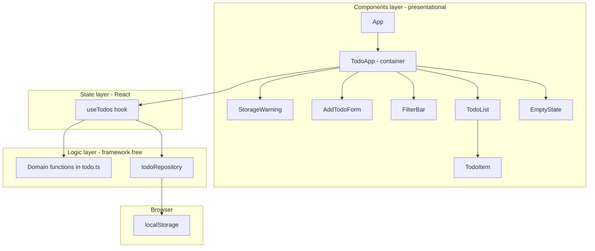
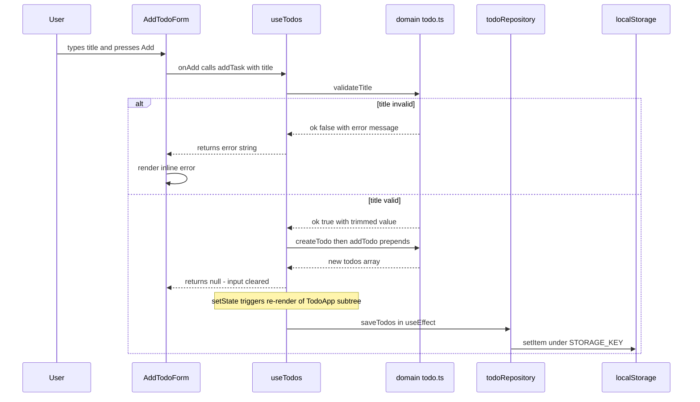

# 04 — Component Architecture

This document specifies the component and module architecture of the To-Do List app before implementation. It defines the layers, the responsibility of each component, the props/state contract between them, and the data-flow rules that every piece of code must follow.

**Stack:** TypeScript · React 19 · Vite · Tailwind CSS v4 · localStorage · Vitest + React Testing Library · Playwright

---

## 1. Layered architecture

The app is organised into four layers with a strict, one-directional dependency rule: **UI components → `useTodos` hook → pure domain functions + storage repository → browser localStorage**. Nothing below the hook knows React exists; nothing in the domain layer knows the browser exists.



### Layer responsibilities

| Layer | Files | Responsibility | Allowed to import |
| --- | --- | --- | --- |
| Components | `src/components/*.tsx`, `src/App.tsx` | Render UI, capture user input, display errors. No business rules. | React, `useTodos`, domain **types** only (`Todo`, `Filter`) |
| State (hook) | `src/hooks/useTodos.ts` | Own the single `todos` + `filter` state, orchestrate domain calls, trigger persistence, surface `storageWarning`. | React, domain functions, repository |
| Domain | `src/domain/todo.ts` | All business rules: validation, create/edit/toggle/delete, filtering, counting. Pure and immutable. | Nothing (no React, no browser APIs) |
| Storage | `src/storage/todoRepository.ts` | Serialize/deserialize `Todo[]` under `STORAGE_KEY = 'shopback-todo.v1'`; classify failures as `'unavailable'` or `'corrupted'`; never throw. | Domain types, `Storage` interface |
| Browser | localStorage | Physical persistence. | — |

### Dependency rules

- Components never import the repository or call domain **mutation** functions directly — every state change goes through a `useTodos` action.
- `src/domain/todo.ts` has **zero imports**: no React, no browser globals. Every function takes inputs and returns new values (arrays are never mutated in place).
- `src/storage/todoRepository.ts` accepts an optional `Storage` parameter (defaulting to `window.localStorage`) so unit tests inject a mock without touching jsdom globals.
- `useTodos` is the only module that combines the two: it calls domain functions to compute the next state and the repository to persist it.

---

## 2. Component props, state, and actions

`TodoApp` is the single stateful container; every other component is presentational and receives data and callbacks via props. Callbacks passed down are the `useTodos` actions (or thin wrappers around them).

| Component | Props | Local state | `useTodos` actions triggered |
| --- | --- | --- | --- |
| `App` | — | — | — (renders `TodoApp` only) |
| `TodoApp` | — | — (all state comes from `useTodos()`) | Owns the hook instance; wires every action below into child props |
| `StorageWarning` | `message: string` | `dismissed: boolean` (hides banner for the session) | — |
| `AddTodoForm` | `onAdd: (title: string) => string \| null` | `title: string` (input draft), `error: string \| null` (inline validation message) | `addTask` (via `onAdd`; on `null` result clears input and error, otherwise shows returned error) |
| `FilterBar` | `filter: Filter`, `onFilterChange: (f: Filter) => void`, `itemsLeft: number`, `hasCompleted: boolean`, `onClearCompleted: () => void` | — | `setFilter`, `clearCompletedTasks` |
| `TodoList` | `todos: Todo[]`, `onToggle: (id: string) => void`, `onDelete: (id: string) => void`, `onEdit: (id: string, title: string) => string \| null` | — | — (pure pass-through to `TodoItem`) |
| `TodoItem` | `todo: Todo`, `onToggle`, `onDelete`, `onEdit` (same signatures as above) | `isEditing: boolean`, `draft: string` (edit buffer), `editError: string \| null` | `toggleTask` (checkbox), `deleteTask` (Delete button), `editTask` (Save / Enter; Escape or Cancel discards the draft without any action) |
| `EmptyState` | `filter: Filter` (message varies by active filter) | — | — |

Notes on the contract:

- `onAdd` and `onEdit` return `string | null` — the validation error message or success. This lets `AddTodoForm` and `TodoItem` render inline errors locally without lifting transient error state into the hook.
- `TodoApp` derives `itemsLeft` from `activeCount(todos)` and the visible list from `filterTodos(todos, filter)`; children never filter or count on their own.
- Draft text (`title` in `AddTodoForm`, `draft` in `TodoItem`) is deliberately local: it is transient UI state, not application state, and must not be persisted or shared.

---

## 3. Data flow

### Single source of truth

The `todos: Todo[]` array and the active `filter` live in exactly one place: the `useTodos` hook instance owned by `TodoApp`. There is no duplicated or derived state stored elsewhere — counts, filtered views, and empty-state decisions are all computed on render from that one array.

### Unidirectional flow

State flows **down** as props; intent flows **up** as action calls. A user interaction never mutates data where it happens — it invokes an action, the hook computes the next immutable state via a domain function, React re-renders, and every component receives the new props. Persistence is a side effect of the state change (a `useEffect` in `useTodos` saves on every `todos` change), so the UI and localStorage can never disagree about what happened.



The same shape applies to every use case: `editTask`, `toggleTask`, `deleteTask`, and `clearCompletedTasks` each map to one domain function, one state update, and one auto-save.

### Presentational components, testable domain

- **Components are presentational.** They contain rendering logic and transient input state only. `TodoItem` does not know that empty titles are invalid — it just displays whatever string `onEdit` returns. This keeps components trivial to integration-test through user interactions (`src/components/TodoApp.test.tsx`, IT-xx).
- **All business rules live in the domain layer.** Trimming, the empty-title rejection, the `MAX_TITLE_LENGTH = 200` cap, newest-first ordering, immutable toggle/edit/delete, filtering, and active counting are all pure functions in `src/domain/todo.ts`. Because that file imports nothing, its rules are unit-tested exhaustively in `src/domain/todo.test.ts` (UT-xx) with plain Vitest — no React, no DOM, no mocks.
- **Failure handling is data, not exceptions.** The repository converts storage failures into `LoadResult`/boolean values (`'unavailable'`, `'corrupted'`); the hook translates those into `storageWarning`, and `StorageWarning` merely renders it. The app keeps working in memory either way.

---

## 4. Project file structure

```text
shopback-todo/
├── e2e/
│   └── todo.spec.ts             # Playwright end-to-end flows, incl. persistence across reload (E2E-xx)
├── specs/                       # Pre-implementation specification documents (this file is 04)
│   ├── 01-scope.md
│   ├── 02-use-cases.md
│   ├── 03-domain-model.md
│   ├── 04-component-architecture.md
│   ├── 05-sequence-diagrams.md
│   └── 06-test-plan.md
├── src/
│   ├── components/
│   │   ├── AddTodoForm.tsx      # Input + Add button + inline validation error
│   │   ├── EmptyState.tsx       # Empty-list message, varies by active filter
│   │   ├── FilterBar.tsx        # All/Active/Completed tabs, items-left counter, Clear completed
│   │   ├── StorageWarning.tsx   # Dismissible banner for storage errors
│   │   ├── TodoApp.tsx          # Container: owns useTodos, composes all children
│   │   ├── TodoApp.test.tsx     # Integration tests: RTL + user-event, real domain + repository (IT-xx)
│   │   ├── TodoItem.tsx         # Checkbox toggle, inline edit with Save/Cancel, Delete
│   │   └── TodoList.tsx         # Maps visible todos to TodoItem rows
│   ├── domain/
│   │   ├── todo.ts              # Pure business rules: Todo, validateTitle, add/edit/toggle/delete, filters
│   │   └── todo.test.ts         # Unit tests for every domain function (UT-xx)
│   ├── hooks/
│   │   └── useTodos.ts          # Single source of truth; load on mount, auto-save on change
│   ├── storage/
│   │   ├── todoRepository.ts    # loadTodos/saveTodos/isValidTodoArray over STORAGE_KEY
│   │   └── todoRepository.test.ts  # Unit tests with a mocked Storage object (UT-xx)
│   ├── App.tsx                  # Renders TodoApp
│   ├── index.css                # Tailwind v4 entry
│   └── main.tsx                 # React 19 root
├── index.html
├── package.json
├── playwright.config.ts
├── tsconfig.json
└── vite.config.ts
```

This structure mirrors the layers one-to-one: each directory under `src/` is a layer, unit tests sit next to the module they cover, and the only cross-layer file is `useTodos.ts`, which is exactly where the layers are meant to meet.
