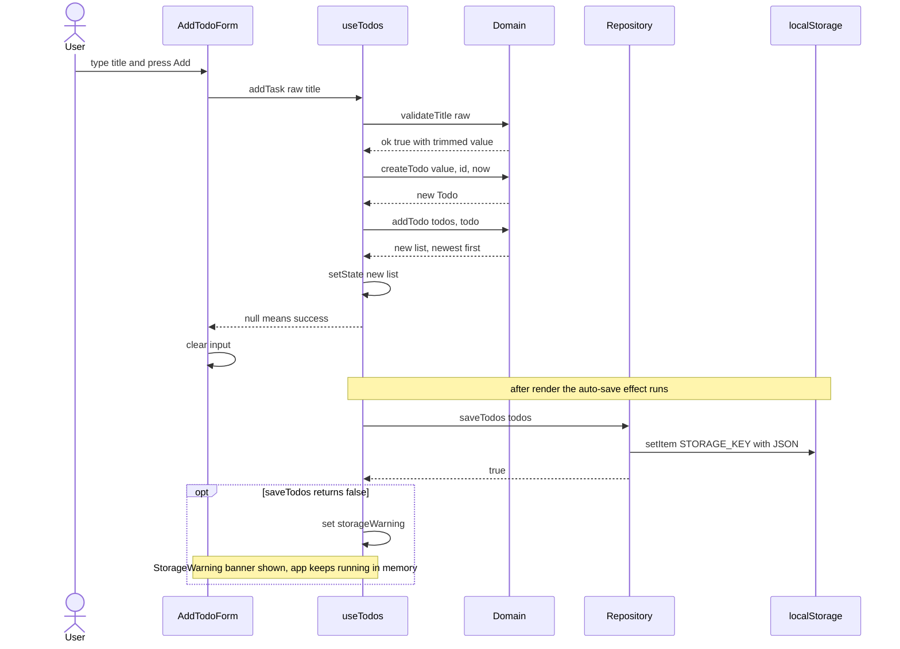
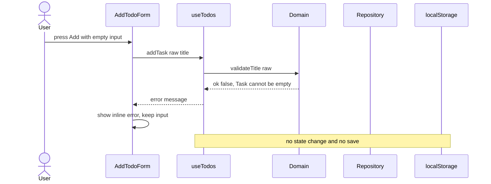
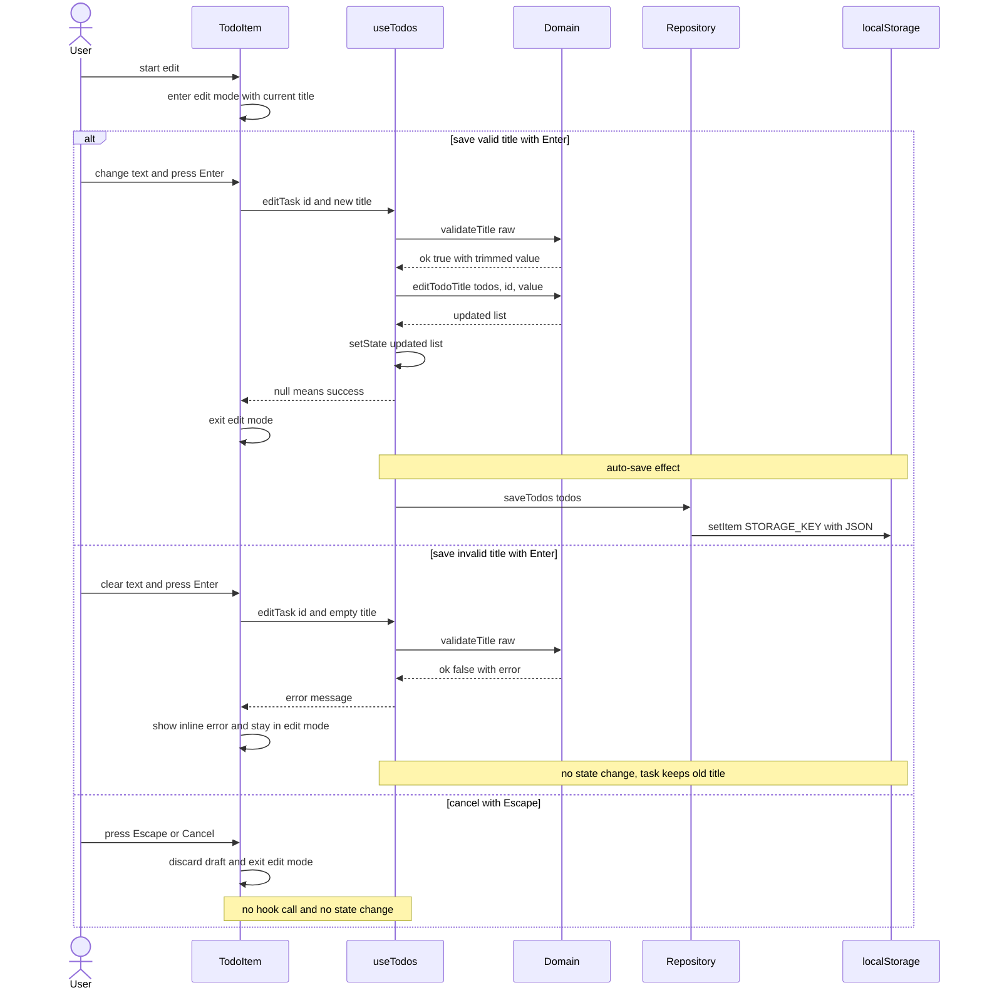
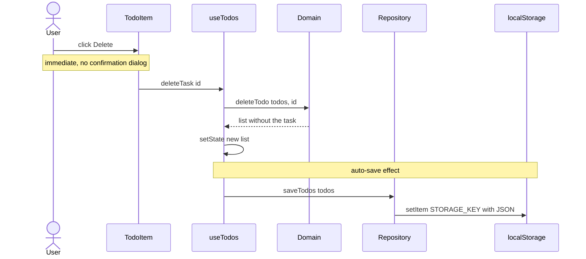
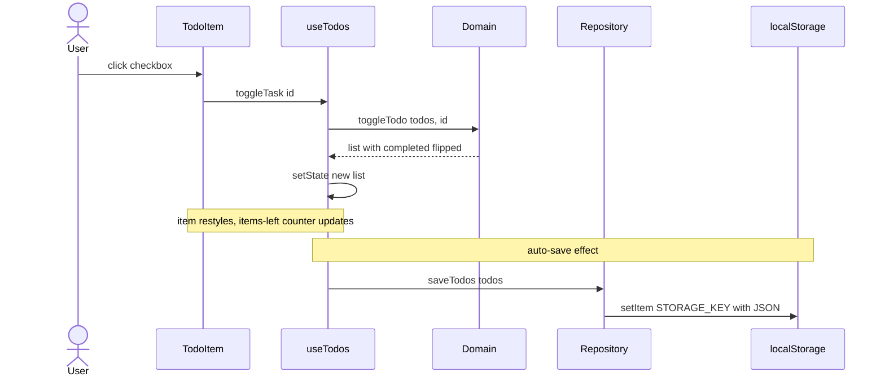
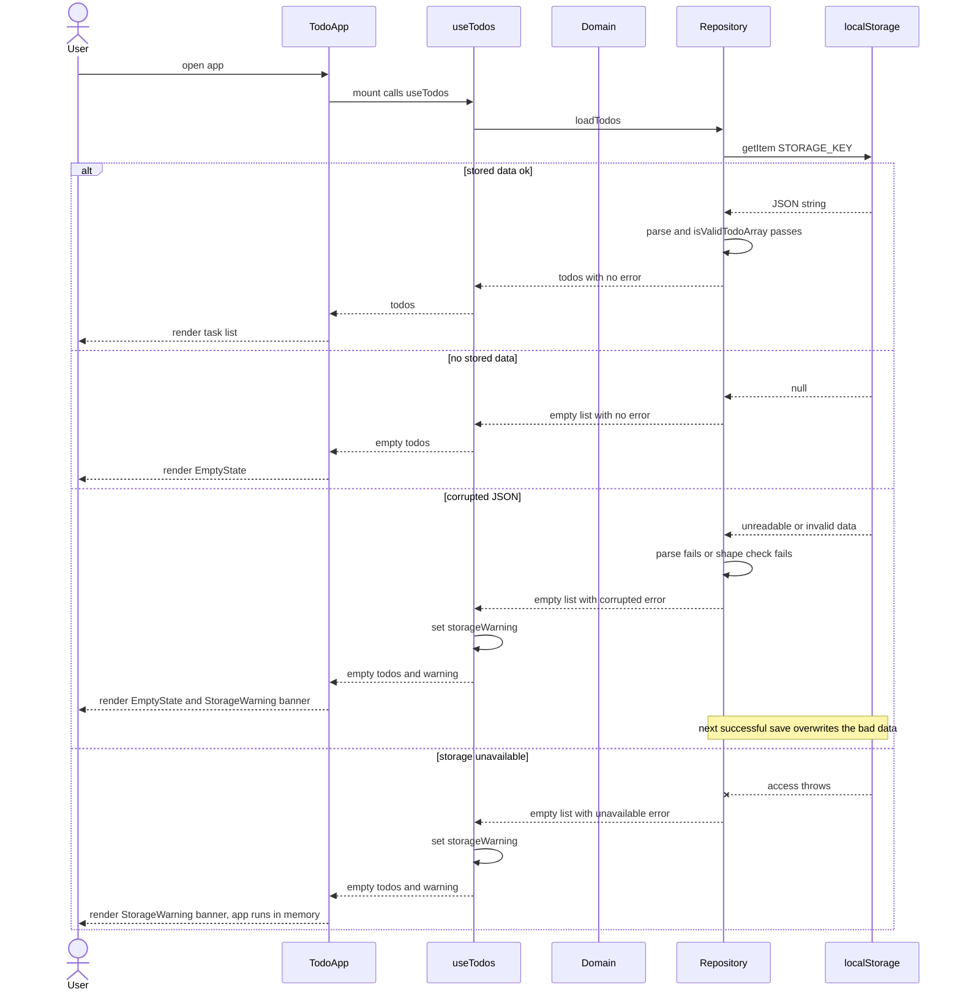

# 05 — Sequence Diagrams

This document shows the runtime interactions for each main use case of the To-Do List app. Every diagram follows the same layered flow: a UI component calls an action on the `useTodos` hook, the hook delegates to pure domain functions, React state updates, and a `useEffect` auto-saves the new list through the storage repository to browser localStorage.

## How to read these diagrams

| Participant | Maps to |
| --- | --- |
| User | Person using the app in a browser |
| AddTodoForm / TodoItem / TodoApp | React component in `src/components/` that initiates the flow |
| useTodos | `src/hooks/useTodos.ts` — state, actions, and the auto-save effect |
| Domain | `src/domain/todo.ts` — pure, immutable functions |
| Repository | `src/storage/todoRepository.ts` — load and save with error handling |
| localStorage | Browser `localStorage`, keyed by `shopback-todo.v1` |

Two conventions apply throughout:

- **Auto-save**: any state change re-runs the hook's `useEffect`, which calls `saveTodos`. It is shown in full in UC-01 and abbreviated with a note in later diagrams.
- **Error returns, not exceptions**: `addTask` and `editTask` return an error message string on validation failure and `null` on success; the component renders the string inline.

---

## UC-01 Add task — happy path

The user types a title and submits. The hook validates and trims the title, builds a new `Todo`, prepends it so the newest task appears on top, and the auto-save effect persists the new list.

## UC-01 Add task — validation error path

Submitting an empty or whitespace-only title is rejected before any state change; the same path applies to titles over 200 characters with a different message. The Repository and localStorage lifelines stay idle — nothing is saved.

## UC-02 Edit task title

The user activates inline editing on a task, then either saves a valid title, attempts an invalid save, or cancels. On an invalid save the task keeps its old title and stays in edit mode; Escape or Cancel discards the draft without touching the hook.

## UC-03 Delete task

Deletion is immediate by design — no confirmation dialog and no undo. The domain returns a new list without the task and the auto-save effect persists it.

## UC-04 Mark task complete / incomplete

Clicking the checkbox flips the task's `completed` flag immutably. The same flow handles both directions; the FilterBar counter and any active filter re-render from the new state.

## UC-05 Persist and restore tasks — startup and restore

On mount, `useTodos` calls `loadTodos` exactly once. The repository distinguishes four outcomes: valid stored data, no data yet, corrupted JSON, and inaccessible storage — the last two surface a dismissible StorageWarning banner while the app keeps working.

