# 05 - Sequence Diagrams

This document shows the runtime interactions for the main use cases of the ShopBack To-Do app (v2). Every flow follows the same layered path: a UI component calls an action exposed by the hooks/context layer (`useApp` from `AppContext` for auth and onboarding, the `useTodos` hook for task mutations), which delegates to a service (`authService` or `todoService`); services combine pure domain functions with repository calls against the in-browser SQLite database (sql.js), and after every mutation the service persists the whole database as a binary snapshot into IndexedDB.

## How to read these diagrams

| Participant | Maps to |
| --- | --- |
| User | Person using the app in a browser |
| AuthPage / LoginForm / SignupForm | Auth components in `src/components/` |
| AddTodoForm / TodoItem / TodosView | Task components in `src/components/` |
| Shell / Leaderboard / OnboardingTour | Shell-level components in `src/components/` |
| AppContext | `src/app/AppContext.tsx` - `AppProvider` boots the app; `useApp` exposes `adb`, `user`, auth actions, and `completeOnboarding` |
| useTodos | `src/hooks/useTodos.ts` - task state for the logged-in user; delegates every mutation to `todoService` and re-queries via `todoSqlRepository.listByUser` afterwards |
| AuthService | `src/services/authService.ts` - signup, login, demo login, legacy import |
| TodoService | `src/services/todoService.ts` - task mutations, XP award, snapshot persistence |
| Domain | Pure functions in `src/domain/` - `todo.ts`, `xp.ts`, `mascot.ts`, `calendar.ts` |
| Password | `src/auth/password.ts` - PBKDF2-SHA256 hashing |
| WebCrypto | Browser Web Crypto API used by Password |
| SessionStore | `src/auth/sessionStore.ts` - localStorage key `shopback-todo.session.v1` |
| UserRepo | `src/storage/userRepository.ts` - SQL access to the `users` table |
| TodoRepo | `src/storage/todoSqlRepository.ts` - SQL access to the `todos` table |
| AppDatabase | `src/db/database.ts` - sql.js SQLite database with `persist` and `close` |
| IndexedDB | Browser IndexedDB holding the binary database snapshot |
| localStorage | Browser localStorage - the session key and the legacy v1 task key `shopback-todo.v1` |

Three conventions apply throughout:

- **Persist after every mutation**: instead of the v1 auto-save effect, each service mutation ends by calling `persist` on `AppDatabase`, which exports the database to bytes and writes the snapshot into IndexedDB. It is shown in full in UC-01 and abbreviated with a note in later diagrams. Reads never persist.
- **Error returns, not exceptions**: validation failures come back as error message strings and `null` means success; the component renders the string inline. Only a failed database boot surfaces as an error screen.
- **State refresh**: after a successful mutation the hooks/context layer re-reads the affected rows and React re-renders; derived UI such as the mascot mood, due badges, and the items-left counter recompute from the new state.

---

## UC-05 Persist and restore tasks - startup

On first paint, `AppProvider` boots the database and restores the session. `createAppDatabase` loads the sql.js WASM binary, asks the IndexedDB storage adapter for an existing snapshot, and either opens it and runs any pending migrations recorded in the `meta` table, or creates a fresh schema and seeds the demo account plus 7 demo colleagues. A stored session then decides whether the user lands in the Shell or on the AuthPage.

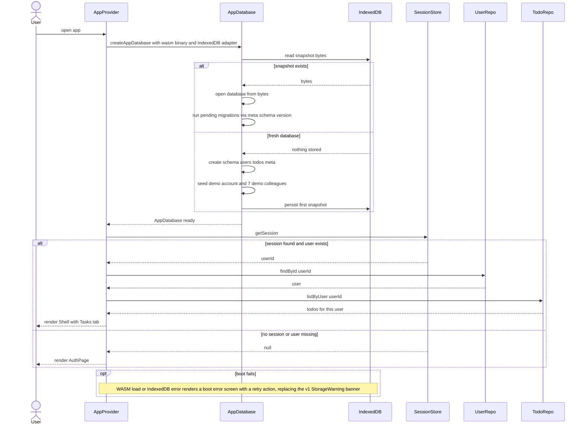

## UC-01 Add task - happy path

The user types a title, optionally picks a due date, and submits. The service validates and trims the title, builds a new `Todo` with `xpAwarded` false, inserts it for the current user, and persists the snapshot. The newest task appears on top.

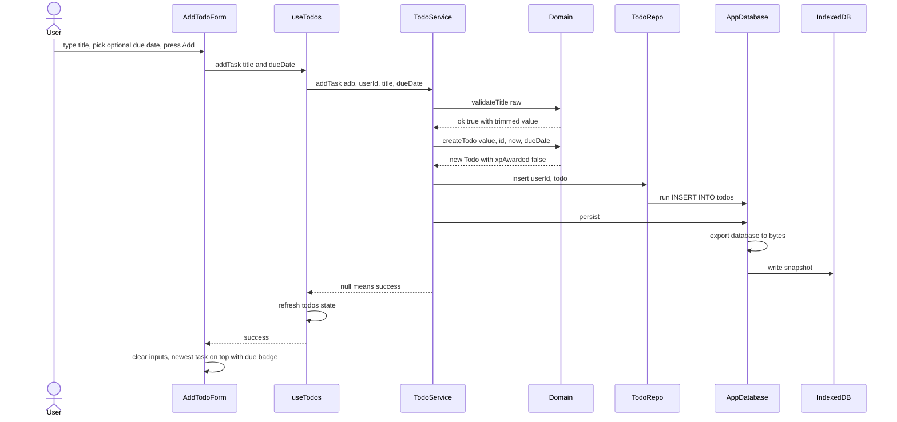

## UC-01 Add task - validation error path

Submitting an empty or whitespace-only title is rejected before any write; the same path applies to titles over 200 characters with a different message. The repository, database, and IndexedDB lifelines stay idle - nothing is saved.

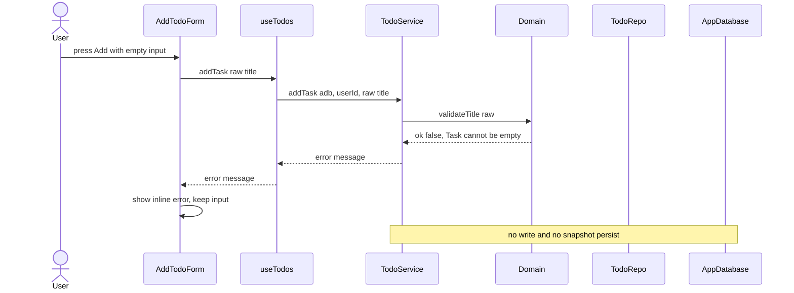

## UC-02 Edit task title (and due date)

The user activates inline editing on a task, then either saves valid changes, attempts an invalid save, or cancels. A save can change the title, the due date, or both; past due dates are allowed. On an invalid title the task keeps its old values and stays in edit mode; Escape or Cancel discards the draft without touching the service.

```mermaid
sequenceDiagram
    actor User
    participant Item as TodoItem
    participant Hook as useTodos
    participant Svc as TodoService
    participant Domain
    participant TodoRepo
    participant DB as AppDatabase

    User->>Item: start edit
    Item->>Item: enter edit mode with current title and due date
    alt save valid changes with Enter
        User->>Item: change text or due date and press Enter
        Item->>Hook: editTask id, title, dueDate
        Hook->>Svc: editTask adb, id, title, dueDate
        Svc->>Domain: validateTitle raw
        Domain-->>Svc: ok true with trimmed value
        Svc->>TodoRepo: updateTitle id, value
        Svc->>TodoRepo: updateDueDate id, dueDate
        Note over Svc,DB: persist snapshot
        Svc-->>Hook: null means success
        Hook-->>Item: success
        Item->>Item: exit edit mode, due badge re-renders
    else save invalid title with Enter
        User->>Item: clear text and press Enter
        Item->>Hook: editTask id, empty title
        Hook->>Svc: editTask adb, id, empty title
        Svc->>Domain: validateTitle raw
        Domain-->>Svc: ok false with error
        Svc-->>Hook: error message
        Hook-->>Item: error message
        Item->>Item: show inline error and stay in edit mode
        Note over Svc,DB: no write and no persist, task keeps old values
    else cancel with Escape
        User->>Item: press Escape or Cancel
        Item->>Item: discard draft and exit edit mode
        Note over Item,Hook: no service call and no state change
    end
```

## UC-03 Delete task

Deletion is immediate by design - no confirmation dialog and no undo. The row is removed from the `todos` table and the snapshot persisted. XP already earned from the task is kept, because XP lives on the user row, not the task.

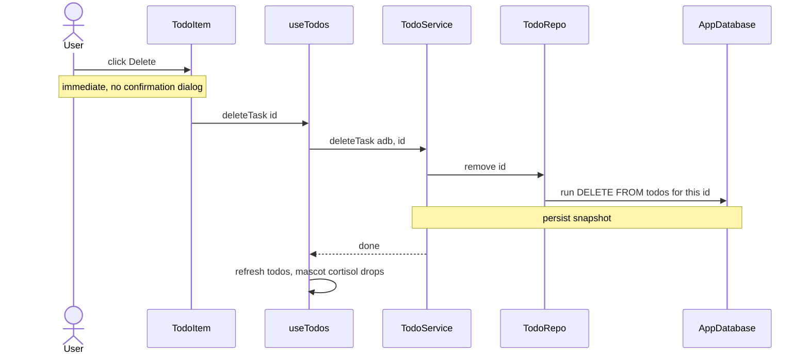

UC-07 Clear completed tasks follows this exact pattern with `clearCompletedTasks`, which removes every completed row for the current user in one statement before persisting.

## UC-04 Mark task complete / incomplete and UC-10 Earn XP and level up

Clicking the checkbox flips `completed` through `setCompleted`. Completing a task for the first time awards `COMPLETION_XP` 10, plus `ON_TIME_BONUS_XP` 5 when the task has a due date and is completed on or before the end of that day - `completionXp` in `src/domain/xp.ts` decides the amount. The `xpAwarded` flag guarantees XP is granted at most once per task: un-ticking keeps the XP and re-ticking awards nothing.

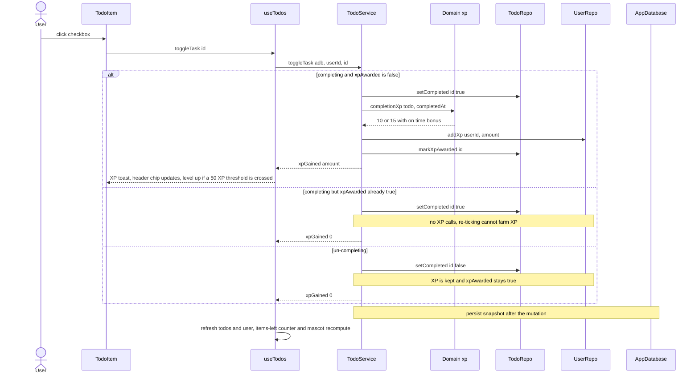

## UC-08 Sign up for an account

Signup validates the username, password, and department, checks uniqueness, hashes the password with a fresh per-user salt via Web Crypto, and inserts the user with `xp` 0 and `has_seen_onboarding` 0. If the legacy v1 localStorage key still holds tasks, they are imported into the new account exactly once and the key is removed, so a second account on the same browser cannot import them again.

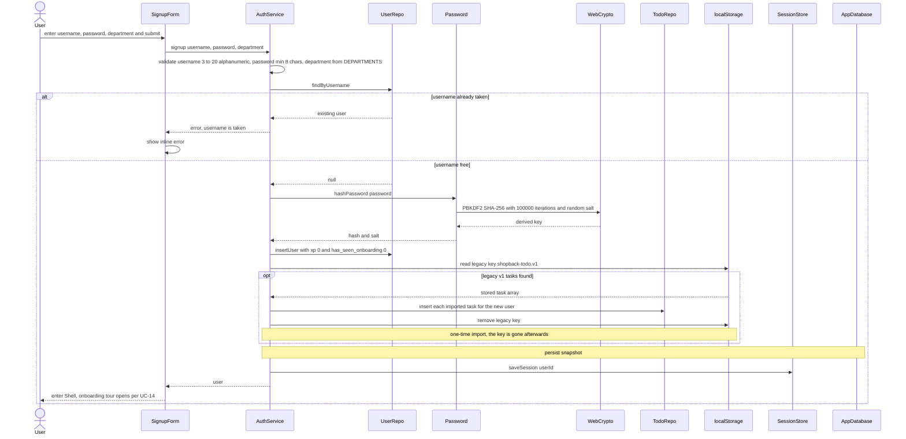

## UC-09 Log in and log out

Login looks the user up, verifies the password by re-deriving the PBKDF2 hash with the stored salt, and saves the session. Unknown username and wrong password deliberately return the same generic message so the form cannot be used to probe which accounts exist. The demo button on the AuthPage runs this same flow with the seeded credentials, username demo and password demo1234.

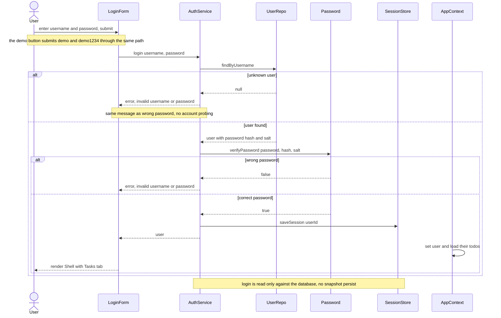

Logging out clears only the session - the database and its snapshot are untouched, so the account and its tasks are still there on the next login.

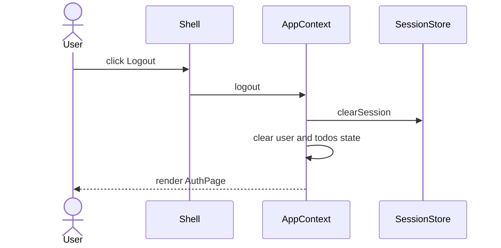

## UC-11 View the leaderboard

The Leaderboard tab is a pure read. `listLeaderboard` returns every user ordered by XP descending, then domain functions apply competition ranking - tied XP shares a rank and the next rank is skipped - and map XP to level titles. The current user's row is highlighted and the UI notes that the seeded rows are demo colleagues.

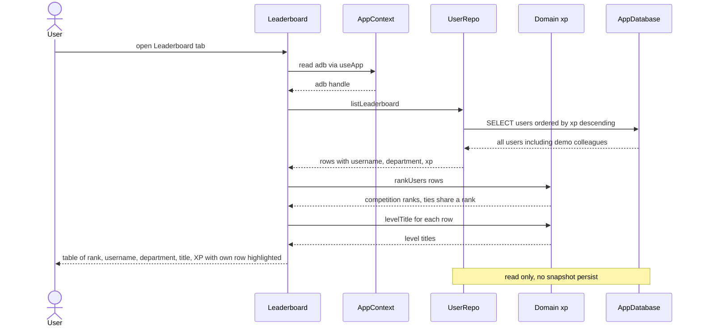

## UC-14 First-time onboarding tour

After login or signup, the Shell opens the 4-step tour when the user's `has_seen_onboarding` flag is 0. The steps cover tasks and due dates, XP and the leaderboard, Kapi and cortisol, and the calendar. Finishing or skipping calls `completeOnboarding`, which sets the flag in the `users` table and persists - so the tour never auto-opens again for that account. The header help button reopens it anytime without writing.

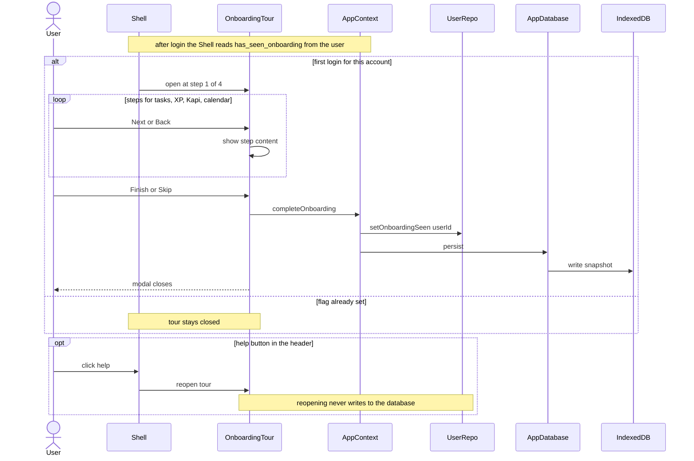

## Flows without a dedicated diagram

The remaining use cases are render-time derivations or reuse a pattern shown above, so a separate diagram would add no new interaction:

- **UC-06 Filter tasks** - `filterTodos` runs purely at render over the in-memory list; no service, repository, or persist call is involved.
- **UC-07 Clear completed tasks** - `clearCompletedTasks` follows the UC-03 mutation pattern with a single bulk delete, then persists.
- **UC-12 Assign due dates and view the calendar** - assigning a due date is part of UC-01 and UC-02; the due badges via `dueBadge` and the Monday-start month grid via `buildMonthGrid`, `monthLabel`, and `todosOn` are pure calendar-domain derivations computed at render.
- **UC-13 Mascot reacts to task load** - after every state refresh the Mascot component recomputes `cortisolLevel` from active and overdue counts, maps it through `moodForCortisol`, and renders the matching expression, message, and CortisolBar; nothing is stored.
