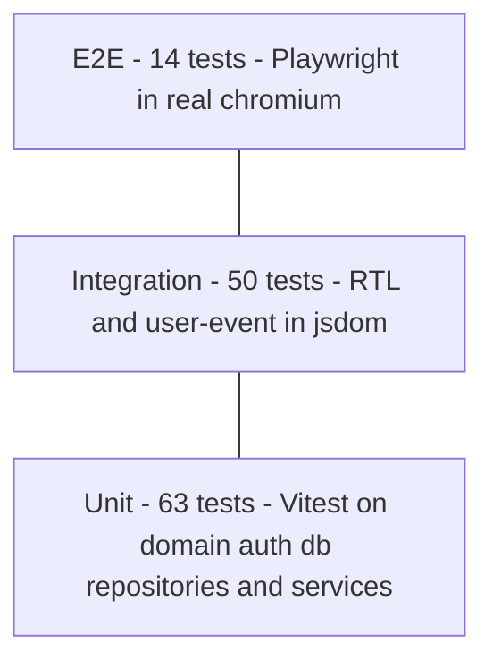
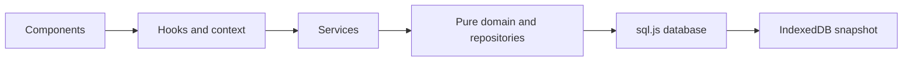

# 06 - Test Plan

> **Status note.** This document is the plan the suite was built from. The implemented suite has since grown past it: a post-implementation adversarial coverage audit added hardening tests (session store, legacy-import failure modes, ownership checks, auth boundary values, persistence discipline, calendar and XP boundaries), bringing the real totals to **210 Vitest tests and 14 Playwright tests**, all passing. The audit also surfaced and fixed two real defects: the legacy import destroyed the v1 key on unreadable data, and edit/delete were not ownership-scoped like toggle.

Test plan for the ShopBack To-Do web app v2 (TypeScript, React 19, Vite, Tailwind CSS v4). The app is frontend-only: SQLite runs in the browser via **sql.js** (a WebAssembly build of SQLite), and the whole database is persisted as a binary snapshot in **IndexedDB** after every mutation. Accounts are authenticated with **Web Crypto PBKDF2-SHA256** password hashing, and the session is kept in `localStorage`. Tooling: **Vitest + React Testing Library** for unit and integration tests, **Playwright** for end-to-end tests, **fake-indexeddb** as a test-only stand-in for the browser's IndexedDB.

---

## 1. Strategy

### 1.1 Test pyramid

The suite follows the classic test pyramid: many fast, deterministic unit tests at the base; a smaller set of integration tests that exercise the real app the way a user does; a handful of end-to-end tests that prove the whole system works in a real browser, including accounts, XP, and persistence across a page reload.



### 1.2 Test seams in the architecture

The app is layered, and each test level replaces exactly one thing at the bottom of the stack - everything above the seam is always real:



- **Unit tests** run the real sql.js engine but inject the **in-memory storage adapter** into `createAppDatabase`, so no IndexedDB is involved. SQL behavior is never mocked - repositories and services run against a real SQLite database.
- **Integration tests** keep the real adapter but run it against **fake-indexeddb**, and inject the sql.js **wasm binary** from `node_modules` (jsdom cannot fetch `.wasm` over the network).
- **E2E tests** replace nothing: real browser, real IndexedDB, real wasm fetch, real `localStorage`.

### 1.3 Bottom-up unit testing - isolate the important parts

The domain layer carries all of the business rules and is deliberately free of React and browser APIs, so it is tested **bottom-up** as plain functions:

- `src/domain/todo.test.ts` - validation, trimming, the 200-character limit, newest-first ordering, no-op on unknown ids, immutability of inputs, due date and `xpAwarded` defaults. Pure functions, no mocks at all.
- `src/domain/xp.test.ts` - completion XP, the on-time bonus, level thresholds, level titles, level progress, and competition ranking for ties. Pure functions taking explicit timestamps, so day-boundary cases are deterministic.
- `src/domain/mascot.test.ts` - overdue detection, the cortisol formula and its cap, mood thresholds, and mascot messages. Pure functions taking an explicit `now`.
- `src/domain/calendar.test.ts` - day arithmetic, the Monday-start month grid, month labels, per-day todo lookup, and due badges.
- `src/auth/password.test.ts` - `hashPassword` / `verifyPassword` against the **real Web Crypto implementation** available in the Node test runtime (PBKDF2-SHA256, 100000 iterations, per-user salt). `src/auth/sessionStore.test.ts` covers the `localStorage` session round-trip.
- `src/db/database.test.ts`, `src/storage/userRepository.test.ts`, `src/storage/todoSqlRepository.test.ts`, `src/services/authService.test.ts`, `src/services/todoService.test.ts` - all run against a **real in-memory sql.js database** created through `createAppDatabase` with the injected in-memory storage adapter. This exercises real SQL - migrations, seeding, constraints, and per-user scoping - with every failure mode of the snapshot adapter (missing, corrupted, throwing) simulated deterministically through injection.

Where a test depends on the current time, the time is passed as an argument (domain) or pinned with `vi.setSystemTime` (services), so every date-boundary test is deterministic.

### 1.4 Top-down integration testing - simulate the real user

`src/App.test.tsx` tests **top-down** from the root of the app. It renders the real `App` under `AppProvider` and drives it with `user-event` exactly as a person would: signing up, logging in, typing tasks, picking due dates, clicking checkboxes, tabs, and buttons. Nothing inside the app is mocked - the tests run the **real context, real services, real domain functions, real repositories, and the real sql.js engine**, with **fake-indexeddb** standing in for the browser's IndexedDB and the wasm binary injected into `createAppDatabase`. This verifies the wiring the unit tests cannot see: database boot on mount, session restore, snapshot persistence after every mutation, XP surfacing in the header chip, the leaderboard, the calendar, Kapi's moods, and the onboarding tour.

### 1.5 End-to-end testing - the full browser truth

The Playwright suite in `e2e/` runs against a production-like build in **real chromium**, using the browser's **real IndexedDB** and **real `localStorage`**. E2E tests cover complete user journeys - signup, demo login, task flows, XP gain, the leaderboard, the calendar, onboarding - and the behaviors no lower level can prove: **tasks, accounts, XP, and the session survive an actual page reload**. IndexedDB and `localStorage` are cleared before each test for isolation.

### 1.6 Who covers what

| Level | Tool | Files | Database and storage | Test ID prefix |
| --- | --- | --- | --- | --- |
| Unit | Vitest | `src/domain/*.test.ts`, `src/auth/*.test.ts`, `src/db/database.test.ts`, `src/storage/*.test.ts`, `src/services/*.test.ts` | Domain: pure, nothing needed. DB, repositories, services: real in-memory sql.js database with the injected in-memory adapter. Session store: jsdom `localStorage` | UT-xx |
| Integration | Vitest + RTL + user-event (jsdom) | `src/App.test.tsx` | Real sql.js with injected wasm binary; fake-indexeddb snapshot store; real jsdom `localStorage` for the session | IT-xx |
| E2E | Playwright (chromium) | `e2e/*.spec.ts` | Real browser IndexedDB, `localStorage`, and wasm fetch | E2E-xx |

Test IDs from v1 are kept stable wherever the behavior is unchanged; v2 cases continue the numbering from where v1 stopped (UT-30, IT-20, E2E-08 onward). Because new cases were appended rather than renumbered, IDs inside a single table are not always contiguous.

---

## 2. Test cases per use case

### UC-01 - Add task

Adding a task now accepts an **optional due date**. Title rules are unchanged from v1.

| Test ID | Level | Target unit | Mocked / Real | Pre condition | Action - Input | Post condition | Expected result |
| --- | --- | --- | --- | --- | --- | --- | --- |
| UT-01 | Unit | `validateTitle` | Pure function, nothing mocked | - | Call with `"Buy milk"` | No state | Returns `{ ok: true, value: "Buy milk" }` |
| UT-02 | Unit | `validateTitle` | Pure function, nothing mocked | - | Call with `"  Buy milk  "` | No state | Returns `ok: true` with trimmed `value: "Buy milk"` |
| UT-03 | Unit | `validateTitle` | Pure function, nothing mocked | - | Call with `""` | No state | Returns `ok: false` with error `"Task cannot be empty"` |
| UT-04 | Unit | `validateTitle` | Pure function, nothing mocked | - | Call with `"   "` whitespace only | No state | Returns `ok: false` with error `"Task cannot be empty"` |
| UT-05 | Unit | `validateTitle` | Pure function, nothing mocked | - | Call with a 201-character string | No state | Returns `ok: false` with a max-length error mentioning `MAX_TITLE_LENGTH` 200 |
| UT-06 | Unit | `validateTitle` | Pure function, nothing mocked | - | Call with an exactly 200-character string | No state | Returns `ok: true` - boundary value is accepted |
| UT-07 | Unit | `createTodo` | Pure function, nothing mocked | - | Call with title `"A"`, id `"id-1"`, createdAt `1000`, no due date | No state | Returns `{ id: "id-1", title: "A", completed: false, createdAt: 1000, dueDate: null, xpAwarded: false }` |
| UT-30 | Unit | `createTodo` | Pure function, nothing mocked | - | Call with the optional `dueDate` param set to a timestamp | No state | Returned todo carries that `dueDate`; `xpAwarded` is still `false` |
| UT-08 | Unit | `addTodo` | Pure function, nothing mocked | List `[B]` exists | Call `addTodo` with list and new todo `A` | Input array is unchanged | Returns a new array `[A, B]` - newest first, original not mutated |
| IT-01 | Integration | `TodosView` + `AddTodoForm` + `todoService.addTask` | Real app stack; sql.js with injected wasm; fake-indexeddb | Logged in as demo, list empty | Type `"Buy milk"`, click Add | Todo stored in the SQLite database and snapshot persisted | Item `"Buy milk"` appears at the top of the list, input is cleared, no error shown |
| IT-02 | Integration | `TodosView` + `AddTodoForm` | Real app stack; sql.js with injected wasm; fake-indexeddb | Logged in as demo | Type `"  padded  "`, submit | Todo stored with trimmed title | Item renders as `"padded"` with no surrounding whitespace |
| IT-03 | Integration | `TodosView` + `AddTodoForm` | Real app stack; sql.js with injected wasm; fake-indexeddb | Logged in as demo, list empty | Submit with empty input | No todo created, snapshot unchanged | Inline error `"Task cannot be empty"` is shown, list still empty |
| IT-04 | Integration | `AddTodoForm` input | Real DOM in jsdom | Logged in as demo | Inspect the title input element | - | Input carries `maxLength` 200, so over-long titles cannot be typed; oversize rejection logic is pinned by UT-05 |
| IT-05 | Integration | `TodosView` | Real app stack; sql.js with injected wasm; fake-indexeddb | Logged in as demo, item `"Buy milk"` exists | Add another task titled `"Buy milk"` | Both todos stored with distinct ids | Two items titled `"Buy milk"` are listed - duplicates are allowed by design |
| IT-20 | Integration | `AddTodoForm` due date input + `todoService.addTask` | Real app stack; sql.js with injected wasm; fake-indexeddb | Logged in as demo, system time pinned | Type `"Pay rent"`, pick today's date in the due date input, submit | Todo row stored with `due_date` set; snapshot persisted | Item appears with a `Today` due badge; the due date survives a re-render from the snapshot |
| E2E-01 | E2E | Full app in chromium | Real browser, real IndexedDB | Storage cleared, demo login done | Type `"Write report"`, press Enter | Todo persisted in the browser database snapshot | Task appears at the top of the list with an unchecked checkbox |

### UC-02 - Edit task title

Editing now covers the title **and the due date** of an existing task.

| Test ID | Level | Target unit | Mocked / Real | Pre condition | Action - Input | Post condition | Expected result |
| --- | --- | --- | --- | --- | --- | --- | --- |
| UT-09 | Unit | `editTodoTitle` | Pure function, nothing mocked | List with todo id `"1"` titled `"Old"` | Call with id `"1"`, title `"New"` | Input array unchanged | Returns new array where todo `"1"` has title `"New"`; other fields and todos untouched |
| UT-10 | Unit | `editTodoTitle` | Pure function, nothing mocked | List with todos `"1"`, `"2"` | Call with unknown id `"nope"` | Input array unchanged | Returns an array equal to the input - unknown id is a safe no-op |
| IT-06 | Integration | `TodoItem` inline edit + `todoService.editTask` | Real app stack; sql.js with injected wasm; fake-indexeddb | Logged in as demo, item `"Old title"` exists | Enter edit mode on the item, replace text with `"New title"`, press Enter | Updated title stored in the database and snapshot persisted | Item now reads `"New title"`; edit mode is closed |
| IT-07 | Integration | `TodoItem` inline edit | Real app stack; sql.js with injected wasm; fake-indexeddb | Logged in as demo, item `"Keep me"` exists | Enter edit mode, clear the text, press Enter | Todo unchanged in database and snapshot | Inline error `"Task cannot be empty"` shown; item still reads `"Keep me"` and remains in edit mode until a valid save or cancel |
| IT-08 | Integration | `TodoItem` inline edit | Real app stack; sql.js with injected wasm; fake-indexeddb | Logged in as demo, item `"Keep me"` exists | Enter edit mode, type `"discarded"`, press Escape | Todo unchanged | Edit mode closes; item still reads `"Keep me"` - the draft is discarded |
| IT-21 | Integration | `TodoItem` due date editing + `todoSqlRepository.updateDueDate` | Real app stack; sql.js with injected wasm; fake-indexeddb | Logged in as demo, item without a due date exists, system time pinned | Open the item's due date editor, set tomorrow's date, save | `due_date` updated in the todos table; snapshot persisted | Item now shows a `Tomorrow` badge; clearing the date removes the badge again |
| E2E-02 | E2E | Full app in chromium | Real browser, real IndexedDB | Demo login done, one task `"Draft"` exists | Edit it to `"Final"`, save with Enter | New title persisted | List shows `"Final"`; `"Draft"` no longer appears |

### UC-03 - Delete task

| Test ID | Level | Target unit | Mocked / Real | Pre condition | Action - Input | Post condition | Expected result |
| --- | --- | --- | --- | --- | --- | --- | --- |
| UT-11 | Unit | `deleteTodo` | Pure function, nothing mocked | List with todos `"1"`, `"2"` | Call with id `"1"` | Input array unchanged | Returns new array containing only todo `"2"` |
| UT-12 | Unit | `deleteTodo` | Pure function, nothing mocked | List with todos `"1"`, `"2"` | Call with unknown id `"nope"` | Input array unchanged | Returns an array equal to the input - unknown id is a safe no-op |
| IT-09 | Integration | `TodoItem` Delete button + `todoService.deleteTask` | Real app stack; sql.js with injected wasm; fake-indexeddb | Logged in as demo, items `"A"` and `"B"` exist | Click Delete on `"A"` | `"A"` removed from the database; snapshot persisted | `"A"` disappears immediately with no confirmation dialog; `"B"` remains |
| IT-10 | Integration | `TodosView` + `EmptyState` | Real app stack; sql.js with injected wasm; fake-indexeddb | Logged in as demo, exactly one item exists | Delete it | List empty in database and snapshot | `EmptyState` component is rendered in place of the list |
| E2E-03 | E2E | Full app in chromium | Real browser, real IndexedDB | Demo login done, two tasks exist | Click Delete on the first task | Deletion persisted | Task is removed from the visible list; the other task remains |

### UC-04 - Mark task complete / incomplete

Toggling now routes through `todoService.toggleTask`, which applies the XP rules of UC-10 and returns `xpGained`. This table pins the toggle behavior itself; all XP-specific cases live under UC-10.

| Test ID | Level | Target unit | Mocked / Real | Pre condition | Action - Input | Post condition | Expected result |
| --- | --- | --- | --- | --- | --- | --- | --- |
| UT-13 | Unit | `toggleTodo` | Pure function, nothing mocked | List with active todo `"1"` | Call with id `"1"` | Input array unchanged | Returns new array where todo `"1"` has `completed: true` |
| UT-14 | Unit | `toggleTodo` | Pure function, nothing mocked | List with completed todo `"1"` | Call with id `"1"` | Input array unchanged | Returns new array where todo `"1"` has `completed: false` - toggle is symmetric |
| UT-15 | Unit | `toggleTodo` | Pure function, nothing mocked | List with todos `"1"`, `"2"` | Call with unknown id `"nope"` | Input array unchanged | Returns an array equal to the input - unknown id is a safe no-op |
| IT-11 | Integration | `TodoItem` checkbox + `todoService.toggleTask` | Real app stack; sql.js with injected wasm; fake-indexeddb | Logged in as demo, two active items exist, counter reads `"2 items left"` | Click the checkbox of the first item | Completed state stored in the database; snapshot persisted | Item is checked and styled as completed; counter now reads `"1 item left"` |
| IT-12 | Integration | `TodoItem` checkbox | Real app stack; sql.js with injected wasm; fake-indexeddb | Logged in as demo, one completed item exists | Click its checkbox again | Todo active again in database and snapshot | Item is unchecked and styled as active; counter increments accordingly; the user's XP does not change |
| E2E-04 | E2E | Full app in chromium | Real browser, real IndexedDB | Demo login done, task `"Ship it"` exists, active | Click its checkbox | Completed state persisted | Task shows completed styling and the items-left counter decreases by one |

### UC-05 - Persist and restore tasks

Persistence moved from a `localStorage` JSON payload to a **SQLite database exported as a binary snapshot into IndexedDB** after every mutation, and loaded on startup by `createAppDatabase`. The old `StorageWarning` banner is retired in favor of database boot error handling.

| Test ID | Level | Target unit | Mocked / Real | Pre condition | Action - Input | Post condition | Expected result |
| --- | --- | --- | --- | --- | --- | --- | --- |
| UT-16 | Unit | `createAppDatabase` | Real sql.js engine; injected in-memory storage adapter | Adapter holds no snapshot - first run | Call `createAppDatabase` with the adapter and wasm binary | Fresh database created | Migrations create the `users`, `todos`, and `meta` tables; `meta` holds the schema version; the `demo` account and the 7 demo colleagues are seeded with `is_demo` 1 |
| UT-17 | Unit | `createAppDatabase` | Real sql.js engine; injected in-memory storage adapter | Adapter holds a snapshot previously written by `persist` | Call `createAppDatabase` with the adapter | Existing database loaded | Users and todos from the snapshot are readable; demo seeding does not run again - seeding happens only on a fresh database |
| UT-18 | Unit | `createAppDatabase` corrupted snapshot handling | Real sql.js engine; injected adapter returning garbage bytes | Adapter returns bytes that are not a valid SQLite file | Call `createAppDatabase` with the adapter | Fresh, seeded database created in place of the corrupt one | No exception escapes; the result flags that recovery happened so the UI can inform the user; the next `persist` overwrites the corrupt snapshot with a valid one |
| UT-19 | Unit | `AppDatabase.persist` | Real sql.js engine; injected in-memory storage adapter | Database contains one user and two todos | Call `persist`, then feed the written bytes into a new `createAppDatabase` | Snapshot written to the adapter | The reloaded database contains identical rows - a full export and reload round-trip |
| UT-20 | Unit | `createAppDatabase` | Real sql.js engine; injected adapter whose read throws | Adapter simulates unavailable storage | Call `createAppDatabase` with the adapter | No database created | The call rejects with a typed boot error; the exception does not escape unhandled - UI handling is pinned by IT-16 |
| UT-21 | Unit | `todoSqlRepository.insert` + `listByUser` | Real in-memory sql.js database | Fresh database with one user | Insert a todo with title, due date, and default flags, then call `listByUser` | Row present in the `todos` table | The todo comes back with every field intact - `dueDate` and `xpAwarded` included - and lists newest-first |
| UT-22 | Unit | `todoSqlRepository` mutations | Real in-memory sql.js database | Database with one user and three todos | Call `updateTitle`, `setCompleted`, `updateDueDate`, `markXpAwarded` on one row, then `remove` on another | Only targeted rows changed | Each mutation affects exactly the addressed row; `remove` deletes it; the remaining rows are byte-identical to before |
| UT-23 | Unit | `todoSqlRepository` per-user scoping | Real in-memory sql.js database | Two users, each with own active and completed todos | Call `listByUser` for each user, then `clearCompleted` for user A | Only user A's completed rows deleted | Each list contains only that user's todos; user B's completed todos are untouched by user A's `clearCompleted` |
| IT-13 | Integration | `AppProvider` boot + session restore via `App` | Real app stack; sql.js with injected wasm; fake-indexeddb | Logged in as demo; tasks `"A"`, `"B"` added through the UI; component unmounted | Render a fresh `App` against the same fake-indexeddb and `localStorage` | Database reloaded from the snapshot; session restored | The demo user is logged back in and both tasks reappear in the same order with the same completed state - full snapshot round-trip |
| IT-14 | Integration | Snapshot persistence after every mutation | Real app stack; sql.js with injected wasm; fake-indexeddb | Logged in as demo, list empty | Add a task, toggle it, then delete it - reopening the stored snapshot after each step | Snapshot rewritten after every change | The snapshot's contents match the on-screen state after each mutation - persist fires on add, toggle, and delete |
| IT-15 | Integration | Corrupted snapshot recovery in the UI | Real app stack; fake-indexeddb seeded with invalid snapshot bytes | Fake-indexeddb pre-seeded with garbage under the snapshot key | Render `App`, then use the demo login | App boots on a fresh, seeded database; next persist writes a valid snapshot | A recovery notice is shown; the demo account still works because seeding re-ran; adding a task succeeds and persists |
| IT-16 | Integration | Database boot error handling | Real app stack; storage adapter stubbed to throw on open | IndexedDB access fails for this test | Render `App` | No database available | A database boot error screen is rendered instead of the app; the failure message is shown and nothing crashes - this replaces the v1 `StorageWarning` banner |
| E2E-05 | E2E | Full app in chromium | Real browser, real IndexedDB | Storage cleared; demo login done; tasks `"One"`, `"Two"` added, `"Two"` completed | Reload the page | Database restored from the browser's IndexedDB; session restored from `localStorage` | The demo user is still logged in and both tasks reappear after reload in the same order, with `"Two"` still completed |

### UC-06 - Filter tasks

| Test ID | Level | Target unit | Mocked / Real | Pre condition | Action - Input | Post condition | Expected result |
| --- | --- | --- | --- | --- | --- | --- | --- |
| UT-24 | Unit | `filterTodos` | Pure function, nothing mocked | List with 2 active and 1 completed todo | Call with filter `"all"` | No state | Returns all 3 todos in original order |
| UT-25 | Unit | `filterTodos` | Pure function, nothing mocked | Same list | Call with filter `"active"` | No state | Returns only the 2 todos with `completed: false` |
| UT-26 | Unit | `filterTodos` | Pure function, nothing mocked | Same list | Call with filter `"completed"` | No state | Returns only the 1 todo with `completed: true` |
| UT-27 | Unit | `activeCount` | Pure function, nothing mocked | Same list | Call `activeCount` | No state | Returns `2` |
| IT-17 | Integration | `FilterBar` + filter state in `TodosView` | Real app stack; sql.js with injected wasm; fake-indexeddb | Logged in as demo, 2 active and 1 completed items exist | Click Active tab, then Completed tab, then All tab | Filter state updates; todos untouched | Each tab shows only its matching items; counter always reads `"2 items left"` regardless of active tab |
| IT-18 | Integration | `EmptyState` per filter | Real app stack; sql.js with injected wasm; fake-indexeddb | Logged in as demo, only active items exist | Switch to the Completed tab | No todos match the filter | `EmptyState` renders with the completed-filter-specific message; switching back to All shows the list again |
| E2E-06 | E2E | Full app in chromium | Real browser, real IndexedDB | Demo login done, 1 active and 1 completed task exist | Click Active, then Completed | Filter applied in UI | Active view shows only the unchecked task; Completed view shows only the checked one |

### UC-07 - Clear completed tasks

| Test ID | Level | Target unit | Mocked / Real | Pre condition | Action - Input | Post condition | Expected result |
| --- | --- | --- | --- | --- | --- | --- | --- |
| UT-28 | Unit | `clearCompleted` | Pure function, nothing mocked | List with 2 active and 2 completed todos | Call `clearCompleted` | Input array unchanged | Returns new array with only the 2 active todos, order preserved |
| UT-29 | Unit | `clearCompleted` | Pure function, nothing mocked | List with only active todos | Call `clearCompleted` | Input array unchanged | Returns an array equal to the input - nothing to clear is a safe no-op |
| IT-19 | Integration | `FilterBar` Clear completed + `todoService.clearCompletedTasks` | Real app stack; sql.js with injected wasm; fake-indexeddb | Logged in as demo, 1 active and 2 completed items exist | Click the Clear completed button | Completed rows removed from the database; snapshot persisted | Only the active item remains; reopening the snapshot shows the completed todos are gone |
| E2E-07 | E2E | Full app in chromium | Real browser, real IndexedDB | Demo login done, 1 active and 1 completed task exist | Click Clear completed, then reload the page | Cleared state persisted | Only the active task is shown, both before and after the reload |

### UC-08 - Sign up for an account

Signup validates username (3–20 characters, alphanumeric), password (minimum 8 characters), and department (from the `DEPARTMENTS` list), hashes the password with PBKDF2-SHA256 and a per-user salt, and imports any v1 legacy `localStorage` tasks into the new account exactly once.

| Test ID | Level | Target unit | Mocked / Real | Pre condition | Action - Input | Post condition | Expected result |
| --- | --- | --- | --- | --- | --- | --- | --- |
| UT-31 | Unit | `hashPassword` + `verifyPassword` | Real Web Crypto PBKDF2 in the test runtime | - | Hash `"demo1234"` twice, verify each result against `"demo1234"` | No state | The two hashes have different salts and different digests - per-user random salt - and both verify `true` |
| UT-32 | Unit | `verifyPassword` | Real Web Crypto PBKDF2 | A stored hash and salt for `"demo1234"` | Verify candidate `"wrongpass"` | No state | Returns `false` - wrong password never verifies |
| UT-33 | Unit | `authService.signup` happy path | Real service, `userRepository`, in-memory sql.js database, real Web Crypto | Fresh seeded database without username `"zhifeng"` | Sign up with username `"zhifeng"`, password `"hunter2025"`, department `Engineering` | User row inserted with `password_hash`, `salt`, `xp` 0, `has_seen_onboarding` 0, `is_demo` 0 | Returns the newly logged-in user; the plaintext password appears nowhere in the database |
| UT-34 | Unit | `authService.signup` duplicate username | Real service and in-memory sql.js database | User `"zhifeng"` already exists | Sign up again with username `"zhifeng"` | No new row inserted | Returns a username-already-taken error; the user count is unchanged |
| UT-35 | Unit | `authService.signup` invalid username | Real service and in-memory sql.js database | Fresh database | Sign up with `"ab"` 2 chars, a 21-character name, and `"bad name!"` with a space and punctuation | Nothing inserted | Each attempt returns a username validation error - 3 to 20 alphanumeric characters required |
| UT-36 | Unit | `authService.signup` password length boundary | Real service and in-memory sql.js database | Fresh database | Sign up with a 7-character password, then with an exactly 8-character password | Only the second attempt inserts a user | The 7-character password is rejected with a minimum-length error; the 8-character boundary value is accepted |
| UT-37 | Unit | `authService.signup` department validation | Real service and in-memory sql.js database | Fresh database | Sign up with department `"HR"` which is not in `DEPARTMENTS` | Nothing inserted | Returns a department validation error - only Engineering, Product, Design, Marketing, Operations, Finance, People and Culture are accepted |
| UT-38 | Unit | `authService.signup` legacy import | Real service, in-memory sql.js database; jsdom `localStorage` holding the v1 key | v1 legacy `localStorage` key holds two v1 todos | Sign up a new account, then sign up a second account | Legacy todos inserted for the first account only; legacy key removed | The first account owns both imported tasks with `dueDate` null and `xpAwarded` false; the legacy key is gone; the second signup imports nothing - the import runs once |
| IT-22 | Integration | `AuthPage` + `SignupForm` happy path | Real app stack; sql.js with injected wasm; fake-indexeddb | App booted, no session | Fill valid username and password, select department `Engineering`, submit | Account created; session saved; onboarding flag still 0 | The `Shell` renders with tabs Tasks, Calendar, Leaderboard; the user chip shows the username, `Window Shopper`, and 0 XP; the onboarding tour opens - detailed in UC-14 |
| IT-23 | Integration | `SignupForm` duplicate username | Real app stack; sql.js with injected wasm; fake-indexeddb | An account with the chosen username already exists | Submit the signup form with that username | No account created, no session | An inline username-already-taken error is shown and the app stays on `AuthPage` |
| IT-24 | Integration | `SignupForm` client validation | Real app stack; sql.js with injected wasm; fake-indexeddb | App booted, no session | Submit with a 2-character username, then with a 7-character password | No account created | Inline validation errors are shown for each invalid field; the form does not submit |
| IT-25 | Integration | Legacy import through the UI | Real app stack; sql.js with injected wasm; fake-indexeddb; jsdom `localStorage` seeded with the v1 key | v1 legacy key holds tasks `"Old A"`, `"Old B"` | Complete a signup | Tasks imported into the new account; legacy key removed | `"Old A"` and `"Old B"` appear in the new account's task list; the legacy `localStorage` key no longer exists |
| E2E-08 | E2E | Full app in chromium | Real browser, real IndexedDB | Storage cleared | Open the app, switch to sign up, create an account, land in the app | Account persisted in the browser database | The Tasks tab is shown with the empty state, the user chip shows the new username, and the onboarding tour appears |

### UC-09 - Log in and log out

Login verifies credentials against the stored PBKDF2 hash; a one-click demo login uses the seeded `demo` / `demo1234` account; the session lives in `localStorage` under `shopback-todo.session.v1` and is restored on load.

| Test ID | Level | Target unit | Mocked / Real | Pre condition | Action - Input | Post condition | Expected result |
| --- | --- | --- | --- | --- | --- | --- | --- |
| UT-39 | Unit | `authService.login` happy path | Real service, in-memory sql.js database, real Web Crypto | User `"zhifeng"` exists with password `"hunter2025"` | Log in with the correct username and password | Session established | Returns the user; subsequent calls see the user as logged in |
| UT-40 | Unit | `authService.login` wrong password | Real service and in-memory sql.js database | User `"zhifeng"` exists | Log in with password `"wrongpass"` | No session | Returns an invalid-credentials error |
| UT-41 | Unit | `authService.login` unknown user | Real service and in-memory sql.js database | No user named `"ghost"` | Log in as `"ghost"` | No session | Returns the same invalid-credentials error as UT-40 - the message does not reveal whether the username exists |
| UT-42 | Unit | `authService` demo login | Real service and in-memory seeded sql.js database | Fresh seeded database | Call the demo login | Session established for the demo user | Returns the seeded `demo` account without any form input - one call, no credentials to type |
| UT-43 | Unit | `sessionStore` | Real jsdom `localStorage` | - | `saveSession`, then `getSession`, then `clearSession`; separately seed the key with corrupted JSON and call `getSession` | Key `shopback-todo.session.v1` written and removed | Save and get round-trip the session; clear removes the key; a corrupted stored value makes `getSession` return `null` instead of throwing |
| IT-26 | Integration | `AuthPage` + `LoginForm` happy path | Real app stack; sql.js with injected wasm; fake-indexeddb | Seeded database, no session | Type `demo` and `demo1234`, submit | Session saved to `localStorage` | The `Shell` renders with tabs Tasks, Calendar, Leaderboard and the demo user's chip in the header |
| IT-27 | Integration | `LoginForm` wrong password | Real app stack; sql.js with injected wasm; fake-indexeddb | Seeded database, no session | Type `demo` and `nope1234`, submit | No session written | An inline invalid-credentials error is shown; the app stays on `AuthPage` |
| IT-28 | Integration | Demo login button | Real app stack; sql.js with injected wasm; fake-indexeddb | Seeded database, no session | Click the one-click demo button | Session saved | A single click logs the evaluator in as `demo` - no typing required |
| IT-29 | Integration | Session restore on boot | Real app stack; sql.js with injected wasm; fake-indexeddb | Snapshot contains the demo user; `localStorage` holds a saved demo session | Render `App` | Session restored during boot | The app opens directly in the `Shell` as the demo user; `AuthPage` is never shown |
| IT-30 | Integration | Stale session handling | Real app stack; sql.js with injected wasm; fake-indexeddb | `localStorage` holds a session for a user id that is not in the database | Render `App` | Stale session cleared | `AuthPage` is shown and the dead session key is removed - no crash, no half-logged-in state |
| IT-31 | Integration | Logout | Real app stack; sql.js with injected wasm; fake-indexeddb | Logged in as demo with tasks visible | Click the logout button in the header | Session key cleared from `localStorage` | `AuthPage` is rendered; no task data is visible; re-rendering `App` stays on `AuthPage` |
| E2E-09 | E2E | Full app in chromium | Real browser, real IndexedDB and localStorage | Storage cleared | Demo login, reload the page, then log out, then reload again | Session persisted, then cleared | After the first reload the demo user is still logged in; after logout and the second reload the login page is shown |

### UC-10 - Earn XP and level up

Completing a task awards `COMPLETION_XP` 10, plus `ON_TIME_BONUS_XP` 5 when the task has a due date and is completed on or before the end of that day. XP is awarded once per task via the `xpAwarded` flag; un-completing never removes XP. One level per `XP_PER_LEVEL` 50, with titles Window Shopper, Deal Hunter, Cashback Collector, Voucher Veteran, Savings Star, Rebate Royalty.

| Test ID | Level | Target unit | Mocked / Real | Pre condition | Action - Input | Post condition | Expected result |
| --- | --- | --- | --- | --- | --- | --- | --- |
| UT-44 | Unit | `completionXp` base award | Pure function, nothing mocked | - | Call with a todo that has no due date and any `completedAt` | No state | Returns 10 - base completion XP only |
| UT-45 | Unit | `completionXp` on-time boundary | Pure function, nothing mocked | Todo due today | Call with `completedAt` at the last millisecond of the due day, then at the first millisecond of the next day, then two days early | No state | On or before end of due day returns 15 including the bonus - early completion counts; the first millisecond after the due day returns 10 |
| UT-46 | Unit | `levelForXp` + `levelTitle` boundaries | Pure function, nothing mocked | - | Call with XP 0, 49, 50, 99, 100, and 300 | No state | 0 and 49 XP are level 1 `Window Shopper`; 50 XP crosses into level 2 `Deal Hunter`; 100 XP is level 3 `Cashback Collector`; beyond the last threshold the title stays `Rebate Royalty` |
| UT-47 | Unit | `levelProgress` | Pure function, nothing mocked | - | Call with 0 XP and with 60 XP | No state | 0 XP is 0 of 50 toward the next level; 60 XP is 10 of 50 into the current level |
| UT-48 | Unit | `todoService.toggleTask` awards XP | Real service, repositories, in-memory sql.js database; pinned clock | User with 0 XP; active task due today | Toggle the task complete | User `xp` updated; todo `xp_awarded` set to 1; snapshot persisted | Returns `xpGained` 15 - base plus on-time bonus; `findById` shows the user at 15 XP |
| UT-49 | Unit | `todoService.toggleTask` no XP farming | Real service, repositories, in-memory sql.js database | Task completed once, `xp_awarded` 1, user at 10 XP | Un-tick the task, then re-tick it | Todo toggles both times; `xp_awarded` stays 1 | Un-completing leaves the user at 10 XP - XP is never removed; the re-completion returns `xpGained` 0 and the user still has 10 XP |
| UT-50 | Unit | `userRepository.addXp` | Real in-memory sql.js database | User at 0 XP | Call `addXp` with 10, then with 15 | User row updated | `findById` returns the user with 25 XP - awards accumulate |
| IT-32 | Integration | Complete task updates header XP | Real app stack; sql.js with injected wasm; fake-indexeddb | Logged in as demo at 0 XP; one task without a due date | Click the task's checkbox | XP written to the users table; snapshot persisted | The header user chip goes from 0 XP to 10 XP |
| IT-33 | Integration | On-time bonus through the UI | Real app stack; sql.js with injected wasm; fake-indexeddb; pinned clock | Logged in as demo at 0 XP; one task due today | Complete the task | XP written including the bonus | The header chip shows 15 XP - 10 base plus 5 on-time |
| IT-34 | Integration | Re-toggle awards nothing | Real app stack; sql.js with injected wasm; fake-indexeddb | Logged in as demo; a task already completed once, chip shows 10 XP | Un-tick the task, then tick it again | `xp_awarded` unchanged | The chip still shows 10 XP after both actions - no farming through the UI |
| IT-35 | Integration | Level-up in the user chip | Real app stack; sql.js with injected wasm; fake-indexeddb; pinned clock | Logged in as a user with 45 XP; one task due today | Complete the task | User crosses 50 XP | The chip updates to 60 XP and the title changes from `Window Shopper` to `Deal Hunter` |
| E2E-10 | E2E | Full app in chromium | Real browser, real IndexedDB | Demo login done; one task without a due date | Complete the task, then reload the page | XP persisted in the snapshot | The header XP increases by 10 and shows the same value after the reload |

### UC-11 - View the leaderboard

The leaderboard ranks all users by XP descending with competition ranking for ties, showing rank, username, department, level title, and XP. The current user's row is highlighted, and the seeded demo colleagues are labeled as such.

| Test ID | Level | Target unit | Mocked / Real | Pre condition | Action - Input | Post condition | Expected result |
| --- | --- | --- | --- | --- | --- | --- | --- |
| UT-51 | Unit | `rankUsers` competition ranking | Pure function, nothing mocked | Users with XP 100, 80, 80, 50 | Call `rankUsers` | No state | Ranks are 1, 2, 2, 4 - tied users share a rank and the next rank is skipped |
| UT-52 | Unit | `rankUsers` ordering and fields | Pure function, nothing mocked | Users in arbitrary input order | Call `rankUsers` | No state | Entries come back sorted by XP descending, each pairing a rank with a user carrying username, department, and XP; ties are listed alphabetically by username |
| UT-53 | Unit | `userRepository.listLeaderboard` | Real in-memory seeded sql.js database | Fresh seeded database plus one signed-up user | Call `listLeaderboard` | No state change | Returns all 9 rows - the seeded `demo` account, the 7 seeded demo colleagues, and the new user - ordered by XP descending |
| IT-36 | Integration | `Leaderboard` rendering | Real app stack; sql.js with injected wasm; fake-indexeddb | Logged in as demo; seeded database | Open the Leaderboard tab | - | The table shows rank, username, department, level title, and XP for every user; the current user's row is highlighted; a note explains the demo colleagues are demo data |
| IT-37 | Integration | Tie ranking in the UI | Real app stack; sql.js with injected wasm; fake-indexeddb | Two users seeded with identical XP above a third user | Open the Leaderboard tab | - | The tied users display the same rank number and the user below them skips a rank - competition ranking rendered correctly |
| IT-38 | Integration | Leaderboard reflects new XP | Real app stack; sql.js with injected wasm; fake-indexeddb | Logged in as demo at 0 XP | Complete a task, then open the Leaderboard tab | Demo user's XP updated | The demo user's row shows the new XP and the ordering reflects it |
| E2E-11 | E2E | Full app in chromium | Real browser, real IndexedDB | Demo login done | Open the Leaderboard tab | - | The board is populated with the demo colleagues, the demo user's row is highlighted, and columns show rank, username, department, level title, XP |

### UC-12 - Assign due dates and view the calendar

Tasks carry an optional due date; past dates are allowed. The list shows due badges - Overdue in red, Today, Tomorrow, or a short date - and the Calendar tab shows a Monday-start month grid with navigation, a highlighted today cell, and task chips.

| Test ID | Level | Target unit | Mocked / Real | Pre condition | Action - Input | Post condition | Expected result |
| --- | --- | --- | --- | --- | --- | --- | --- |
| UT-54 | Unit | `startOfDay`, `isSameDay`, `addDays` | Pure function, nothing mocked | - | Call `startOfDay` on an afternoon timestamp; `isSameDay` across the same day and across midnight; `addDays` from August 31 | No state | `startOfDay` zeroes the time; `isSameDay` is true within a day and false across midnight; `addDays` rolls over correctly into September |
| UT-55 | Unit | `buildMonthGrid` Monday start and month edges | Pure function, nothing mocked | - | Build the grid for February 2026 whose 1st is a Sunday, and for June 2026 whose 1st is a Monday, passing a fixed today | No state | Every week has 7 cells and the first cell of each week is a Monday; February's grid starts on Monday January 26 with leading cells marked `inMonth` false; June's grid starts exactly on June 1 with no leading filler; `isToday` is true only for the cell matching the fixed today |
| UT-56 | Unit | `monthLabel` + year rollover | Pure function, nothing mocked | - | Get the label for July 2026; build grids for December 2026 and January 2027 | No state | Label reads `July 2026`; both year-edge grids are valid Monday-start grids - navigation across the year boundary is safe |
| UT-57 | Unit | `todosOn` | Pure function, nothing mocked | Todos due on the target day, on other days, without a due date, and one completed on the target day | Call `todosOn` for the target day | No state | Returns only todos due that day, including the completed one; todos on other days or with no due date are excluded |
| UT-58 | Unit | `dueBadge` labels | Pure function, nothing mocked | Fixed `now` | Call with an active todo due yesterday, due today, due tomorrow, due in five days, with no due date, and a completed todo due yesterday | No state | Yesterday-active returns `Overdue` with the red tone; today returns `Today`; tomorrow returns `Tomorrow`; five days out returns a short date label; no due date returns `null`; the completed overdue todo is not labeled `Overdue` |
| IT-39 | Integration | `CalendarView` month grid | Real app stack; sql.js with injected wasm; fake-indexeddb; pinned clock | Logged in as demo; tasks due today and next week | Open the Calendar tab | - | The weekday header starts with Monday; the today cell is highlighted; each task chip sits on its due date's cell |
| IT-40 | Integration | Month navigation | Real app stack; sql.js with injected wasm; fake-indexeddb; clock pinned to January | Logged in as demo, Calendar tab open | Click previous month, then next month twice | - | The month label steps from January back to December of the previous year and forward again - grid and label stay consistent across the year edge |
| IT-41 | Integration | Completed chip styling | Real app stack; sql.js with injected wasm; fake-indexeddb | Logged in as demo; one completed task due today | Open the Calendar tab | - | The completed task's chip renders with completed styling, distinct from active chips |
| IT-42 | Integration | Due badges in the list | Real app stack; sql.js with injected wasm; fake-indexeddb; pinned clock | Logged in as demo; tasks due yesterday, today, tomorrow, and next week | View the Tasks tab | - | The four items show `Overdue` in red, `Today`, `Tomorrow`, and a short date respectively |
| E2E-12 | E2E | Full app in chromium | Real browser, real IndexedDB | Demo login done | Add a task due tomorrow, open the Calendar tab, navigate to the next month and back | Due date persisted | The list shows a `Tomorrow` badge; the calendar shows the chip on tomorrow's cell; month navigation updates the grid and returns correctly |

### UC-13 - Mascot reacts to task load

Kapi the capybara renders as inline SVG with a cortisol bar: `cortisol = min of 100 and active*8 + overdue*12`, where overdue tasks are the subset of active tasks due before the start of today. Moods: 0 zen, 1–39 chill, 40–63 worried, 64–89 stressed, 90+ panic.

| Test ID | Level | Target unit | Mocked / Real | Pre condition | Action - Input | Post condition | Expected result |
| --- | --- | --- | --- | --- | --- | --- | --- |
| UT-59 | Unit | `isOverdue` day boundaries | Pure function, nothing mocked | Fixed `now` | Call with an active todo due at the last millisecond of yesterday, one due at the very start of today, a completed todo with a past due date, and a todo with no due date | No state | Last millisecond of yesterday is overdue; the start of today is not - the boundary is the start of today; completed and undated todos are never overdue |
| UT-60 | Unit | `cortisolLevel` formula and cap | Pure function, nothing mocked | Fixed `now` | Call with no todos; with 3 active none overdue; with 3 active of which 1 overdue; with 13 active; with only completed todos | No state | Returns 0, then 24, then 36 - the overdue task counts in both terms - then 100 capped from 104; completed todos contribute nothing |
| UT-61 | Unit | `moodForCortisol` boundaries | Pure function, nothing mocked | - | Call with cortisol 0, 1, 39, 40, 63, 64, 89, 90, 100 | No state | 0 is `zen`; 1 and 39 are `chill`; 40 and 63 are `worried`; 64 and 89 are `stressed`; 90 and 100 are `panic` |
| UT-62 | Unit | `mascotMessage` | Pure function, nothing mocked | - | Call for each of the five moods | No state | Each mood returns its own non-empty message, and the five messages are distinct |
| IT-43 | Integration | `Mascot` + `CortisolBar` at rest | Real app stack; sql.js with injected wasm; fake-indexeddb | Logged in as demo, no tasks | View the Tasks tab | - | Kapi shows the `zen` expression and message and the cortisol bar is at 0 |
| IT-44 | Integration | Mood transitions with task load | Real app stack; sql.js with injected wasm; fake-indexeddb | Logged in as demo, no tasks | Add five active tasks, then complete all of them | - | With five active tasks the bar reads 40 and Kapi is `worried`; after completing them all Kapi returns to `zen` with the bar at 0 - fewer tasks, happier mascot |
| IT-45 | Integration | Overdue weighting | Real app stack; sql.js with injected wasm; fake-indexeddb; pinned clock | Logged in as demo, one active task due yesterday | View the Tasks tab | - | The cortisol bar reads 20 - 8 for active plus 12 for overdue - versus 8 for the same task without an overdue date |
| E2E-13 | E2E | Full app in chromium | Real browser, real IndexedDB | Demo login done, no tasks | Add five tasks, then complete all of them | - | Kapi visibly changes from `zen` to `worried` and back to `zen`, with the cortisol bar rising to 40 and returning to 0 |

### UC-14 - First-time onboarding tour

The first login per account opens a 4-step tour covering tasks and due dates, XP and the leaderboard, Kapi and cortisol, and the calendar. Finishing or skipping sets `has_seen_onboarding`; the header help button reopens the tour anytime.

| Test ID | Level | Target unit | Mocked / Real | Pre condition | Action - Input | Post condition | Expected result |
| --- | --- | --- | --- | --- | --- | --- | --- |
| UT-63 | Unit | `userRepository.setOnboardingSeen` | Real in-memory sql.js database | User with `has_seen_onboarding` 0 | Call `setOnboardingSeen` for the user | Row updated | `findById` returns the user with `has_seen_onboarding` 1, and the value survives a snapshot round-trip |
| IT-46 | Integration | `OnboardingTour` first run | Real app stack; sql.js with injected wasm; fake-indexeddb | A freshly signed-up account | Log in, click Next through all 4 steps, then Finish | `has_seen_onboarding` set to 1; snapshot persisted | The tour opens automatically at step 1 of 4; the steps cover tasks and due dates, XP and leaderboard, Kapi and cortisol, and the calendar; Finish closes the modal |
| IT-47 | Integration | Tour shown once, then never again | Real app stack; sql.js with injected wasm; fake-indexeddb | A user who finished the tour | Log out, then log back in | Flag unchanged | The tour does not open on the second login - first login per account only |
| IT-48 | Integration | Skip persists | Real app stack; sql.js with injected wasm; fake-indexeddb | A freshly signed-up account, tour open on step 2 | Click Skip, then log out and log back in | `has_seen_onboarding` set to 1 | The modal closes immediately on Skip and does not reappear on the next login - skipping counts as seen |
| IT-49 | Integration | Help button reopens the tour | Real app stack; sql.js with injected wasm; fake-indexeddb | A user who already finished the tour | Click the help button in the header, then close the tour | Flag unchanged | The tour opens on demand at step 1 and closing it changes nothing - reopening is always available |
| IT-50 | Integration | Back navigation | Real app stack; sql.js with injected wasm; fake-indexeddb | Tour open on step 3 | Click Back, then Next | - | Back returns to step 2, Next moves forward to step 3 again - the step indicator stays consistent |
| E2E-14 | E2E | Full app in chromium | Real browser, real IndexedDB | Storage cleared | Sign up a new account, click Skip on the tour, reload the page, then click the help button | Skip persisted in the users table | The tour appears after signup, does not reappear after the reload, and the help button reopens it on demand |

---

## 3. Traceability

| Use case | Unit | Integration | E2E |
| --- | --- | --- | --- |
| UC-01 Add task | UT-01 – UT-08, UT-30 | IT-01 – IT-05, IT-20 | E2E-01 |
| UC-02 Edit task title | UT-09, UT-10 | IT-06 – IT-08, IT-21 | E2E-02 |
| UC-03 Delete task | UT-11, UT-12 | IT-09, IT-10 | E2E-03 |
| UC-04 Mark task complete / incomplete | UT-13 – UT-15 | IT-11, IT-12 | E2E-04 |
| UC-05 Persist and restore tasks | UT-16 – UT-23 | IT-13 – IT-16 | E2E-05 |
| UC-06 Filter tasks | UT-24 – UT-27 | IT-17, IT-18 | E2E-06 |
| UC-07 Clear completed tasks | UT-28, UT-29 | IT-19 | E2E-07 |
| UC-08 Sign up for an account | UT-31 – UT-38 | IT-22 – IT-25 | E2E-08 |
| UC-09 Log in and log out | UT-39 – UT-43 | IT-26 – IT-31 | E2E-09 |
| UC-10 Earn XP and level up | UT-44 – UT-50 | IT-32 – IT-35 | E2E-10 |
| UC-11 View the leaderboard | UT-51 – UT-53 | IT-36 – IT-38 | E2E-11 |
| UC-12 Assign due dates and view the calendar | UT-54 – UT-58 | IT-39 – IT-42 | E2E-12 |
| UC-13 Mascot reacts to task load | UT-59 – UT-62 | IT-43 – IT-45 | E2E-13 |
| UC-14 First-time onboarding tour | UT-63 | IT-46 – IT-50 | E2E-14 |

Every use case is covered at all three levels: 63 unit tests, 50 integration tests, 14 end-to-end tests - 127 tests in total.

---

## 4. How to run

```bash
npm test           # Vitest: all unit + integration tests (UT-xx, IT-xx)
npm run test:e2e   # Playwright: end-to-end suite in chromium (E2E-xx)
npm run lint       # ESLint - must pass with no errors
npm run build      # TypeScript check + Vite production build - must pass with no errors
```

The Vitest setup registers **fake-indexeddb** globally and loads the sql.js **wasm binary from `node_modules`** for injection into `createAppDatabase`, so unit and integration tests run without a network or a real browser. Playwright starts the Vite dev/preview server automatically via its `webServer` config, so `npm run test:e2e` is self-contained.

All four commands passing - together with tasks and accounts surviving a page reload (E2E-05, E2E-09) and XP being unfarmable by re-completing (UT-49, IT-34) - form the test-related portion of the Definition of Done; deployment to Vercel and captured screenshots complete it.
