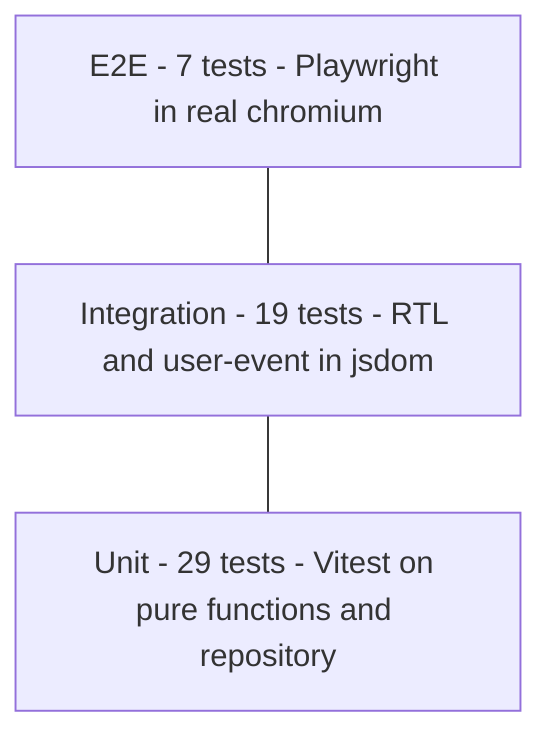

# 06 — Test Plan

Test plan for the To-Do List web app (TypeScript, React 19, Vite, Tailwind CSS v4, localStorage persistence). Tooling: **Vitest + React Testing Library** for unit and integration tests, **Playwright** for end-to-end tests.

---

## 1. Strategy

### 1.1 Test pyramid

The suite follows the classic test pyramid: many fast, deterministic unit tests at the base; a smaller set of integration tests that exercise the app the way a user does; a handful of end-to-end tests that prove the whole system works in a real browser, including persistence across a page reload.



### 1.2 Bottom-up unit testing — isolate the important parts

The domain layer (`src/domain/todo.ts`) and the storage layer (`src/storage/todoRepository.ts`) carry all of the business rules: validation, immutability, ordering, and error classification for storage failures. Both are deliberately free of React and (in the domain's case) browser APIs, so they are tested **bottom-up** as plain functions:

- `src/domain/todo.test.ts` — pure functions, no mocks at all. Every rule (trimming, the 200-character limit, newest-first ordering, no-op on unknown ids, immutability of inputs) is pinned here, where a failure points at exactly one function.
- `src/storage/todoRepository.test.ts` — the repository is tested against a **mocked `Storage` object** injected through the optional `storage` parameter of `loadTodos` / `saveTodos`. Mocking at this level lets us simulate every failure mode deterministically: a missing key, malformed JSON, a syntactically valid payload with the wrong shape, `getItem` throwing (storage unavailable), and `setItem` throwing (quota exceeded).

### 1.3 Top-down integration testing — simulate the real user

`src/components/TodoApp.test.tsx` tests **top-down** from the container component. It renders `TodoApp` with React Testing Library and drives it with `user-event` exactly as a person would: typing into the input, pressing Enter and Escape, clicking checkboxes, tabs, and buttons. Nothing inside the app is mocked — the tests run the **real `useTodos` hook, real domain functions, and real repository** against **jsdom's real `localStorage`**. This verifies the wiring the unit tests cannot see: load-on-mount, auto-save on every change via `useEffect`, error messages surfacing from `addTask` / `editTask` into inline UI, and the `StorageWarning` banner appearing when the repository reports an error.

### 1.4 End-to-end testing — the full browser truth

`e2e/todo.spec.ts` runs with Playwright against a production-like build in **real chromium**, using the **browser's real `localStorage`**. E2E tests cover complete user journeys — add, edit, complete, filter, clear, delete — and the one behavior no lower level can prove: **tasks survive an actual page reload**. `localStorage` is cleared before each test for isolation.

### 1.5 Who covers what

| Level | Tool | Files | Storage | Test ID prefix |
| --- | --- | --- | --- | --- |
| Unit | Vitest | `src/domain/todo.test.ts`, `src/storage/todoRepository.test.ts` | Domain: none needed. Repository: mocked `Storage` object | UT-xx |
| Integration | Vitest + RTL + user-event (jsdom) | `src/components/TodoApp.test.tsx` | Real jsdom `localStorage` (stubbed only for the unavailable-storage scenario) | IT-xx |
| E2E | Playwright (chromium) | `e2e/todo.spec.ts` | Real browser `localStorage` | E2E-xx |

Test IDs are numbered continuously across this document within each prefix.

---

## 2. Test cases per use case

### UC-01 — Add task

| Test ID | Level | Target unit | Mocked / Real | Pre condition | Action - Input | Post condition | Expected result |
| --- | --- | --- | --- | --- | --- | --- | --- |
| UT-01 | Unit | `validateTitle` | Pure function, nothing mocked | — | Call with `"Buy milk"` | No state | Returns `{ ok: true, value: "Buy milk" }` |
| UT-02 | Unit | `validateTitle` | Pure function, nothing mocked | — | Call with `"  Buy milk  "` | No state | Returns `ok: true` with trimmed `value: "Buy milk"` |
| UT-03 | Unit | `validateTitle` | Pure function, nothing mocked | — | Call with `""` | No state | Returns `ok: false` with error `"Task cannot be empty"` |
| UT-04 | Unit | `validateTitle` | Pure function, nothing mocked | — | Call with `"   "` whitespace only | No state | Returns `ok: false` with error `"Task cannot be empty"` |
| UT-05 | Unit | `validateTitle` | Pure function, nothing mocked | — | Call with a 201-character string | No state | Returns `ok: false` with a max-length error mentioning `MAX_TITLE_LENGTH` 200 |
| UT-06 | Unit | `validateTitle` | Pure function, nothing mocked | — | Call with an exactly 200-character string | No state | Returns `ok: true` — boundary value is accepted |
| UT-07 | Unit | `createTodo` | Pure function, nothing mocked | — | Call with title `"A"`, id `"id-1"`, createdAt `1000` | No state | Returns `{ id: "id-1", title: "A", completed: false, createdAt: 1000 }` |
| UT-08 | Unit | `addTodo` | Pure function, nothing mocked | List `[B]` exists | Call `addTodo` with list and new todo `A` | Input array is unchanged | Returns a new array `[A, B]` — newest first, original not mutated |
| IT-01 | Integration | `TodoApp` + `AddTodoForm` + `useTodos` | Real hook, domain, repository; real jsdom localStorage | App rendered, list empty | Type `"Buy milk"`, click Add | Todo stored in state and localStorage | Item `"Buy milk"` appears at the top of the list, input is cleared, no error shown |
| IT-02 | Integration | `TodoApp` + `AddTodoForm` | Real hook, domain, repository; real jsdom localStorage | App rendered | Type `"  padded  "`, submit | Todo stored with trimmed title | Item renders as `"padded"` with no surrounding whitespace |
| IT-03 | Integration | `TodoApp` + `AddTodoForm` | Real hook, domain, repository; real jsdom localStorage | App rendered, list empty | Submit with empty input | No todo created, nothing saved | Inline error `"Task cannot be empty"` is shown, list still empty |
| IT-04 | Integration | `AddTodoForm` input | Real DOM in jsdom | App rendered | Inspect the title input element | — | Input carries `maxLength` 200, so over-long titles cannot be typed; oversize rejection logic is pinned by UT-05 |
| IT-05 | Integration | `TodoApp` | Real hook, domain, repository; real jsdom localStorage | Item `"Buy milk"` exists | Add another task titled `"Buy milk"` | Both todos stored with distinct ids | Two items titled `"Buy milk"` are listed — duplicates are allowed by design |
| E2E-01 | E2E | Full app in chromium | Real browser, real localStorage | App deployed build loaded, storage cleared | Type `"Write report"`, press Enter | Todo persisted in browser localStorage | Task appears at the top of the list with an unchecked checkbox |

### UC-02 — Edit task title

| Test ID | Level | Target unit | Mocked / Real | Pre condition | Action - Input | Post condition | Expected result |
| --- | --- | --- | --- | --- | --- | --- | --- |
| UT-09 | Unit | `editTodoTitle` | Pure function, nothing mocked | List with todo id `"1"` titled `"Old"` | Call with id `"1"`, title `"New"` | Input array unchanged | Returns new array where todo `"1"` has title `"New"`; other fields and todos untouched |
| UT-10 | Unit | `editTodoTitle` | Pure function, nothing mocked | List with todos `"1"`, `"2"` | Call with unknown id `"nope"` | Input array unchanged | Returns an array equal to the input — unknown id is a safe no-op |
| IT-06 | Integration | `TodoItem` inline edit + `useTodos.editTask` | Real hook, domain, repository; real jsdom localStorage | Item `"Old title"` exists | Enter edit mode on the item, replace text with `"New title"`, press Enter | Updated title stored in state and localStorage | Item now reads `"New title"`; edit mode is closed |
| IT-07 | Integration | `TodoItem` inline edit | Real hook, domain, repository; real jsdom localStorage | Item `"Keep me"` exists | Enter edit mode, clear the text, press Enter | Todo unchanged in state and storage | Inline error `"Task cannot be empty"` shown; item still reads `"Keep me"` and remains in edit mode until a valid save or cancel |
| IT-08 | Integration | `TodoItem` inline edit | Real hook, domain, repository; real jsdom localStorage | Item `"Keep me"` exists | Enter edit mode, type `"discarded"`, press Escape | Todo unchanged | Edit mode closes; item still reads `"Keep me"` — the draft is discarded |
| E2E-02 | E2E | Full app in chromium | Real browser, real localStorage | One task `"Draft"` exists | Edit it to `"Final"`, save with Enter | New title persisted | List shows `"Final"`; `"Draft"` no longer appears |

### UC-03 — Delete task

| Test ID | Level | Target unit | Mocked / Real | Pre condition | Action - Input | Post condition | Expected result |
| --- | --- | --- | --- | --- | --- | --- | --- |
| UT-11 | Unit | `deleteTodo` | Pure function, nothing mocked | List with todos `"1"`, `"2"` | Call with id `"1"` | Input array unchanged | Returns new array containing only todo `"2"` |
| UT-12 | Unit | `deleteTodo` | Pure function, nothing mocked | List with todos `"1"`, `"2"` | Call with unknown id `"nope"` | Input array unchanged | Returns an array equal to the input — unknown id is a safe no-op |
| IT-09 | Integration | `TodoItem` Delete button + `useTodos.deleteTask` | Real hook, domain, repository; real jsdom localStorage | Items `"A"` and `"B"` exist | Click Delete on `"A"` | `"A"` removed from state and localStorage | `"A"` disappears immediately with no confirmation dialog; `"B"` remains |
| IT-10 | Integration | `TodoApp` + `EmptyState` | Real hook, domain, repository; real jsdom localStorage | Exactly one item exists | Delete it | List empty in state and storage | `EmptyState` component is rendered in place of the list |
| E2E-03 | E2E | Full app in chromium | Real browser, real localStorage | Two tasks exist | Click Delete on the first task | Deletion persisted | Task is removed from the visible list; the other task remains |

### UC-04 — Mark task complete / incomplete

| Test ID | Level | Target unit | Mocked / Real | Pre condition | Action - Input | Post condition | Expected result |
| --- | --- | --- | --- | --- | --- | --- | --- |
| UT-13 | Unit | `toggleTodo` | Pure function, nothing mocked | List with active todo `"1"` | Call with id `"1"` | Input array unchanged | Returns new array where todo `"1"` has `completed: true` |
| UT-14 | Unit | `toggleTodo` | Pure function, nothing mocked | List with completed todo `"1"` | Call with id `"1"` | Input array unchanged | Returns new array where todo `"1"` has `completed: false` — toggle is symmetric |
| UT-15 | Unit | `toggleTodo` | Pure function, nothing mocked | List with todos `"1"`, `"2"` | Call with unknown id `"nope"` | Input array unchanged | Returns an array equal to the input — unknown id is a safe no-op |
| IT-11 | Integration | `TodoItem` checkbox + `useTodos.toggleTask` | Real hook, domain, repository; real jsdom localStorage | Two active items exist, counter reads `"2 items left"` | Click the checkbox of the first item | Completed state stored in state and localStorage | Item is checked and styled as completed; counter now reads `"1 item left"` |
| IT-12 | Integration | `TodoItem` checkbox | Real hook, domain, repository; real jsdom localStorage | One completed item exists | Click its checkbox again | Todo active again in state and storage | Item is unchecked and styled as active; counter increments accordingly |
| E2E-04 | E2E | Full app in chromium | Real browser, real localStorage | Task `"Ship it"` exists, active | Click its checkbox | Completed state persisted | Task shows completed styling and the items-left counter decreases by one |

### UC-05 — Persist and restore tasks

| Test ID | Level | Target unit | Mocked / Real | Pre condition | Action - Input | Post condition | Expected result |
| --- | --- | --- | --- | --- | --- | --- | --- |
| UT-16 | Unit | `loadTodos` | Mocked `Storage` object | Mock `getItem` returns valid serialized todo array under `STORAGE_KEY` | Call `loadTodos` with the mock | No state change | Returns `{ todos: [parsed todos], error: null }` |
| UT-17 | Unit | `loadTodos` | Mocked `Storage` object | Mock `getItem` returns `null` — key never written | Call `loadTodos` with the mock | No state change | Returns `{ todos: [], error: null }` — first run is not an error |
| UT-18 | Unit | `loadTodos` | Mocked `Storage` object | Mock `getItem` returns `"{not json"` | Call `loadTodos` with the mock | No state change | Returns `{ todos: [], error: "corrupted" }` — JSON.parse failure is contained |
| UT-19 | Unit | `loadTodos` | Mocked `Storage` object | Mock `getItem` returns valid JSON of the wrong shape, e.g. `"{\"a\":1}"` | Call `loadTodos` with the mock | No state change | Returns `{ todos: [], error: "corrupted" }` — shape is rejected by `isValidTodoArray` |
| UT-20 | Unit | `loadTodos` | Mocked `Storage` object | Mock `getItem` throws, simulating blocked storage | Call `loadTodos` with the mock | No state change | Returns `{ todos: [], error: "unavailable" }` — the exception does not escape |
| UT-21 | Unit | `saveTodos` | Mocked `Storage` object | Mock `setItem` succeeds | Call `saveTodos` with one todo and the mock | Mock received one write | Returns `true`; `setItem` was called with `STORAGE_KEY` and the JSON-serialized array |
| UT-22 | Unit | `saveTodos` | Mocked `Storage` object | Mock `setItem` throws a quota-exceeded error | Call `saveTodos` with the mock | No state change | Returns `false`; the exception does not escape |
| UT-23 | Unit | `isValidTodoArray` | Pure function, nothing mocked | — | Call with a valid todo array, a non-array, an array with a missing field, an array with wrong field types | No state | Returns `true` only for the valid todo array, `false` for all malformed inputs |
| IT-13 | Integration | `useTodos` load-on-mount wiring via `TodoApp` | Real hook, domain, repository; real jsdom localStorage | Tasks `"A"`, `"B"` added through the UI, component unmounted | Render a fresh `TodoApp` | State rebuilt from storage | Both tasks reappear in the same order with the same completed state — full storage round-trip |
| IT-14 | Integration | `useTodos` auto-save wiring | Real hook, domain, repository; real jsdom localStorage | App rendered, list empty | Add a task, toggle it, then delete it — reading `localStorage.getItem` under `STORAGE_KEY` after each step | localStorage rewritten after every change | Stored JSON matches the on-screen state after each mutation — auto-save fires on every todos change |
| IT-15 | Integration | `TodoApp` + `StorageWarning` | Real hook and repository; jsdom localStorage seeded with bad data | `STORAGE_KEY` pre-set to invalid JSON before render | Render `TodoApp`, then dismiss the banner | App starts with empty list; next save overwrites the bad payload | `StorageWarning` banner is visible and dismissible; list is empty; adding a task succeeds and writes valid JSON |
| IT-16 | Integration | `TodoApp` + `StorageWarning` | Real hook, domain, repository; jsdom localStorage stubbed to throw on access | `localStorage` access throws for this test | Render `TodoApp`, add task `"In memory"` | App holds state in memory only | `StorageWarning` banner is shown; the task still appears and all interactions keep working for the session |
| E2E-05 | E2E | Full app in chromium | Real browser, real localStorage | Storage cleared; tasks `"One"`, `"Two"` added, `"Two"` completed | Reload the page | State restored from browser localStorage | Both tasks reappear after reload in the same order, with `"Two"` still completed |

### UC-06 — Filter tasks

| Test ID | Level | Target unit | Mocked / Real | Pre condition | Action - Input | Post condition | Expected result |
| --- | --- | --- | --- | --- | --- | --- | --- |
| UT-24 | Unit | `filterTodos` | Pure function, nothing mocked | List with 2 active and 1 completed todo | Call with filter `"all"` | No state | Returns all 3 todos in original order |
| UT-25 | Unit | `filterTodos` | Pure function, nothing mocked | Same list | Call with filter `"active"` | No state | Returns only the 2 todos with `completed: false` |
| UT-26 | Unit | `filterTodos` | Pure function, nothing mocked | Same list | Call with filter `"completed"` | No state | Returns only the 1 todo with `completed: true` |
| UT-27 | Unit | `activeCount` | Pure function, nothing mocked | Same list | Call `activeCount` | No state | Returns `2` |
| IT-17 | Integration | `FilterBar` + `useTodos.setFilter` | Real hook, domain, repository; real jsdom localStorage | 2 active and 1 completed items exist | Click Active tab, then Completed tab, then All tab | Filter state updates; todos untouched | Each tab shows only its matching items; counter always reads `"2 items left"` regardless of active tab |
| IT-18 | Integration | `EmptyState` per filter | Real hook, domain, repository; real jsdom localStorage | Only active items exist | Switch to the Completed tab | No todos match the filter | `EmptyState` renders with the completed-filter-specific message; switching back to All shows the list again |
| E2E-06 | E2E | Full app in chromium | Real browser, real localStorage | 1 active and 1 completed task exist | Click Active, then Completed | Filter applied in UI | Active view shows only the unchecked task; Completed view shows only the checked one |

### UC-07 — Clear completed tasks

| Test ID | Level | Target unit | Mocked / Real | Pre condition | Action - Input | Post condition | Expected result |
| --- | --- | --- | --- | --- | --- | --- | --- |
| UT-28 | Unit | `clearCompleted` | Pure function, nothing mocked | List with 2 active and 2 completed todos | Call `clearCompleted` | Input array unchanged | Returns new array with only the 2 active todos, order preserved |
| UT-29 | Unit | `clearCompleted` | Pure function, nothing mocked | List with only active todos | Call `clearCompleted` | Input array unchanged | Returns an array equal to the input — nothing to clear is a safe no-op |
| IT-19 | Integration | `FilterBar` Clear completed + `useTodos.clearCompletedTasks` | Real hook, domain, repository; real jsdom localStorage | 1 active and 2 completed items exist | Click the Clear completed button | Completed todos removed from state and localStorage | Only the active item remains; stored JSON no longer contains the completed todos |
| E2E-07 | E2E | Full app in chromium | Real browser, real localStorage | 1 active and 1 completed task exist | Click Clear completed, then reload the page | Cleared state persisted | Only the active task is shown, both before and after the reload |

---

## 3. Traceability

| Use case | Unit | Integration | E2E |
| --- | --- | --- | --- |
| UC-01 Add task | UT-01 – UT-08 | IT-01 – IT-05 | E2E-01 |
| UC-02 Edit task title | UT-09, UT-10 | IT-06 – IT-08 | E2E-02 |
| UC-03 Delete task | UT-11, UT-12 | IT-09, IT-10 | E2E-03 |
| UC-04 Mark task complete / incomplete | UT-13 – UT-15 | IT-11, IT-12 | E2E-04 |
| UC-05 Persist and restore | UT-16 – UT-23 | IT-13 – IT-16 | E2E-05 |
| UC-06 Filter tasks | UT-24 – UT-27 | IT-17, IT-18 | E2E-06 |
| UC-07 Clear completed | UT-28, UT-29 | IT-19 | E2E-07 |

Every use case is covered at all three levels: 29 unit tests, 19 integration tests, 7 end-to-end tests — 55 tests in total.

---

## 4. How to run

```bash
npm test           # Vitest: all unit + integration tests (UT-xx, IT-xx)
npm run test:e2e   # Playwright: end-to-end suite in chromium (E2E-xx)
npm run lint       # ESLint — must pass with no errors
npm run build      # TypeScript check + Vite production build — must pass with no errors
```

Playwright starts the Vite dev/preview server automatically via its `webServer` config, so `npm run test:e2e` is self-contained. All four commands passing, plus tasks surviving a page refresh (E2E-05), form the test-related portion of the Definition of Done.
